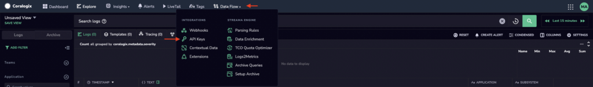
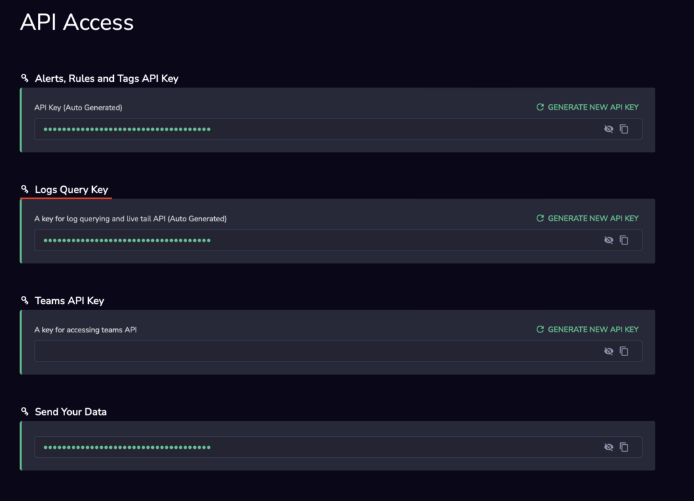

This guide demonstrates how to **download your Coralogix security report** via API.

## Prerequisites

- [Cloud Security Posture Management (CSPM)](https://coralogixstg.wpengine.com/docs/cloud-security-posture-management-cspm/) set up

## Configuration

**STEP 1**. Access your API URL based on the [domain](https://coralogixstg.wpengine.com/docs/coralogix-domain/) associated with your account.

<table><tbody><tr><td>.com</td><td>Ireland</td><td>ng-api-http.coralogixstg.wpengine.com</td></tr><tr><td>.app.eu2.coralogixstg.wpengine.com</td><td>Stockholm</td><td>ng-api-http.eu2.coralogixstg.wpengine.com</td></tr><tr><td>.app.coralogixsg.com</td><td>Singapore</td><td>ng-api-http.coralogixsg.com</td></tr><tr><td>.in</td><td>Mumbai</td><td>ng-api-http.app.coralogix.in</td></tr><tr><td>.us</td><td>United States</td><td>ng-api-http.coralogix.us</td></tr></tbody></table>

**STEP 2**. Access your Coralogix Logs Query Key.

- On your Coralogix dashboard, click **Data Flow** > select **API Keys.**



- Copy your **Logs Query Key.**



**STEP 3**. Create the API.

<table><tbody><tr><td>URL</td><td>https:// /xdr/get-report</td></tr><tr><td>HTTP Method</td><td>POST</td></tr><tr><td>Content Type</td><td>application/json</td></tr><tr><td>Authorization</td><td>Bearer {{Logs Query key}}</td></tr></tbody></table>

**STEP 4**. Schema

Request schema.

```
{
	"executionId": string(uuid), // in case it's not provided using the last scan id
	"filter": {
		"region": string[],
		"account": string[],
		"complianceFramework": string[],
		"provider": string[], // "aws", "gcp", "azure", "github", etc...
    "service": string[], // "RDS", "BIG QUERY", "S3", etc
		"testName": string[], // sort name of the security rule (testIdentity)
		"result": string[] // (enum) "Passed", "Failed"
		"severity": int[], // (enum) 1 - Low, 2 - Medium, 3 - High, 4 - Critical 
		"active": string[] // (enum): "Enabled", "Disabled"
	}
}
```

**Note**: Every field in the request payload is optional. Passing a `null` value or ignoring that field is the same as passing an empty list.

Compliance frameworks and short names:

| Snowbit | snowbit |
| --- | --- |
| CIS AWS 1.4.0 | cis\_aws |
| HIPAA | hipaa |
| ISO-27001 | iso\_27001 |
| PCI DSS 3.1.0 | pci\_dss |
| SOC 2 | soc2 |

Response schema:

```
{
	"executionId": string // uuid v4 format
	"data":[
    {
      "region": string,
      "account": string,
      "complianceFrameworks": string[],
      "provider": string,
			"category": string, // From the category view eg: "Database", "Storage", "Identity Management", etc
      "service": string, // "RDS", "BIG QUERY", "S3", etc
      "testName": string,
      "severity": int, // enum: 1 - Low, 2 - Medium, 3 - High, 4 - Critical 
      "resourceName": string,
      "resourceId": string,
      "passed": boolean,
      "active": boolean
    }
  ]
}
```

## Additional Resources

<table><tbody><tr><td>Documentation</td><td><a href="https://coralogixstg.wpengine.com/docs/cloud-security-posture-management-cspm/">Cloud Security Posture Management (CSPM)</a></td></tr></tbody></table>

## Support

**Need help?**

Our world-class customer success team is available 24/7 to walk you through your setup and answer any questions that may come up.

Feel free to reach out to us **via our in-app chat** or by sending us an email at [support@coralogixstg.wpengine.com](mailto:support@coralogixstg.wpengine.com).
