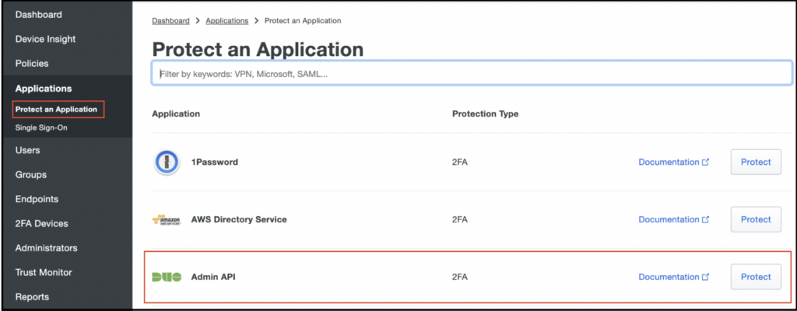
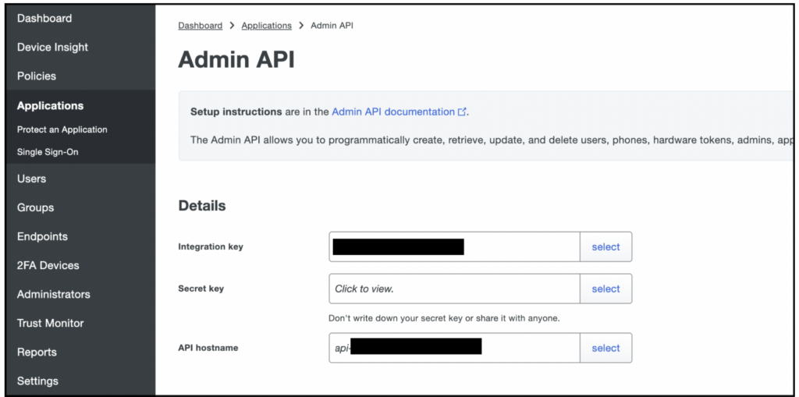

This tutorial demonstrates how to seamlessly send your [Duo Security](https://duo.com/) authentication and administrative logs to Coralogix.

## Prerequisites

- Duo Security [account](https://signup.duo.com/?_gl=1*cmrv23*_gcl_au*ODg0ODIxNTAwLjE2ODc4NTg4ODE.#eyJoYXNoIjoiIiwic2VhcmNoIjoiP19nbD0xKmNtcnYyMypfZ2NsX2F1Kk9EZzBPREl4TlRBd0xqRTJPRGM0TlRnNE9ERS4ifQ==)

- Server capable of fetching data from Duo Security (e.g. EC2, VM Instance, etc.)

## Admin API Setup

Add the Duo Security Admin API to your Duo instance.

**STEP 1**. Log in to the Duo Security [admin portal](https://admin.duosecurity.com), the storage place for your authentication and administrative logs.

**STEP 2**. Click on **Applications** > Protect an Application.

**STEP 3**. Select the Admin API.



**STEP 4**. Once the Duo Admin API application is created, copy the host name and key values to use in the Duo Security log sync configuration. Use the integration key (**ikey**), secret key (**skey**), and API hostname (**hostname**) values here to populate the configuration script.



## Log Sync Setup & Configuration

Full instructions for this section can be found [here](https://github.com/duosecurity/duo_log_sync/blob/master/README.md).

**STEP 1**. [Install](http://python.org/downloads/) Python3 on the server if you haven't already done so.

**STEP 2**. Clone the [duo\_log\_sync repo](https://github.com/duosecurity/duo_log_sync).

**STEP 3**. Create a temp directory at `c:\temp` to store your log files.

- Those using **Linux** operating systems will already have a `/tmp` directory that can be used.

**STEP 4**. Create a file called `config.yml` inside `...\duologsync\config.yml`.

- Those using **Windows** operating systems will need to escape the directory references and put the full path, as in the example below.

- Input the **skey**, **ikey**, and **hostname** values from your Admin API application.

**Linux config.yml file**:

```raw
duoclient:
  skey: "ENTER-SECRET-KEY-HERE"
  ikey: "ENTER-INTEGRATION-KEY-HERE"
  host: "ENTER-API-HOSTNAME-HERE"

logs:
  logDir: "/tmp"
  endpoints:
    enabled: ["auth", "telephony", "adminaction"]
  polling:
    duration: 5
    daysinpast: 1
  checkpointDir: "/tmp"

transport:
  protocol: "TCP"
  host: "localhost"
  port: 8877
  certFileDir: "/tmp"
  certFileName: "selfsigned.cert"

recoverFromCheckpoint:
  enabled: FalseWindows config.yml
```

**STEP 5**. Save the file.

**STEP 6**. [Create a self-signed certificate](https://devopscube.com/create-self-signed-certificates-openssl/) and place it in the `tmp` directory.

**STEP 7**. Inside the `duo_log_sync` directory use the command-line to type:

```bash
python3 setup.py install
```

**STEP 8**. Once the application is running, deploy the [Fluentd log shipper](https://coralogixstg.wpengine.com/docs/fluentd/) to intercept the traffic. Send your logs to Coralogix on port **8877**.

## Additional Resources

<table><tbody><tr><td>Documentation</td><td><a href="https://coralogixstg.wpengine.com/docs/fluentd/" target="_blank" rel="noreferrer noopener"><strong>Fluentd</strong></a></td></tr><tr><td>External</td><td><strong><a href="https://github.com/duosecurity/duo_log_sync/">Duo Security GitHub Repository</a></strong></td></tr></tbody></table>

## Support

**Need help?**

Our world-class customer success team is available 24/7 to walk you through your setup and answer any questions that may come up.

Feel free to reach out to us **via our in-app chat** or by sending us an email at [support@coralogixstg.wpengine.com](mailto:support@coralogixstg.wpengine.com).
