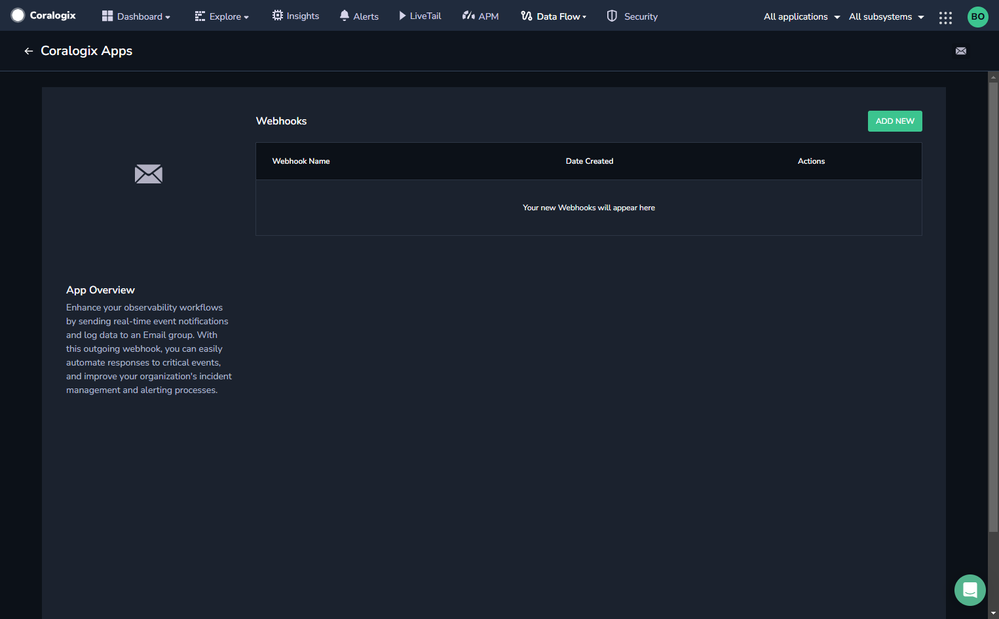
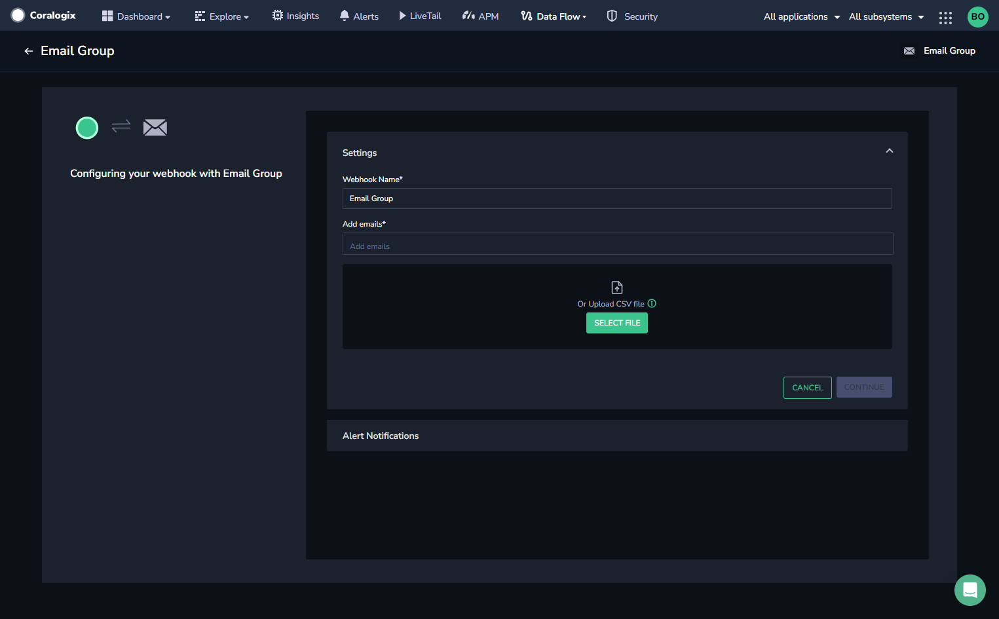
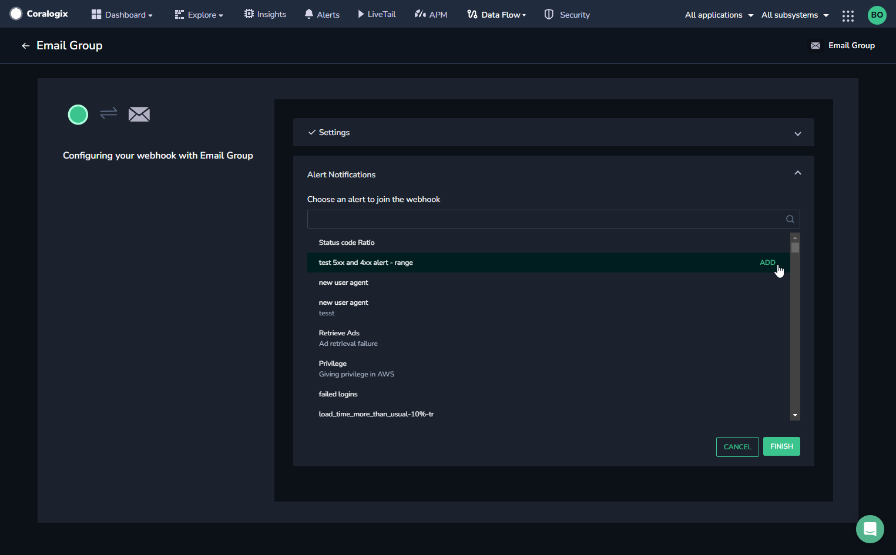
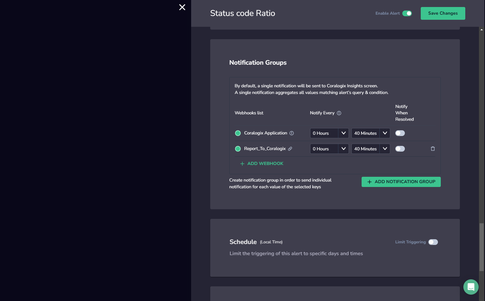

Enhance your observability workflows by sending real-time event notifications and log data to an **Email group**, a pre-defined group of email recipients. With this outbound webhook, you can easily automate responses to critical events, optimizing your organization's incident management and alerting processes.

## Create an Email Groups Webhook

**STEP 1.** From the Coralogix toolbar, navigate to **Data Flow** > **Outbound Webhooks.**

**STEP 2.** In the **Outbound Webhooks** section, click **EMAIL GROUPS WEBHOOK**.

**STEP 3.** Click **\+ ADD NEW**.

**STEP 4.** Enter the following details for your webhook:

- **Webhook Name.** Enter a name for your webhook that will enable you to easily identify this webhook later when attaching it to one of your alerts.

- **Add Emails.** Enter the emails you want to add to your email group. Alternatively, upload a CSV file with the emails.

**STEP 5.** Click **CONTINUE**.

**STEP 6.** Once the webhook is created, select the alert(s) for which this webhook will be used, once an alert is triggered.

**STEP 7.** Click **ADD** next to the alert(s) of choice. The **Alert Notifications** panel will appear.

**STEP 8.** In the **Notification Groups** section, the new webhook will appear. Click **\+ Add WEBHOOK** and select the newly created webhook. Click **SAVE CHANGES**. You can assign the webhook to more than one notification group.

**STEP 9.** Click **FINISH**.

## Additional Resources

<table><tbody><tr><td>Documentation</td><td><a href="https://coralogixstg.wpengine.com/docs/integration-packages/"><strong>Coralogix Integration Packages</strong></a></td></tr></tbody></table>

## Support

**Need help?**

Our world-class customer success team is available 24/7 to walk you through your setup and answer any questions that may come up.

Feel free to reach out to us **via our in-app chat** or by sending us an email at [support@coralogixstg.wpengine.com](mailto:support@coralogixstg.wpengine.com).
