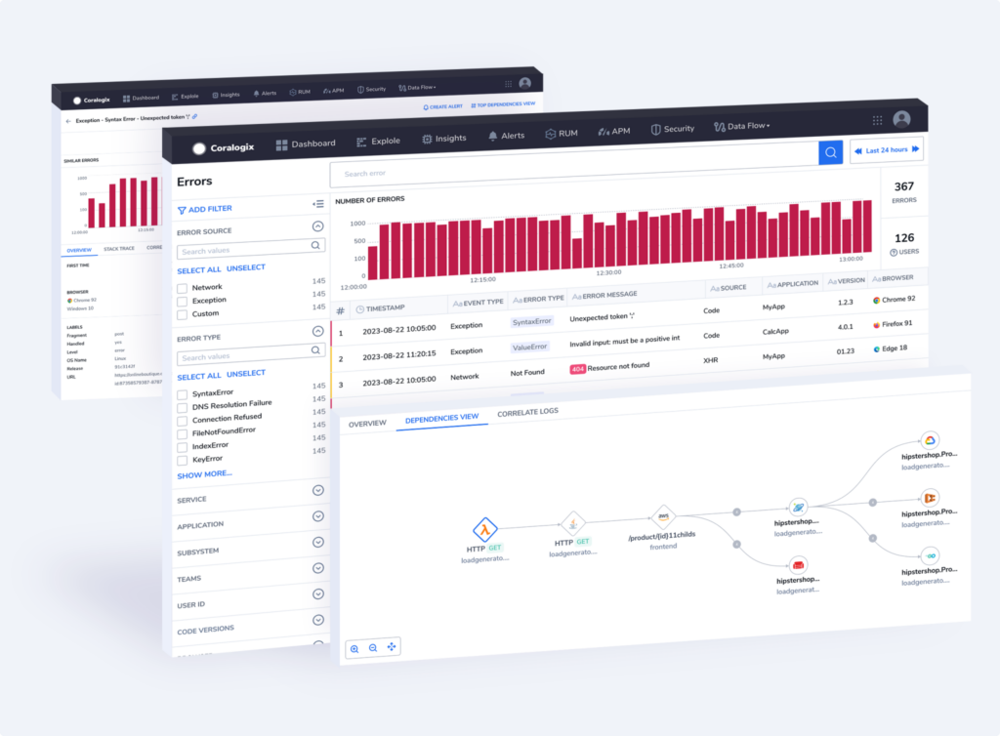

As part of our [Real User Monitoring](https://coralogixstg.wpengine.com/docs/real-user-monitoring/) (RUM) toolkit, Coralogix offers multi-faceted Error Tracking. Designed to help web application owners and developers gain insights into errors occurring within their users' browsers, this tool allows you to effectively capture and analyze frontend errors to optimize application performance and enhance the overall user experience. Get an overview of all errors generated from your browser or view related errors in a consolidated manner. You can view errors as individual errors (**Error Screen**) or aggregated into groups (**Error Template View**).

This user manual demonstrates how to engage with our RUM UI to get the most out of our **Error Tracking** features.

## Get Started

Once you have [configured and installed our browser SDK](https://coralogixstg.wpengine.com/docs/browser-sdk-installation-guide/), in your Coralogix toolbar, navigate to **RUM** \> **Browser Error Tracking**.

## Error Screen

Get an overview of all of the errors generated by your browser. View the number of errors and users affected by each, and filter according to your needs. In addition, create alerts directly from this screen by clicking CREATE ALERT in the upper right-hand corner.

### Display

The Error Screen includes:

1. **Filters.** Refine your view by filtering errors according to particular attributes.

3. **Error Overall Graph and KPIs**. This graph presents the error trend in the application and the overall number of errors and users affected.

5. **Error Grid.** Use the error table grid to view error information, row by row. Modify columns and the information presented based on your specific interests.

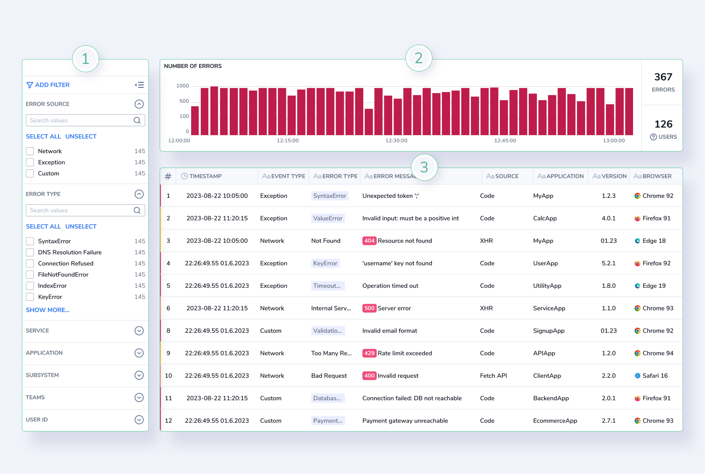

## Group Related Errors (Error Template View)

In addition to a granular view of all errors, take advantage of our **Error Template View**, where similar errors with shared attributes are grouped into a single template for quick and easy analysis. Find out more [here](https://coralogixstg.wpengine.com/docs/error-template-view/).

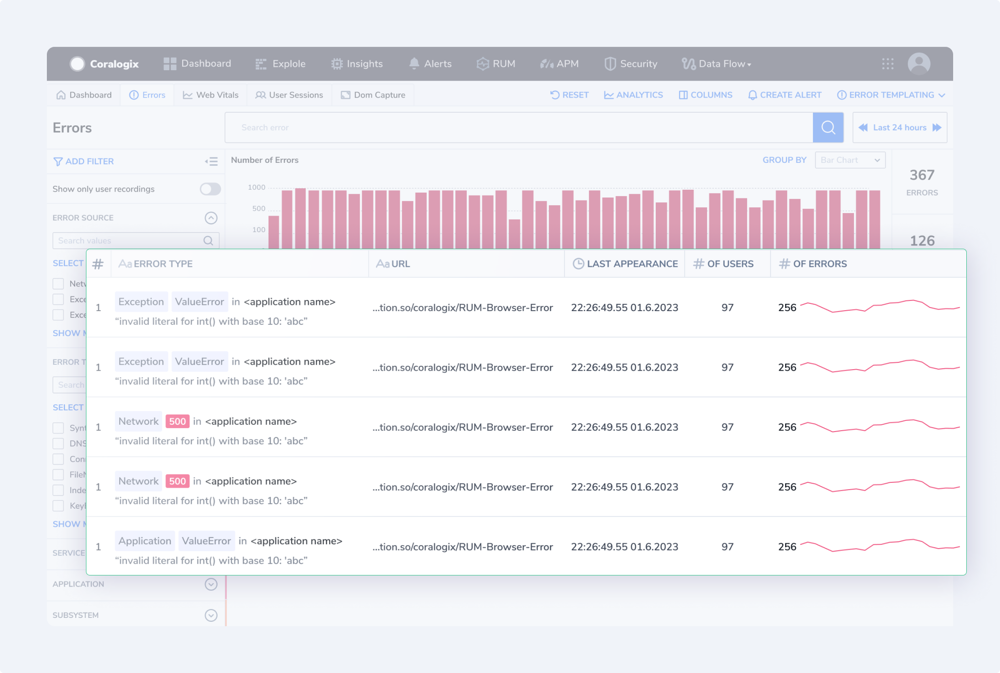

## Investigate Specific Errors

Drill down and investigate a specific error by clicking on an error of interest. The Specific Error Screen includes:

1. **Error Header.** A header bar with information about the error selected.

3. **Error Graph.** This time series graph presents the frequency of the specific error that has been chosen.

5. **Information Grid**.
    - Click on the **OVERVIEW** tab to acquire additional information surrounding the error, including event ID, type, group by, error status, browser, device type, language, country, and labels.
    
    - Depending on the error type, you will presented with a **STACK TRACE** tab, a **DEPENDENCIES VIEW** tab, or a **RELATED LOGS** tab.
        - **STACK TRACE** allows you to drill down into a specific stack trace tab. It is presented when the error is an **unhandled exception** - an error in a computer program or application when the code has no appropriate handling exceptions.
        
        - **DEPENDENCIES VIEW** allows you to visualize all the services in the error flow and pinpoint specific servers that may have caused the error. It is presented when a **network error** has occurred.
        
        - **CORRELATE LOGS** enables users to view detailed logs associated with errors, providing additional contextual information to aid debugging.

7. **Similar Errors Grid**. View and easily move between identical errors received in a selected time period.

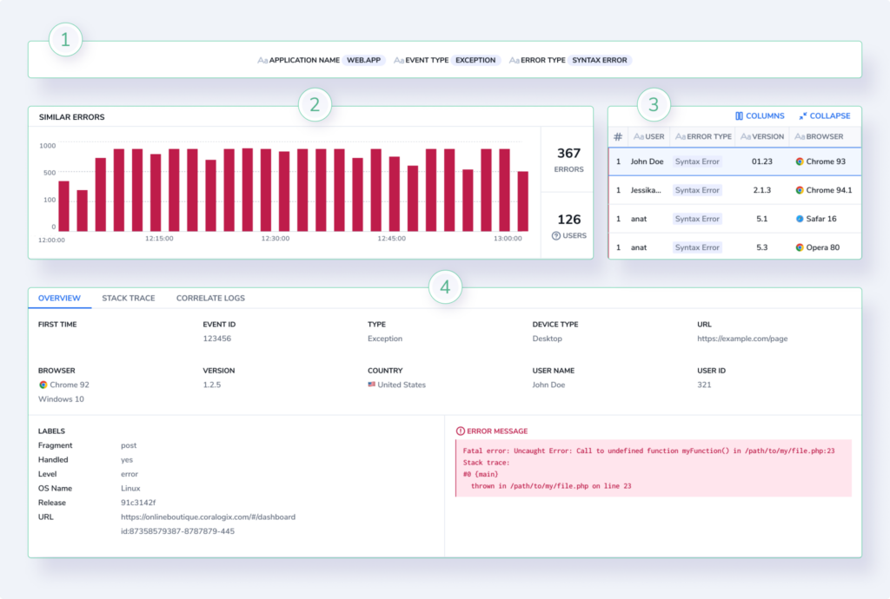

### Stack Trace

Drill-down and investigate the stack trace of an error by clicking on the **STACK TRACE** tab.

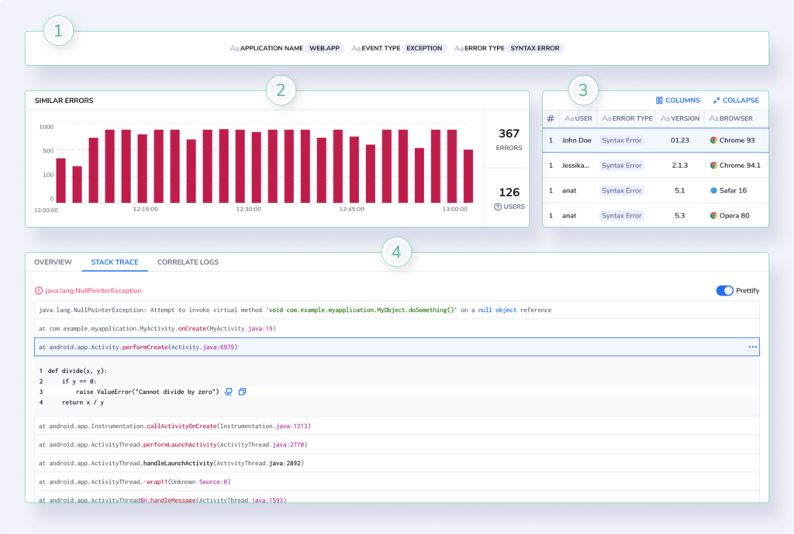

### Dependencies View

Visualize all the services in the error flow and pinpoint specific servers that may have caused the error by clicking on the **DEPENDENCIES VIEW** tab.

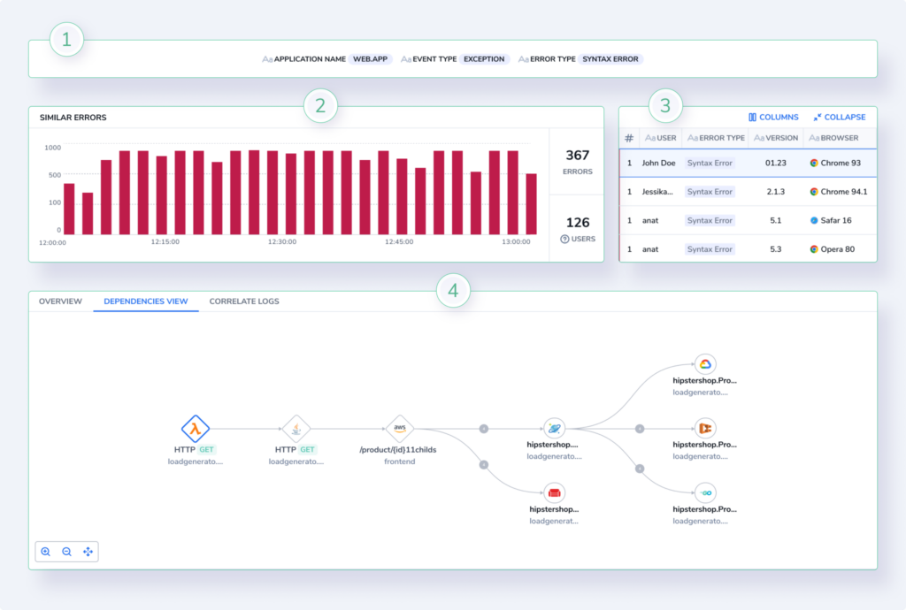

### Correlate Logs

View detailed logs associated with errors, providing additional contextual information to aid debugging by clicking on the **CORRELATE LOGS** tab.

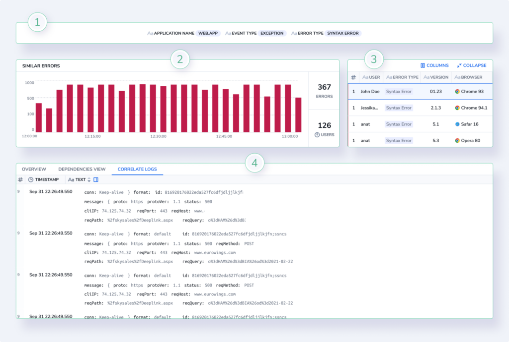

## Add an Alert to Track an Error

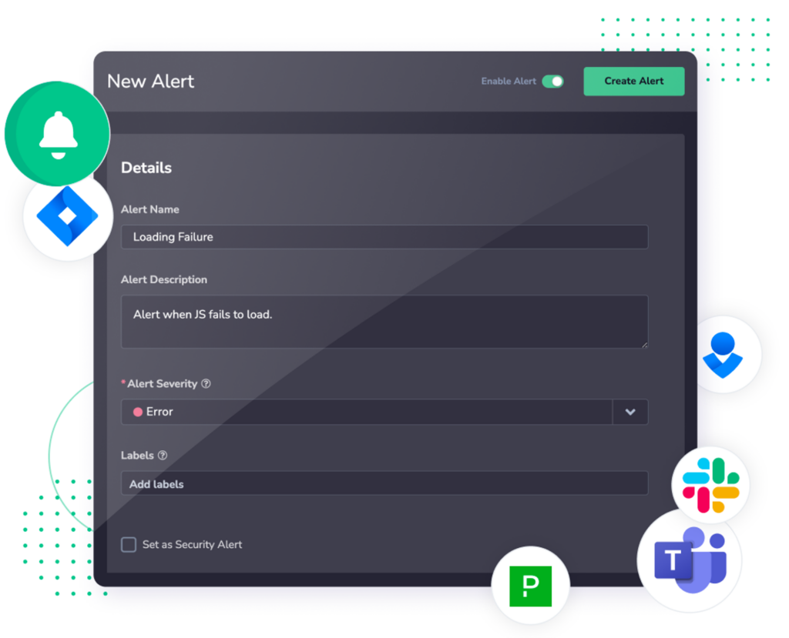

Alerting refers to the practice of setting up automated notifications or alarms that trigger when certain predefined conditions or thresholds are met. These conditions can be related to the performance, health, or behavior of the systems, applications, or infrastructure being monitored. The main purpose of alerting is to promptly notify DevOps teams and developers – when something unusual or problematic occurs, so you can take appropriate actions to resolve the issue before it escalates.

For more detailed information on Coralogix Alerts, see [Getting Started with Coralogix Alerts](https://coralogixstg.wpengine.com/docs/getting-started-with-coralogix-alerts/).

Coralogix enables you to create [alerts](https://coralogixstg.wpengine.com/docs/getting-started-with-coralogix-alerts/) directly from the Error Tracking screen, with several different available options for alert creation.

- **Create a custom alert directly from the error tracking screen.** Click the **CREATE ALERT** button on the right-hand side of the screen. The blank alert creation panel appears on the right-hand side of the screen for you to create your alert.

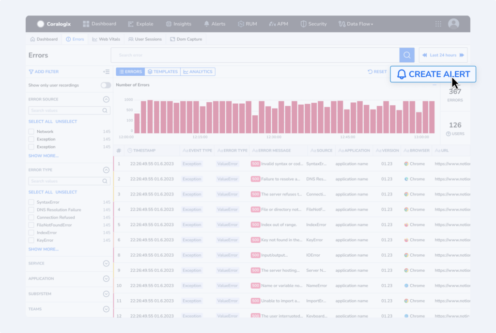

- **Create an alert from a specific error.** Click on the three dots on the left-hand side of the error number and select **CREATE ALERT**. The alert creation panel appears with the specified error details already in the query.

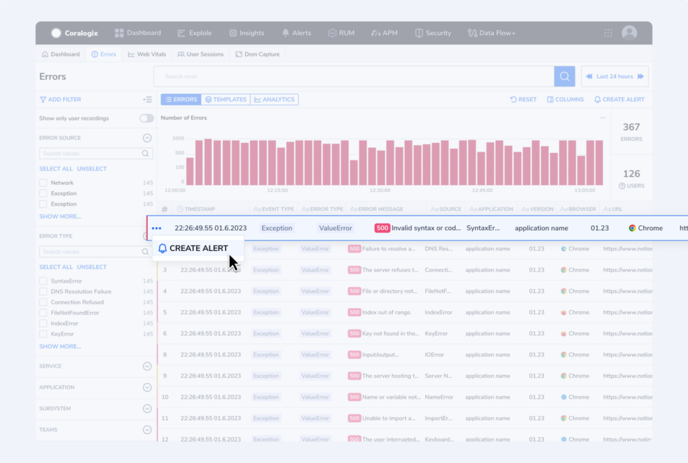

- **Create an alert from a specific template.** Click on the three dots on the left-hand side of the template number and select **CREATE ALERT**. The alert creation panel appears with the specified template details already in the query.

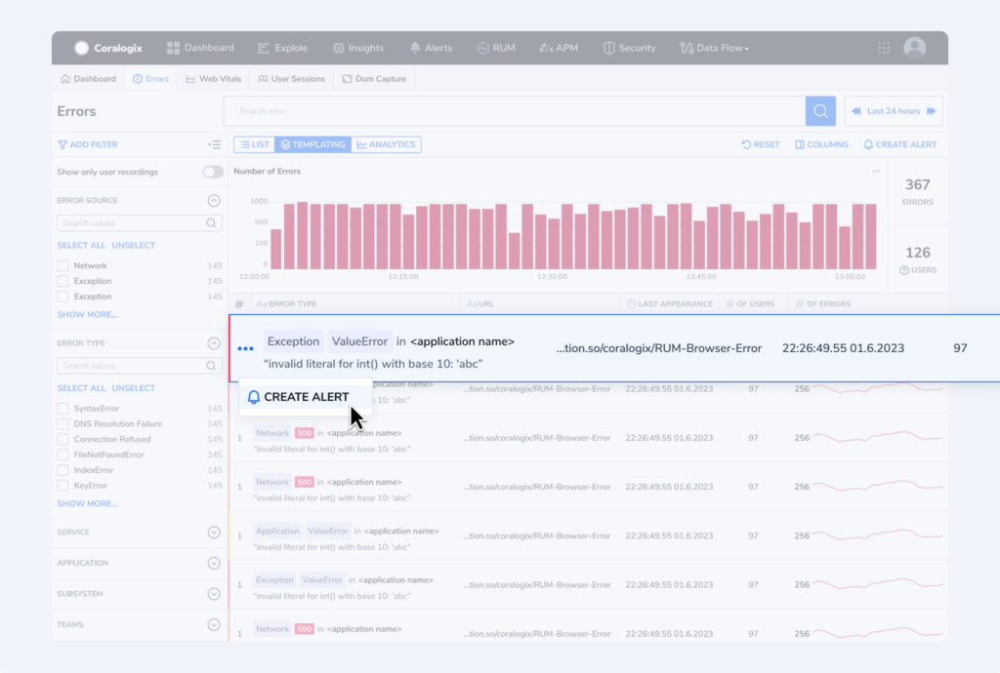

- **Create an alert from a template or error drill-down page.** Click on the **CREATE ALERT** button on the right-hand side of the screen. The alert creation panel appears with the specified error or template details already in the query.

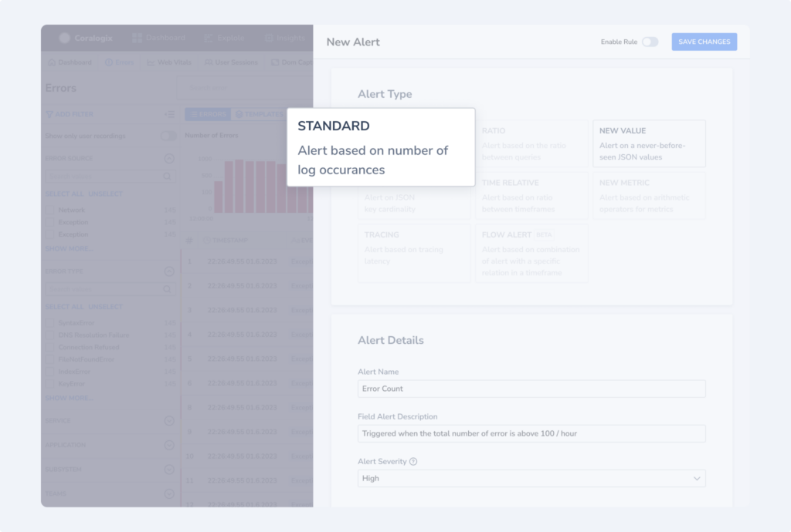

## Additional Resources

<table><tbody><tr><td>Documentation</td><td><strong><a href="https://coralogixstg.wpengine.com/docs/real-user-monitoring/">Real User Monitoring</a></strong> <a href="https://coralogixstg.wpengine.com/docs/error-tracking/"><strong>Error Tracking</strong></a> <a href="https://coralogixstg.wpengine.com/docs/error-template-view/"><strong>Error Template View</strong></a> <strong><a href="https://coralogixstg.wpengine.com/docs/browser-sdk-installation-guide/">Browser SDK Installation Guide</a></strong></td></tr></tbody></table>

## Support

**Need help?**

Our world-class customer success team is available 24/7 to walk you through your setup and answer any questions that may come up.

Feel free to reach out to us **via our in-app chat** or by sending us an email at [support@coralogixstg.wpengine.com](mailto:support@coralogixstg.wpengine.com).
