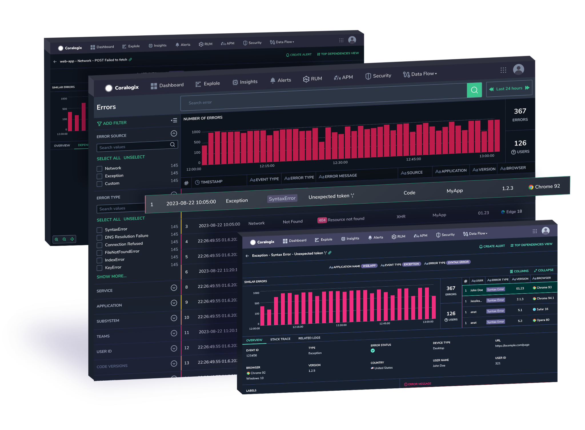
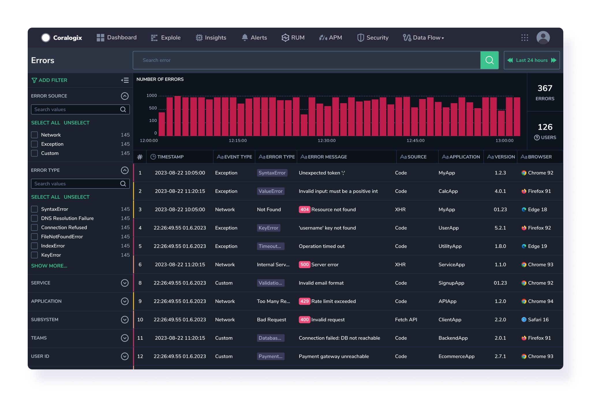
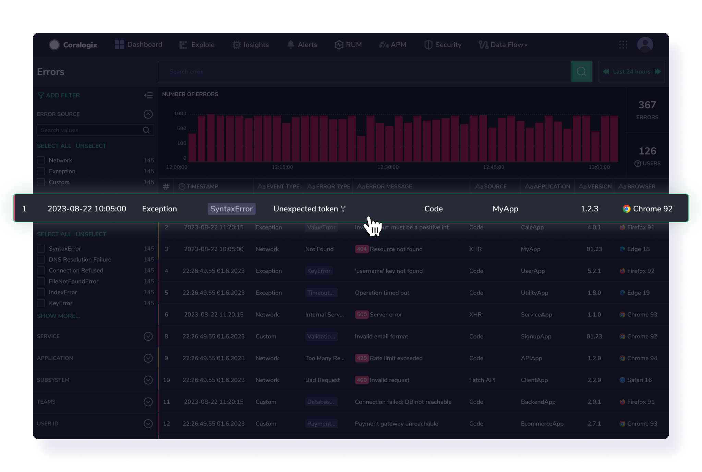
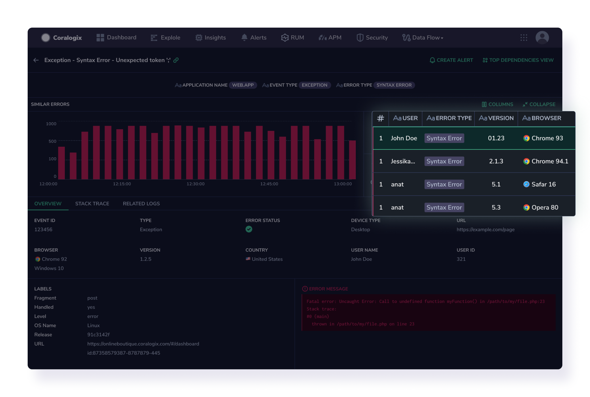
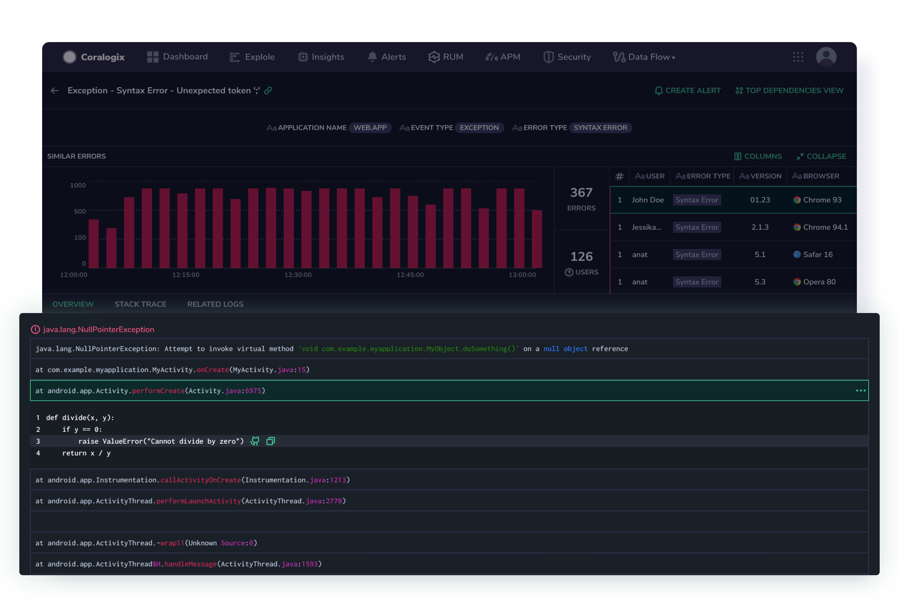
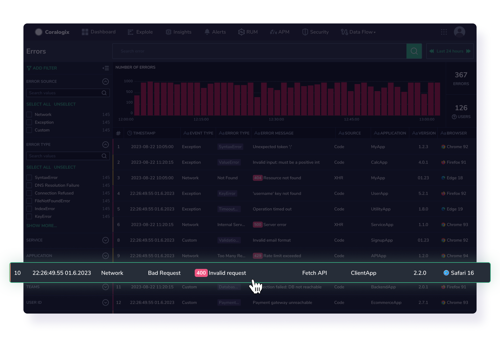
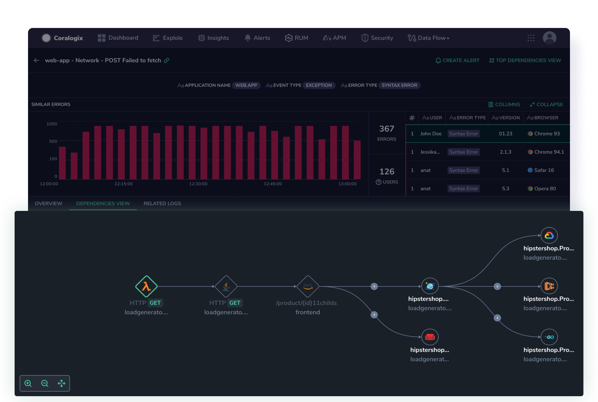

The health of your system relies on your ability to monitor and troubleshoot errors experienced by users on your website and applications consistently. This can be challenging, however, especially when dealing with complex systems. Errors may be difficult to reproduce, and diagnosing them can consume time and resources. Without real-time notifications, developers may only become aware of error patterns when users report them, resulting in lost revenue and lower customer satisfaction.

As part of our [Real User Monitoring](https://coralogixstg.wpengine.com/docs/real-user-monitoring/) (RUM) toolkit, Coralogix offers multi-faceted **Error Tracking**. Designed to help web application owners and developers gain insights into errors occurring within their users' browsers, this tool allows you to effectively capture and analyze frontend errors to optimize application performance and enhance the overall user experience. What’s more, **Error Tracking** is powered by our [Streama© technology](https://coralogixstg.wpengine.com/how-it-works/), allowing your data to run on the Coralogix monitoring pipeline at a third of the cost, without prior indexing.

Error Tracking is available for [Monitoring](https://coralogixstg.wpengine.com/docs/optimize-log-management-costs/#monitoring-data-medium-priority) and [Compliance](https://coralogixstg.wpengine.com/docs/optimize-log-management-costs/#compliance-data-low-priority) priority-level data, in addition to [Frequent Search](https://coralogixstg.wpengine.com/docs/optimize-log-management-costs/#frequent-search-data-high-priority).

## What is Error Tracking?

Coralogix **Error Tracking** was designed to help web application owners and developers gain insights into errors occurring within their users' browsers. Providing a [Browser SDK](https://coralogixstg.wpengine.com/docs/browser-sdk-installation-guide/) and a user-friendly interface, it allows you to effectively capture and analyze frontend errors to optimize application performance and enhance the user experience.

We offer a comprehensive view of your captured frontend errors. Errors are categorized into different types, including application, exception, and network errors. Within their Coralogix UI, users can explore detailed error reports, such as error messages, stack traces, associated URLs, and timestamps. They can also access analytics and visualizations to identify error trends, apply filters, search for specific errors, and receive notifications or alerts for critical issues.

Use **Error Tracking** to:

- Stay informed about any fatal issues that may occur by setting alerts on **Error Tracking** events.

- Identify important errors and reduce noise by grouping similar errors into issues.

- Keep track of issues over time to determine when they first started, if they are still ongoing, and how often they are occurring.

- Collect all necessary context in one place for optimized troubleshooting.

## How Can I Use Error Tracking?

Take a look at these use-cases to get a feel for the many ways that Coralogix **Error Tracking** can serve you.

### Investigating an Exception Error

A DevOps engineer accesses the RUM Error Screen in his Coralogix UI.

He filters according to TypeError (exception error) and finds that the amount of errors is greater than expected.

He then clicks on the first error of this kind to drill-down and investigate. He is presented with the error specifics: time of occurrence, browser, source, location, application page, and associated user information.

The user is presented with other similar errors and a graph displaying the concentration of errors over time.

He clicks on the STACK TRACE tab to understand the source of the error in the source code, what the error looks like and its evolution.

### Investigating a Network Error

A performance engineer accesses the RUM Error Screen in her Coralogix UI. She filters according to network-request (network error) and is presented with many errors. She notices that there was a spike in errors at approximately 10:30.

She chooses to drill-down into an internal server error, viewing the associated status code, URL, method, etc.

She then navigates to the Coralogix DEPENDENCIES VIEW to investigate the server on which the network error occurred. She sees the full trace, originating in the front-end application. With this visualization, she is able to easily locate where in the trace the error occurred.

## Get Started

### Configure & Install our Browser SDK

Coralogix offers a lightweight code tool integrated into the front end of web applications as a **prerequisite** for **Error Tracking**. It detects and captures errors that arise within users' browsers, including JavaScript runtime errors, unhandled exceptions, network errors, and application (custom logic) errors. The SDK collects essential error information and additional contextual data, such as browser details and URLs, and securely sent it to our platform through logs for further analysis.

If you haven't already done so using our [RUM integration package](https://coralogixstg.wpengine.com/docs/rum-integration-package/), configure and install our [Browser SDK](https://coralogixstg.wpengine.com/docs/browser-sdk-installation-guide/) to collect essential error information and associated data and sent it securely to Coralogix.

### Track Errors

Track your errors and engage with our user-friendly UI using our [User Manual](https://coralogixstg.wpengine.com/docs/error-tracking-user-manual/).

## Support

**Need help?**

Our world-class customer success team is available 24/7 to walk you through your setup and answer any questions that may come up.

Feel free to reach out to us **via our in-app chat** or by sending us an email at [support@coralogixstg.wpengine.com](mailto:support@coralogixstg.wpengine.com).
