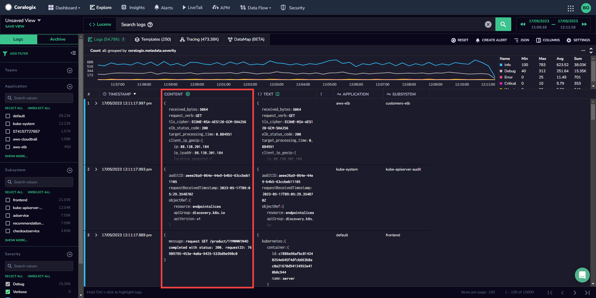

The CONTENT column in the Explore Screen displays selected keys from your logs, improving visibility for your log’s most important data.

## Content Column

Manage the values displayed in the **CONTENT** column by clicking on the column settings icon by the **CONTENT** header. This will open a menu that allows you to select keys known as Content Keys, used to detect the content in your logs. Use the keys available or add to this list.

Content Keys should contain the string value of one of the existing keys in your logs (i.e. `message`, `msg`, `log`, `k8s.log`). Content for each log will be extracted according to a predefined ordered list of Content Keys that you create.

Once you have inputted your Content Keys, click **APPLY**. Edit this list as necessary.

## Additional Resources

| **Documentation** | [Explore Screen](https://coralogixstg.wpengine.com/docs/explore-screen/) |
| --- | --- |

## Support

**Need help?**

Our world-class customer success team is available 24/7 to walk you through your setup and answer any questions that may come up.

Feel free to reach out to us **via our in-app chat** or by sending us an email at [support@coralogixstg.wpengine.com](mailto:support@coralogixstg.wpengine.com).
