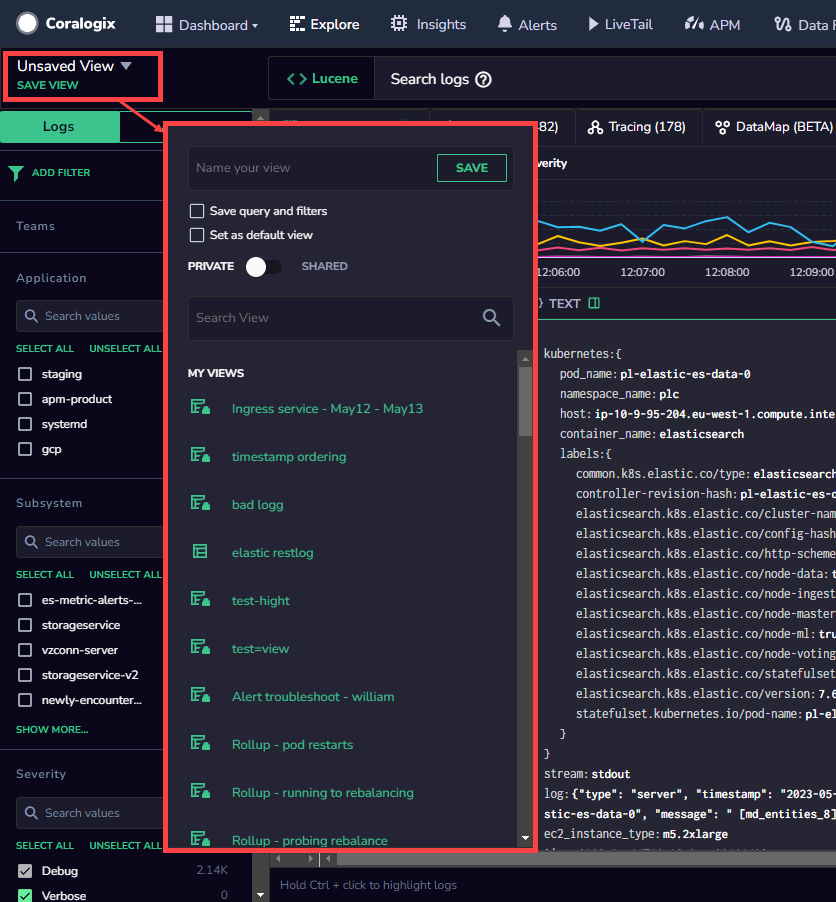

### **Custom Views**

The Explore Screen’s Custom views feature helps organize specific, relevant log information, as well as views that help other users work and retrieve important data more efficiently.

A View is defined as a **[query](https://www.notion.so/21a742f9cbad46d3b131c5a6926fbd50?pvs=21)** that creates the initial logs set that the view starts with, and columns that define the log data that is visible. “Text” is a special column (or field) that holds the entire log (including metadata). Every field can be removed or added to a view.

### **Save Your Current View**

The SAVE VIEW button saves the current settings and customizations of the Explore Screen for use at a later time. This opens a window with options to give the view a name, as well as save the query and filter settings. There is also an option to save the current view as default.

The Private/Shared option allows the view to be kept private or shared between team members.

## Additional Resources

<table><tbody><tr><td>Documentation</td><td><a href="https://coralogixstg.wpengine.com/docs/explore-screen/"><strong>Explore Screen</strong></a></td></tr></tbody></table>

## Support

**Need help?**

Our world-class customer success team is available 24/7 to walk you through your setup and answer any questions that may come up.

Feel free to reach out to us **via our in-app chat** or by sending us an email at [support@coralogixstg.wpengine.com](mailto:support@coralogixstg.wpengine.com).
