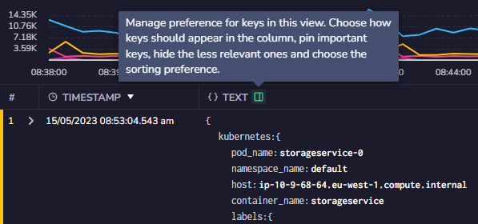
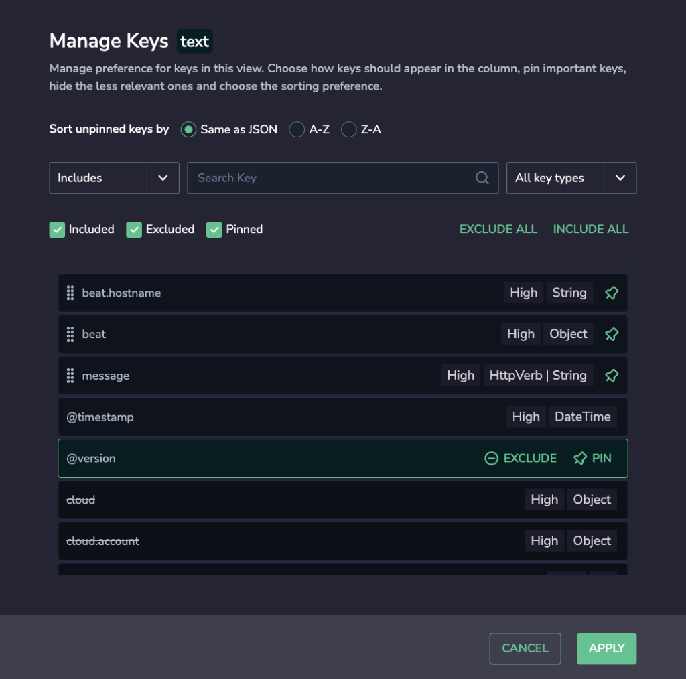
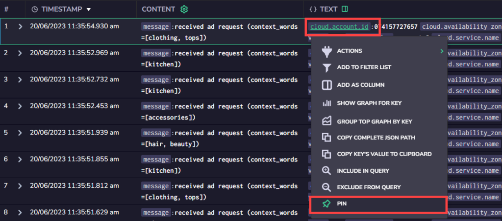

Personalize the columns presenting your log data using our **Manage Keys** feature.

## Manage Keys

The Manage Keys feature in the Explore Screen can be used to personalize the JSON keys layout, by clicking the column icon next to the column header. This will open the Manage Keys box, allowing you to simplify the way you arrange your keys to view data. Select the keys you wish to view, pin and sort them, and save your view.

- **Sort.** Sort unpinned keys as in JSON format (that is, the order they appear in the JSON that appears in the column) or in ascending or descending alphabetical order.

- **Search**. Select the keys you wish to view by searching key type and / or using one of the following parameters: **STARTS WITH**, **INCLUDES**, or **EQUALS.**

- **PINNED / INCLUDED / EXCLUDED.** Select as many keys as you want and set them to be pinned to the top of the list of keys for easy access.
    - Hovering over a key will give you the option to include or exclude it from the list of keys to view (depending on its current state), and also the option to pin a key to the top of the list for easy access.
    
    - You also have the option to include or exclude all keys using the **EXCLUDE** **ALL KEYS** or **INCLUDE ALL KEYS** buttons.
    
    - For example, in the image below, there are three pinned keys, which can be accessed from above the list of included keys without the need to search for them. There are also two excluded keys which are shown towards the bottom of the list.

It is also possible to pin keys directly from the grid, by clicking on the key, opening the context menu, and then selecting Pin from the menu.

## Additional Resources

| Documentation | [Explore Screen](https://coralogixstg.wpengine.com/docs/explore-screen/) |
| --- | --- |

## Support

**Need help?**

Our world-class customer success team is available 24/7 to walk you through your setup and answer any questions that may come up.

Feel free to reach out to us **via our in-app chat** or by sending us an email at [support@coralogixstg.wpengine.com](mailto:support@coralogixstg.wpengine.com).
