The **Coralogix Explore Screen** is a powerful and user-friendly interface designed to provide a comprehensive view of your telemetry data. With its intuitive layout and well-organized presentation, users can effortlessly navigate through their data, gaining valuable insights into their system's behavior.

This tutorial walks you through exploring logs in your Explore Screen.

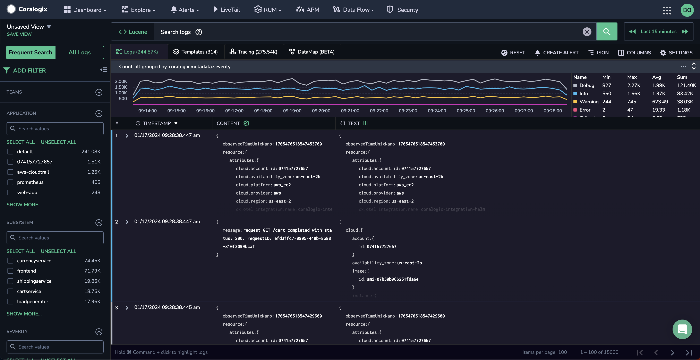

## Overview

Use the Explore screen to:

- Filter and query your telemetry data to pinpoint specific data points.

- View, filter, and data of all TCO priorities.

- Correlate logs and traces to identify cause-and-effect relationships, track the flow of events, and recognize how various system components interact.

- Create new alerts for your data directly from the Explore screen.

## Filter Your Data

### Filter Using Predefined Parameters

In the left-hand sidebar, filter your data by any of the following parameters:

- [teams](https://coralogixstg.wpengine.com/docs/user-team-management/)

- [application](https://coralogixstg.wpengine.com/docs/application-and-subsystem-names/) and [subsystem](https://coralogixstg.wpengine.com/docs/application-and-subsystem-names/)

- severity

The Filters section shows the count-per-filter value at the side of each filter option. This shows how many results will appear when each filter is applied. It also provides a way to generate a count distribution graph for the filtered key using the graph icon that appears when you hover over a heading.

### Filter Using Keywords

Add filters using keyword fields by clicking ADD FILTER at the top of the filter section or by clicking on a JSON field and selecting ADD TO FILTER LIST in the dropdown menu.

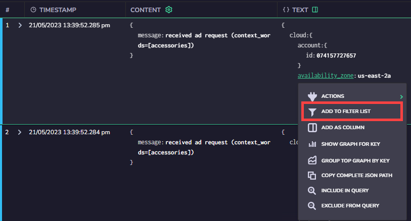

### Time Selection

Select the time range for your query using the data range dropdown on the upper right-hand side of the browser window.

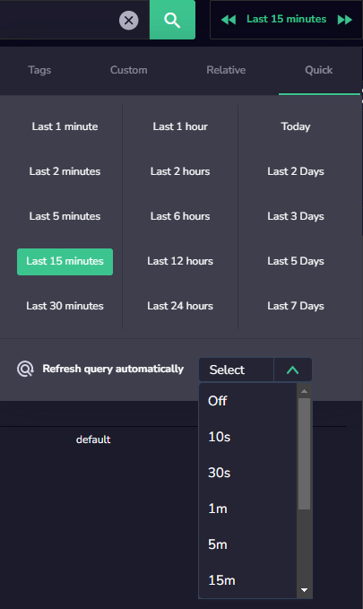

The default time period is the last 15 minutes. It can be modified and filtered using the following:

- **Tags:** Allow you to search for an [application tag](https://coralogixstg.wpengine.com/docs/software-builds-display/) and find all logs associated with it

- **Custom:** Choose an absolute date/time range to filter.

- **Relative:** Choose a time window between (current time – t1) and (current time – t2). Intervals are set in hours, minutes, and seconds.

- **Quick:** Select a predefined query interval with one click. Intervals are set in minutes, hours, and days.

Dragging the mouse across a section of the logs flow graph zooms into the previous query time range and sets a new time interval.

## Query Your Data

Easily query your logs with our state-of-the-art functionalities.

### **Frequent Search / All Logs**

In the left-hand panel, you can execute a default query of your [frequent search](https://coralogixstg.wpengine.com/docs/optimize-log-management-costs/#frequent-search-data-high-priority) (high-priority) logs or query all logs - [compliance](https://coralogixstg.wpengine.com/docs/optimize-log-management-costs/#compliance-data-low-priority) (low priority), [monitoring](https://coralogixstg.wpengine.com/docs/optimize-log-management-costs/#monitoring-data-medium-priority) (medium priority), and [frequent search](https://coralogixstg.wpengine.com/docs/optimize-log-management-costs/#frequent-search-data-high-priority) (high priority) logs.

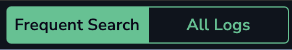

### Logs Query

[Query your logs](https://coralogixstg.wpengine.com/docs/log-query-simply-retrieve-data/) using the “Search logs” entry field with the support of the logs screen dropdown menu that helps you build queries based on the log fields using Lucene or [DataPrime](https://coralogixstg.wpengine.com/docs/dataprime-cheat-sheet/) query languages.

When clicking on a JSON field value, a drop-down menu will open:

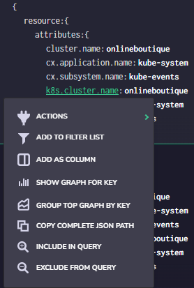

In this example, clicking on the option **INCLUDE IN QUERY** adds the expression ‘`_*exists_*: "resource.attributes.k8s.container.name"`’ to the query. Choosing the **EXCLUDE FROM QUERY** option adds the expression ‘`NOT_*exists_*: "resource.attributes.k8s.container.name"`’ to the query.

You can also copy the complete JSON path to the clipboard, which can help in building query expressions.

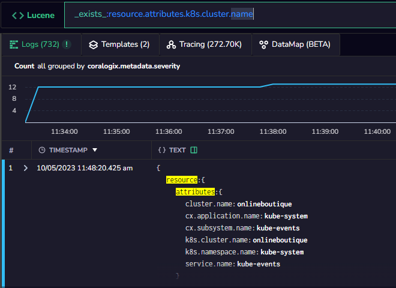

### Results Displayed

For every query, 15,000 logs are displayed. The logs can be displayed in either ascending or descending order based on the timestamp.

### Clear a Query

Clicking on the **x** to the right of the query string deletes the query string but does not affect the rest of the query parameters (filters and time window).

## Logs and Visualizations

### Data Types & Formatting

There are four tabs to the top left in this section:

- **Logs** – Log query results.

- **Templates** – [Loggregation templates](https://coralogixstg.wpengine.com/docs/what-is-coralogix-loggregation/) are logs automatically identified and clustered into the same type/origin.

- **Tracing** – View [distributed tracing](https://coralogixstg.wpengine.com/docs/distributed-tracing/) results.

- [DataMap (BETA)](https://coralogixstg.wpengine.com/docs/datamap/) – View and compose maps combining infrastructure, business metrics, and log data.

On the top right panel, there are five options:

- **Reset** – Clears all query parameters (including filters).

- **Create Alert** – This button brings up the Create Alert prompt, for creating [User-Defined Alerts](https://coralogixstg.wpengine.com/docs/coralogix-user-defined-alerts/).

- **Row Formatting** – Change the format of how the logs are displayed.
    - **1-Line** – logs are condensed into one line.
    
    - **2-Line** – logs are condensed into two lines.
    
    - **Condensed** – the entire log is visible in wrapped format.
    
    - **JSON** – the default view where JSON objects are parsed.
    
    - **List** – presents log data in an easy-to-read list of key-value pairs.

- **Columns** – see explanation of **Columns button** below.

- **Settings** – change the settings of the Explore page.

### **Custom and Saved Views**

[Custom views](http://www.coralogixstg.wpengine.com/docs/explore-screen-custom-views) help organize specific, relevant log information, as well as views that help other users work and retrieve important data more efficiently. You can also save your custom views for use at a future time. For more information, see [Explore Screen - Custom Views](http://www.coralogixstg.wpengine.com/docs/explore-screen-custom-views).

### **Expand Log Text**

If the log is in a view that can be expanded, clicking the arrow ‘**\>**’ icon or double-clicking on the log expands and shows the entire log message.

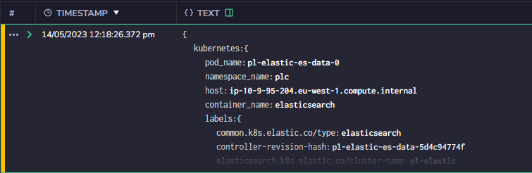

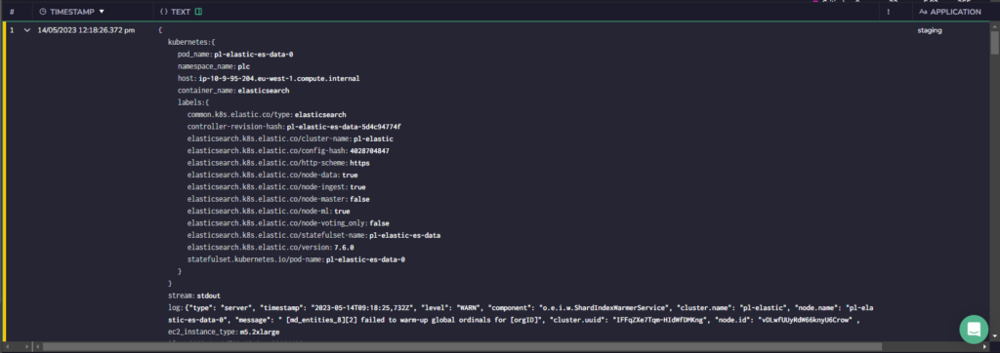

### View Surrounding Logs

In some cases, you may want to view the logs that occurred before and after a particular log to get additional context to better understand the log.

To view the logs surrounding a specific log:

**STEP 1.** Hover over the log number and click the three dots that appear.

**STEP 2.** Click VIEW SURROUNDING LOGS.

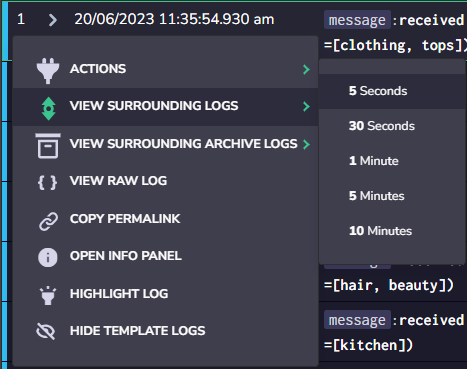

**STEP 3.** Select the time window for which to view the surrounding logs (5 seconds, 30 seconds, 1 minute, 5 minutes, or 10 minutes).

**Notes**:

- When surrounding logs are displayed, the log of interest is highlighted amongst all the results returned.

- However, if there are more than 15,000 results, and the timeline's log distribution means your specific log isn't within the first or last 15,000, it won't be highlighted since it's not part of the currently displayed results.

### **Manage Columns**

Clicking on the COLUMNS button opens the Manage Columns window. There, fields can be arranged between two lists by dragging them. The APPLY button updates the columns on the logs screen. The Manage Columns window can also be accessed from the SETTINGS menu.

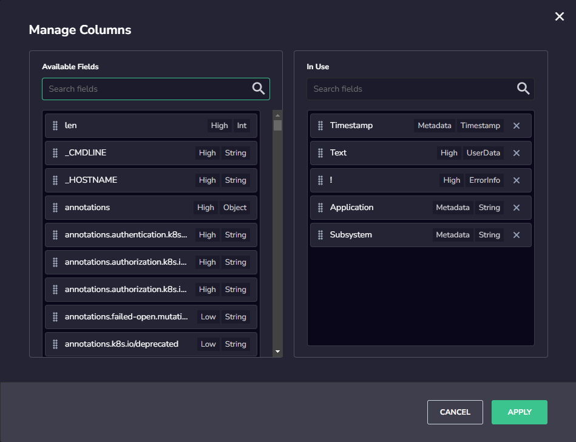

### **Manage Keys**

Use our [Manage Keys](https://coralogixstg.wpengine.com/docs/explore-screen-manage-keys) feature to personalize the JSON layout with fields, by clicking the column icon next to the Column header. This opens the Manage Keys box, allowing you to simplify the way you arrange your columns to view data. Select the keys you wish to view, pin and sort them, and save your view. Find out more [here](https://coralogixstg.wpengine.com/docs/explore-screen-manage-keys).

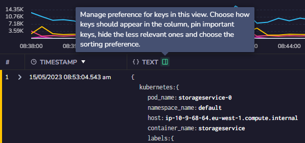

### **CONTENT Column**

Improve visibility for your log’s most important data by using the [CONTENT column](https://coralogixstg.wpengine.com/docs/explore-screen-content-column), which displays selected keys from your logs. Find out more [here](https://coralogixstg.wpengine.com/docs/explore-screen-content-column).

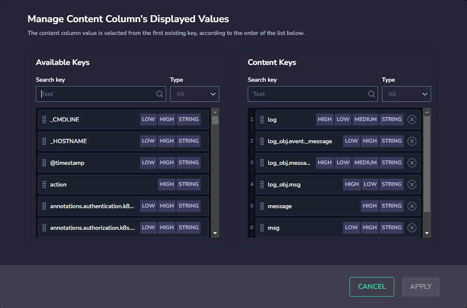

## APM Service Drill-Down

Smoothly transition from reviewing logs to exploring the service responsible for generating them in the [APM Service Drill-Down](https://coralogixstg.wpengine.com/docs/service-catalog/#service-drill-down).

Within the Service Drill-Down, you'll find a concise overview of the service and its associated metrics.

To access this feature, hover over the row number corresponding to the log you're interested in. Then, click on the ellipsis that appears and choose APM SERVICE DRILL-DOWN from the drop-down menu.

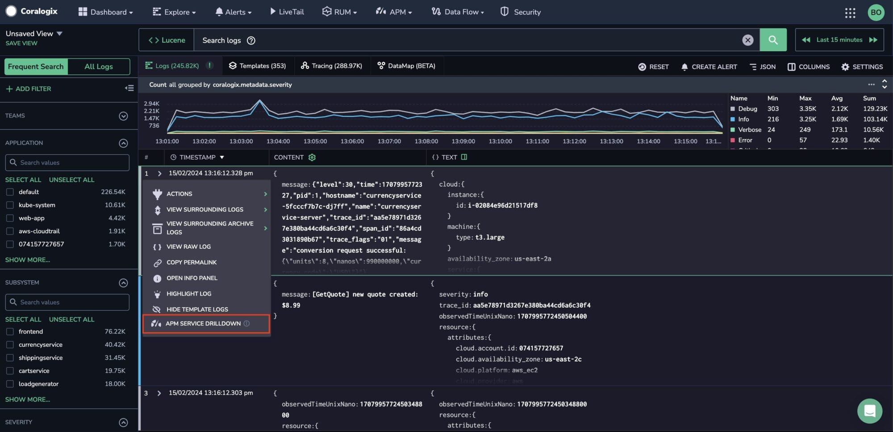

We recommend that your [subsystem name](https://coralogixstg.wpengine.com/docs/application-and-subsystem-names/#subsystem-name) reflect the service or application producing your logs, metrics, and traces. Without this naming in place, you will be rerouted to the [Service Catalog](https://coralogixstg.wpengine.com/docs/service-catalog/) page.

## Additional Resources

<table><tbody><tr><td>Documentation</td><td><strong><a href="https://coralogixstg.wpengine.com/docs/explore-screen-manage-keys">Manage Keys</a> <a href="https://coralogixstg.wpengine.com/docs/explore-screen-content-column">Content Column</a></strong> <strong><a href="http://www.coralogixstg.wpengine.com/docs/explore-screen-custom-views">Custom Views</a></strong></td></tr></tbody></table>

## **Support**

**Need help?**

Our world-class customer success team is available 24/7 to walk you through your setup and answer any questions that may come up.

Contact us **via our in-app chat** or by emailing [support@coralogixstg.wpengine.com](mailto:support@coralogixstg.wpengine.com).
