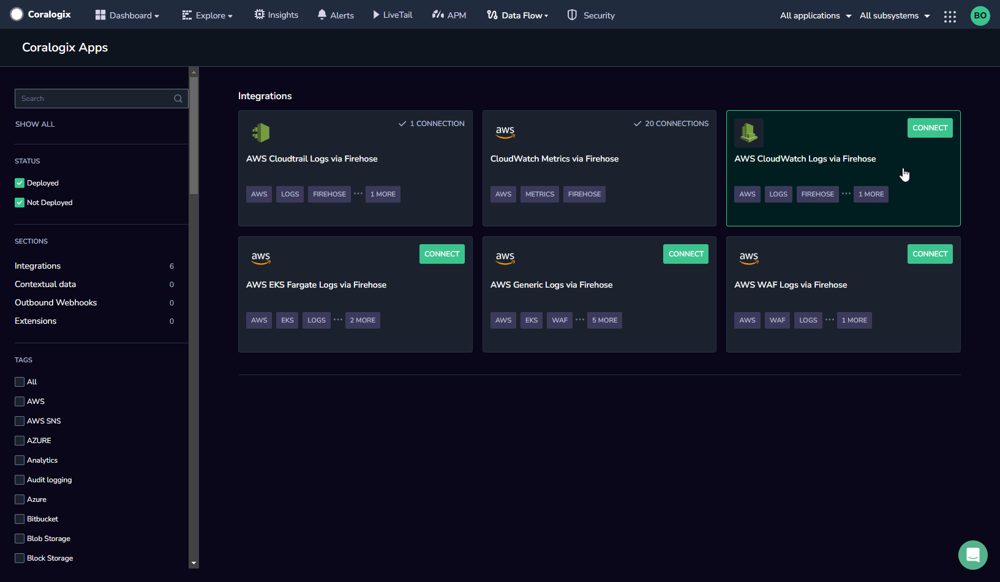
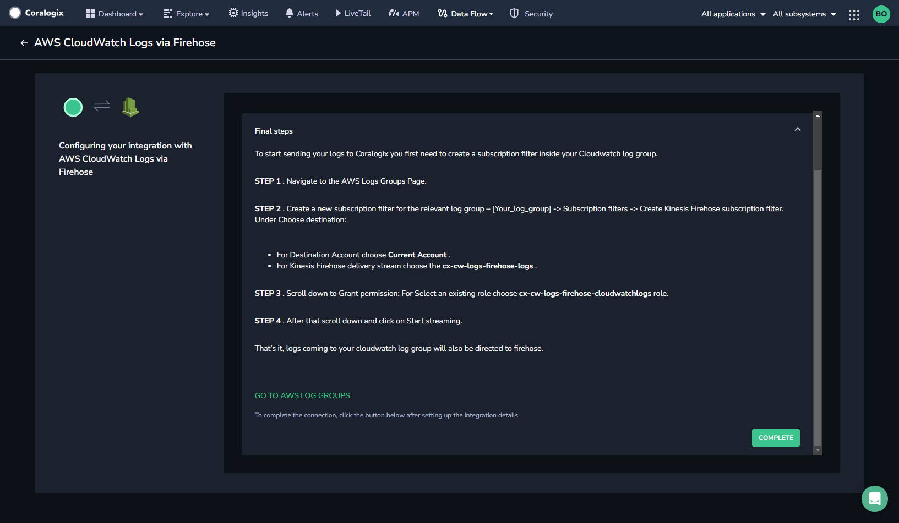

Streamline the process of ingesting and analyzing logs from your AWS resources using our automated **CloudWatch Logs using AWS Kinesis Data Firehose** integration package.

## Overview

AWS CloudWatch logs are records of events and data generated by various AWS resources, applications, and services. These logs play a crucial role in monitoring and troubleshooting your AWS environment. They provide insights into system behavior, errors, and operational performance, allowing you to detect issues, analyze trends, and ensure the reliability and security of your applications.

## Benefits

- Gain deeper insights, conduct advanced analytics, set up proactive alerting, and monitor your AWS CloudWatch logs in real time, enhancing your ability to troubleshoot and maintain optimal system performance.

- Using AWS Kinesis Data Firehose streamlines the data delivery process by providing a reliable and scalable data transfer mechanism. It ensures that your log data reaches Coralogix with minimal latency and no loss of data.

## **Configuration**

**STEP 1**. From your Coralogix toolbar, navigate to **Data Flow** > **Integrations**.

**STEP 2.** In the Integrations section, select **AWS CloudWatch Logs via Firehose**.

**STEP 3.** Click **ADD NEW**.

**STEP 4.** Input your integration details.

- **Integration Name.** Enter a name for your integration. This will be used as a stack name in CloudFormation.

- **API Key**. Enter your [Send-Your-Data API key](https://www.notion.so/d6f178687d464c58b9988fe223c719cc?pvs=21) or click **CREATE A NEW KEY** to create a new API key for the integration.

- **Application Name.** Enter an [application name](https://coralogixstg.wpengine.com/docs/application-and-subsystem-names/). The default name is AWS.

- **Subsystem Name.** Enter a [subsystem name](https://coralogixstg.wpengine.com/docs/application-and-subsystem-names/). The default name is Firehose.

- **Kinesis Stream ARN**. \[**Optional**\] Enter the ARN of the Kinesis stream if using Amazon Kinesis Data Streams as source for logs.

- **AWS Region.** Select your AWS region from the dropdown menu.

- **AWS PrivateLink (Advanced Settings)**. Enabling AWS PrivateLink is **recommended** to ensure a secure and private connection between your VPCs and AWS services. Find out more [here](https://coralogixstg.wpengine.com/docs/coralogix-amazon-web-services-aws-privatelink-endpoints/).

**STEP 6.** Click **NEXT**.

**STEP 7.** Review the instructions for your integration. Click **CREATE CLOUDFORMATION**.

**STEP 8.** You will be rerouted to the AWS website. Verify that all of the auto pre-populated values are correct. Click **Create Stack**.

**STEP 9.** Return to the Coralogix application, where you will be given instructions on creating a subscription filter inside your CloudWatch log group.

**Notes**:

If you provide a Kinesis Stream ARN, Coralogix assumes that the data is in the stream and does not provide any additional instructions. It is the user’s responsibility to deliver data to the stream. Instead of the instructions, you will see a message that prompts the user to confirm the integration.

**STEP 10**. Click **COMPLETE** to close the module.

**STEP 11.** \[**Optional**\] Deploy the [extension package](https://coralogixstg.wpengine.com/docs/extension-packages/) of your choice to complement your integration needs. We offer the following extensions for data originating from CloudTrail and WAF:

- AWS CloudTrail

- AWS WAF

**STEP 12.** View the logs by navigating to **Explore** > **Logs** in your Coralogix toolbar. Find out more [here](https://coralogixstg.wpengine.com/docs/logs-screen/).

## Additional Resources

<table><tbody><tr><td>Documentation</td><td><a href="https://coralogixstg.wpengine.com/docs/guide-first-steps-coralogix/"><strong>Getting Started with Coralogix</strong></a></td></tr></tbody></table>

## Support

**Need help?**

Our world-class customer success team is available 24/7 to walk you through your setup and answer any questions that may come up.

Feel free to reach out to us **via our in-app chat** or by sending us an email at [support@coralogixstg.wpengine.com](mailto:support@coralogixstg.wpengine.com).
