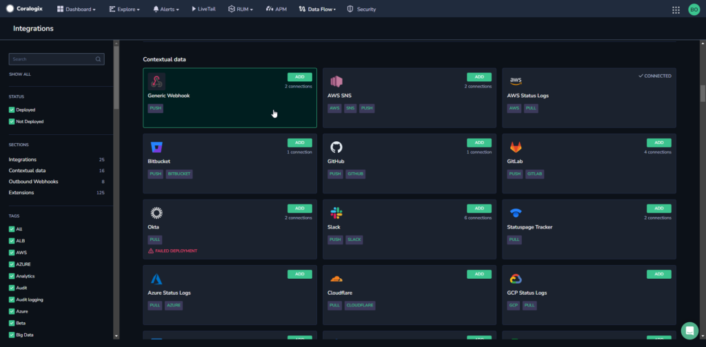
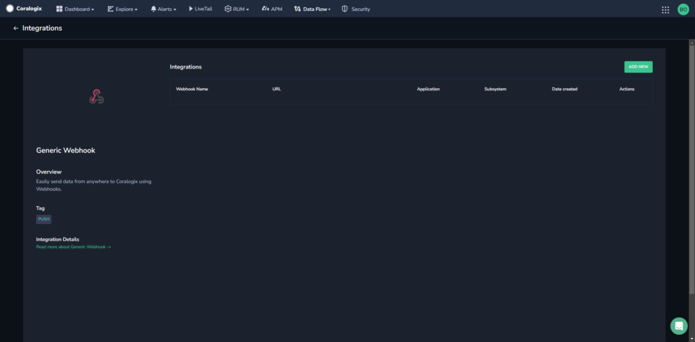
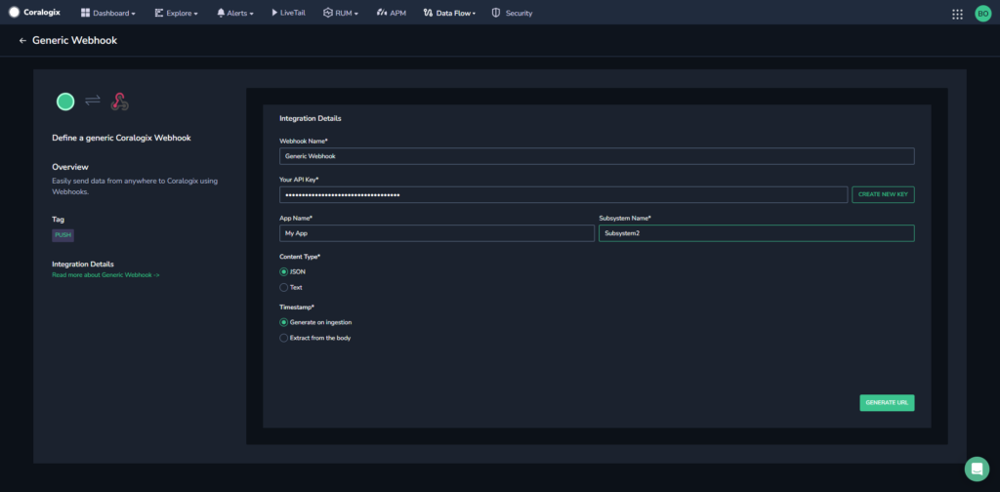
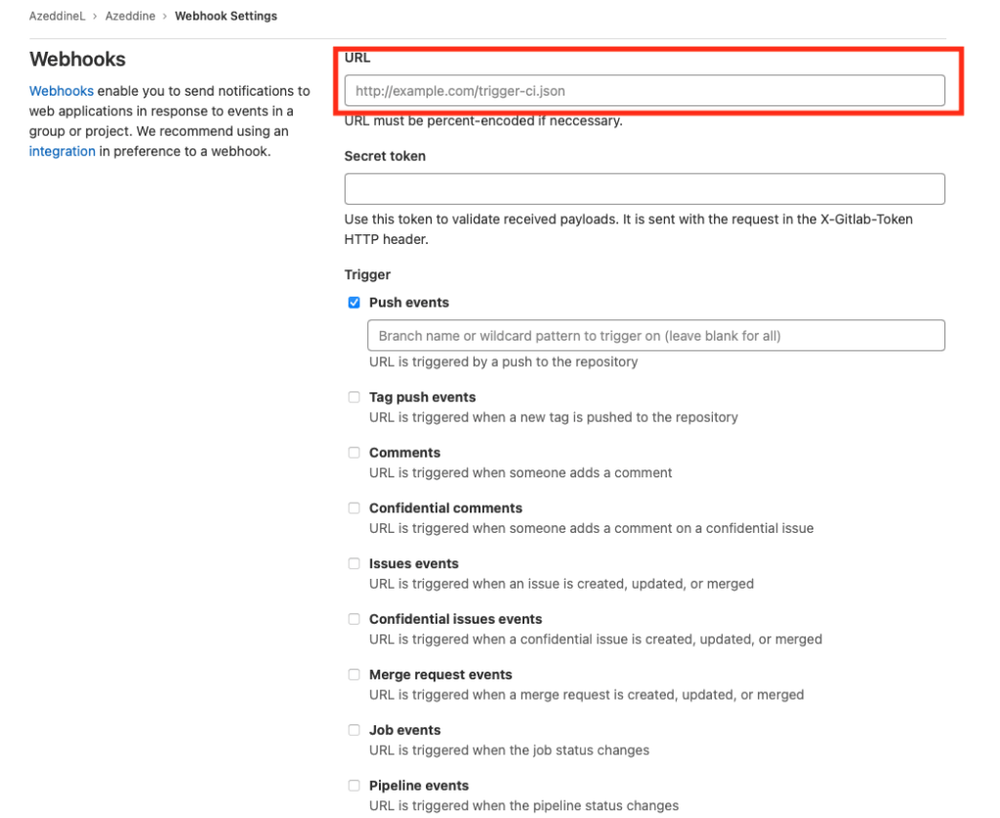

Coralogix offers customers the option of automating the creation of their incoming webhooks to connect their applications to Coralogix.

## Overview

Use our incoming webhooks to simplify the process of generating a webhook URL to connect your applications to Coralogix. This feature enables you to automatically generate the webhook URL necessary to send us your telemetry and expands the selection of applications available for this purpose.

## Intended Usage

Avoid utilizing incoming webhooks for high-traffic scenarios due to the latency overhead associated with each request. Standard log endpoints, such as [singles](https://coralogixstg.wpengine.com/docs/rest-api-singles/), offer better performance in such cases.

## Configuration

**STEP 1.** In your Coralogix navigation pane, click **Data Flow** > **Contextual Data**.

**STEP 2.** In the **Contextual Data** section, click **Generic Webhook** **ADD**.

**STEP 3.** Click **ADD NEW**.

**STEP 4.** Fill in the integration details:

- **Webhook Name:** Name your webhook.

- **Your API Key.** Click **CREATE NEW KEY** to generate an API Key and name it.

- Enter an [**Application**](https://coralogixstg.wpengine.com/docs/application-and-subsystem-names/) and [**Subsystem Name**](https://coralogixstg.wpengine.com/docs/application-and-subsystem-names/) to use in the webhook.

- **Content Type**. Select either **JSON** or **Text**. If JSON is selected, the webhook expects requests with content-type as either `application/json` or `application/x-ndjson`.

- **Timestamp**. Select whether to generate the timestamp using the system time when the event was ingested or to extract it from the body of the event.
    - If extracting from the body of the event, select whether to extract using a **Path** or **Regex**. Generally when the content type is JSON, the extraction will use a path, and when the content is text, the extraction will use Regex.
    
    - Enter the path or Regex to use to extract the timestamp.

**STEP 5.** Click **GENERATE URL**. The URL for the webhook will be automatically created. Copy and paste into the relevant application.

For example, to create an incoming webhook with [GitLab](https://coralogixstg.wpengine.com/docs/gitlab-data-ingestion/), you would paste the URL into the highlighted field, as in the following image.

**NOTE:** If you are working in Secure Mode, you will be able to download the URL once, when you first generate it, and the URL will appear masked in the system.

## Additional Resources

<table><tbody><tr><td>Documentation</td><td><strong><a href="https://coralogixstg.wpengine.com/docs/extension-packages/">Extension Packages</a></strong></td></tr></tbody></table>

## Support

**Need help?**

Our world-class customer success team is available 24/7 to walk you through your setup and answer any questions that may come up.

Feel free to reach out to us **via our in-app chat** or by sending us an email at [support@coralogixstg.wpengine.com](mailto:support@coralogixstg.wpengine.com).
