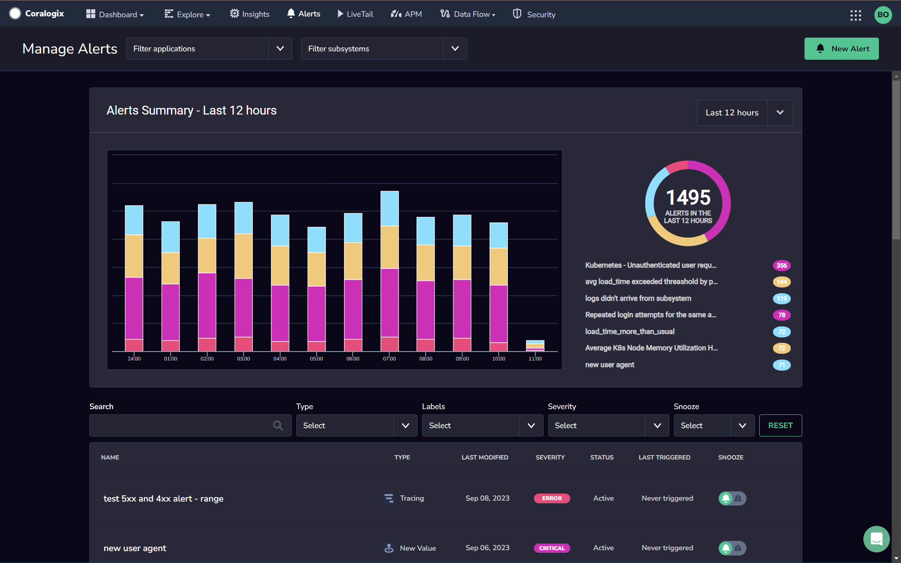
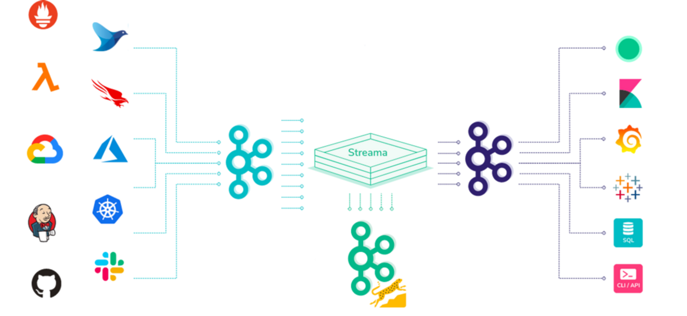

**Coralogix** **Alerts** allow for timely detection of anomalies, proactive incident response, improved mean time to resolution (MTTR), reduced manual monitoring effort, customization and flexibility. Powered by machine learning, our alerts proactively notify teams of potential problems, correlate incidents, and provide root cause analysis. By reducing response fatigue and prioritizing incidents for immediate action, Coralogix Alerts is an indispensable tool for maintaining optimal performance.

## Overview

Alerting refers to the practice of setting up automated notifications or alarms that trigger when certain predefined conditions or thresholds are met. These conditions can be related to the performance, health, or behavior of the systems, applications, or infrastructure being monitored. The main purpose of alerting is to promptly notify you - DevOps teams and developers - when something unusual or problematic occurs, so you can take appropriate actions to resolve the issue before it escalates.

Use our alerting capabilities for any of the following:

- **Timely Detection of Anomalies.** Alerting allows organizations to detect anomalies and issues in real-time or near real-time. This helps to identify problems early on, reducing the impact on users and preventing more severe consequences.

- **Proactive Incident Response.** By providing immediate notifications, alerting enables teams to take proactive actions to address issues before they become critical incidents. This minimizes downtime and ensures better system reliability.

- **Improved Mean Time to Resolution (MTTR).** Prompt alerts allow you to respond quickly to incidents, leading to faster resolution times. This helps in reducing the mean time to resolution and, consequently, improving the overall system uptime and performance.

- **Reduced Manual Monitoring Effort.** Without alerting, teams would need to manually monitor systems constantly, which is impractical and error-prone. Automating alerting saves time and effort by flagging issues automatically.

- **Customization and Flexibility.** Define specific thresholds and conditions based on your knowledge of your system's behavior, ensuring that they receive relevant alerts tailored to your needs.

## **How Streama Enables In-Stream Machine Learning Alerting**

Our alerts are powered by our [Streama© technology](https://coralogixstg.wpengine.com/how-it-works/), which enables automatic triggering of your alerts as part of the streaming process, without prior indexing. In other words, we process your data first and delay storage and indexing until all important decisions have been made. This gives you the value of alerting without paying for the expensive cost of Frequent Search Indexing. Using this technology, our alerts automatically learn your system and adapt to your evolving infrastructure, allowing for rapid setup that can track thousands of components and proactively alert on deviations from the norm.

## How Alerting Works

Check out this high-level workflow of how alerts are generated, triggered, and delivered to users.

**STEP 1**. **Setting Alert Rules**

Administrators, developers, or DevOps define alert rules within the observability platform. These rules specify the conditions under which an alert should be triggered. For instance, they might set a rule to alert when the CPU usage exceeds a certain threshold or when specific error messages appear in the logs.

**STEP 2**. **Data Collection and Analysis**

The Coralogix platform continuously collects data from the system, including logs, metrics, and traces. It processes and analyzes this data against the defined alert rules.

**STEP 3**. **Alert Triggering**

When the monitored data meets the conditions specified in the alert rules, an alert is triggered. This could be a sudden spike in error rates, high latency, low resource availability, or any other predefined anomaly.

**STEP 4**. **Alert Aggregation and Deduplication**

The alerting system may aggregate multiple similar alerts into a single notification to prevent overwhelming users with redundant notifications. Also, it may deduplicate alerts to avoid bombarding users with repetitive information.

**STEP 5**. **Notification and Escalation**

Once an alert is triggered and processed, the system sends notifications to the designated users or teams. Notifications can be delivered through various channels such as email, Slack, SMS, or integrated incident management platforms. If the situation remains unresolved, the alert may be escalated to higher-level teams or individuals.

**STEP 6**. **Alert Resolution and Acknowledgment**

The recipients of the alert acknowledge the alert and take appropriate actions to address the issue. Once the problem is resolved, they mark the alert as “Done” within the platform.

**STEP 7.** **Monitoring and Reporting**

Throughout the alerting process, the observability platform continuously monitors the system's status. It may keep track of acknowledgment status, resolution time, and other metrics to generate reports and help with post-incident analysis and improvement.

## What We Offer

Choose from any of the following alerts:

- [Standard Alert](https://coralogixstg.wpengine.com/docs/coralogix-user-defined-alerts/). Triggered by crossing a set quantity threshold of specific logs, this feature allows you to monitor system performance, get notified when changes occur, and instantly pinpoint potential causes.

- [Metric Alert](https://coralogixstg.wpengine.com/docs/metric-alerts-promql/). This monitoring alert triggers based on the values of metrics exceeding or falling below predefined thresholds. It is commonly used to detect performance issues, resource constraints, or abnormal behavior within a system, allowing administrators to take prompt actions to address potential problems.

- [Machine-Learning Metric Alert](https://coralogixstg.wpengine.com/docs/machine-learning-metric-alert/). This utilizes advanced artificial intelligence algorithms to analyze incoming metric time series and predict their expected behavior for the next 24 hours. By establishing a baseline for normal behavior, this powerful capability enables you to proactively identify anomalies in real-time.

- [Tracing Alert](https://coralogixstg.wpengine.com/docs/tracing-alert/). Coralogix allows you not only to visualize your traces, but also set alerts on them. Our tracing alert allows you to be alerted automatically of specific tags and services on the basis of a specified latency.

- [Flow Alert](https://coralogixstg.wpengine.com/docs/flow-alert/). This alert is designed to notify you when any combination of alert events occurs in a specific sequence within a defined timeframe. For example, to be notified of an increase in HTTP error rate caused by high CPU utilization, a Flow Alert should be configured to trigger when a high CPU utilization alert is followed by a high HTTP error rate alert within a defined timeframe.

- [Time Relative Alert](https://coralogixstg.wpengine.com/docs/time-relative-alerts/). Automatically detect abnormal behavior in your system using this alert, which is triggered when a fixed ratio reaches a set threshold compared to a past time frame. Use this feature to receive automatic alerts regarding changes in your system’s security, operations, and / or business behaviors over time. Then compare between each behavior across different time periods.

- [Unique Count Alert](https://coralogixstg.wpengine.com/docs/unique-count-alert/). This triggers when the number of distinct or unique values in a specific metric or field exceeds a predefined threshold. It helps detect situations where a sudden increase or decrease in unique values may indicate potential anomalies or unexpected behavior within the system.

- [Ratio Alert](https://coralogixstg.wpengine.com/docs/ratio-alerts/). Ratio alerts allow you to easily calculate a ratio between two log queries and trigger an alert when the ratio reaches a set threshold.

- [New Value Alert](https://coralogixstg.wpengine.com/docs/new-value-alerts/). This alert is triggered by the first occurrence of a new value within a time interval. All values are tested against a list that is being dynamically created while the alert is active. The alert is set by a specific query to identify a subset of logs (if needed), is and defined with a key of choice to track for new values within the desired interval.

## Get Started

**STEP 1**. [Sign up](https://dashboard.eu2.coralogixstg.wpengine.com/#/signup) for a Coralogix account if you haven’t already done so.

**STEP 2**. Send your data to Coralogix using our two-step, out-of-the box [integration packages](https://coralogixstg.wpengine.com/docs/integration-packages/) or select from our full list of [integrations](https://coralogixstg.wpengine.com/integrations/). Many of our integration packages allow you to deploy our associated [extension packages](https://coralogixstg.wpengine.com/docs/extension-packages/), unlocking a set of predefined dashboards, alerting and parsing rules, allowing you to jumpstart your Coralogix monitoring.

Find out more on our [Getting Started with Coralogix](https://coralogixstg.wpengine.com/docs/guide-first-steps-coralogix/) page.

**STEP 3**. Set up your alerts. Use our [extension packages](https://coralogixstg.wpengine.com/docs/extension-packages/) for deploying predefined alerts or manual setup.

### Coralogix Alerts API

Optionally, you can set up our [Alerts API](https://coralogixstg.wpengine.com/docs/alerts-api/). This enables you to create alerts that actively check system performance and notify you when there are changes to your data. Our Alerts API allows you to define, query, and manage your alerts programmatically, creating a powerful, dynamic alerting experience that can adapt.

## Support

**Need help?**

Our world-class customer success team is available 24/7 to walk you through your setup and answer any questions that may come up.

Feel free to reach out to us **via our in-app chat** or by sending us an email at [support@coralogixstg.wpengine.com](mailto:support@coralogixstg.wpengine.com).
