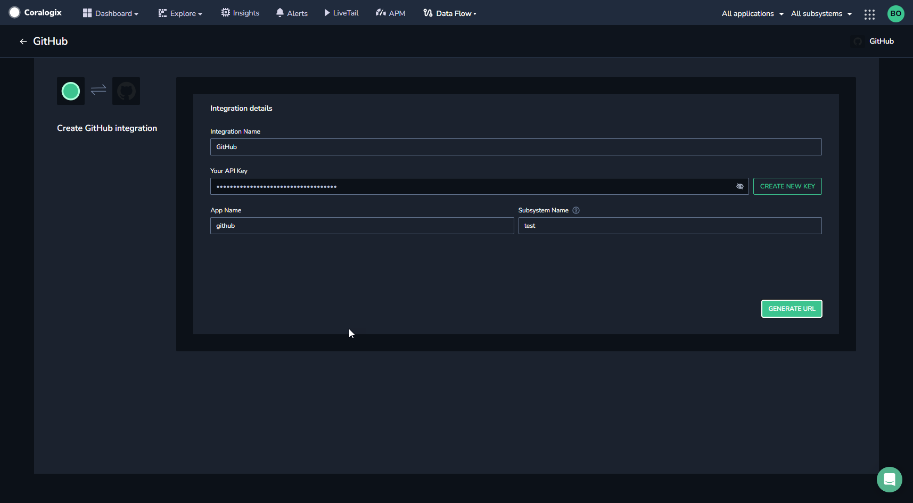
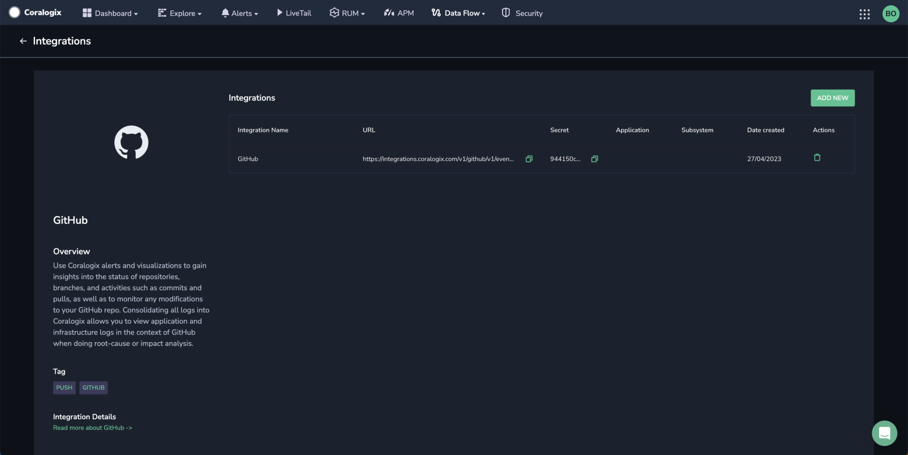
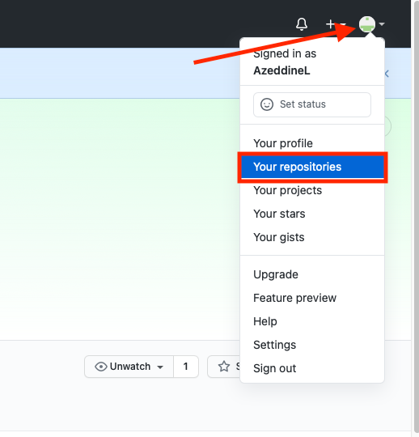
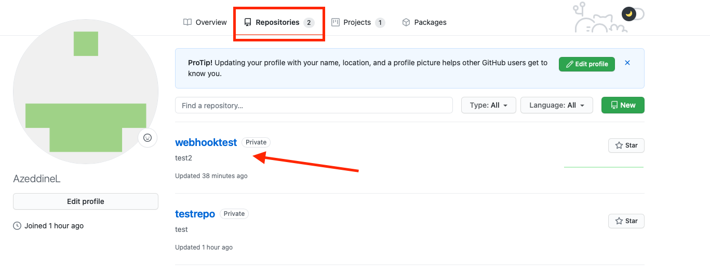
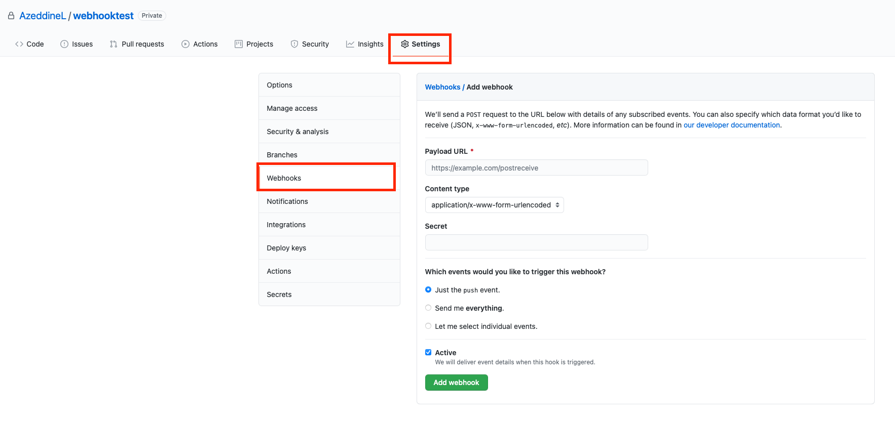

Collect your GitHub messages in the Coralogix platform using our automatic **Contextual Data Integration Package**. The package automatically generates a URL to be used when creating a GitHub webhook.

## Overview

GitHub is a widely used web-based platform designed for version control, software development collaboration, and code hosting. It allows developers to efficiently manage and track changes to their codebase using the Git version control system. GitHub provides a range of features including repositories for code storage, issue tracking, pull requests for code review, continuous integration, and a collaborative environment for teams to work together on projects. It's a hub for open-source and private development, enabling individuals and teams to contribute, collaborate, and maintain high-quality software projects.

Sending your GitHub logs to Coralogix streamlines log management, augments development monitoring, and enhances issue resolution. By routing GitHub logs into Coralogix, you gain a consolidated view of your code repository activities, enabling rapid anomaly detection, proactive debugging, and data-driven decision-making. This integration empowers development teams to optimize workflows, strengthen system reliability, and sustain operational effectiveness, utilizing Coralogix's analytics, alerts, and visualization tools to extract valuable insights from GitHub logs and ensure a seamless and resilient software development lifecycle.

## Get Started

**STEP 1.** In your navigation pane, click **Data Flow** > **Contextual Data**.

**STEP 2.** In the **Contextual Data** section, select **GitHub** and click **+** **ADD**.

**STEP 3.** Click **ADD NEW**.

**STEP 4.** Fill in the **Integration Details**:

- **Name.** Name your integration.

- **Your API Key**. Click **CREATE NEW KEY** to generate an API key and name it.

- **Application Name and Subsystem Name**. Enter an [application and subsystem name](https://coralogixstg.wpengine.com/docs/application-and-subsystem-names/).



**STEP 5.** Click **GENERATE URL**. The URL for the integration will be automatically created. Use this when creating a GitHub webhook.



**STEP 6**. Copy the **Secret** to be used as a shared secret in GitHub when creating the GitHub webhook.

## **Create a GitHub Webhook**

Create a GitHub webhook using your URL.

**STEP 1**. Log in to your GitHub account.

**STEP 2.** If you do not have a project, create one and create a repository under this project. If you have already done that, move to the next step.

**STEP 3.** In the top right corner, click on your name and select your repositories tab.



**STEP 4.** Select the repository to which you want to add the webhook integration.



**STEP 5.** Click **Settings** > **Webhooks**.



**STEP 6.** Complete the **Add webhook** form and select the events that should trigger the webhook.

- Copy the URL generated by the Coralogix integration.

- Set **Content type**: application/json

- Copying the API key to the **Secret** field.

**STEP 7.** Click **Add webhook**.

## Example Log

```json
{
  "github": {
    "ref": "refs/heads/main",
    "before": "02b0534caddfd9d221cc6ac61f6b6f7c226336a3",
    "after": "15cb0605d8097d645036c499ca84253e75d7367f",
    "repository": {
      "id": 323160153,
      "node_id": "MDEwOlJlcG9zaXRvcnkzMjMxNjAxNTM=",
      "name": "my_first_repo",
      "full_name": "test/my_first_repo",
      "private": true,
      "owner": {
        "name": "test",
        "email": "111111+test@users.noreply.github.com",
        "login": "test",
        "id": 11111111,
        "node_id": "MDQ6VXNlcjc2NDA4Mzcw",
        "avatar_url": "https://avatars.githubusercontent.com/u/11111111?v=4",
        "gravatar_id": "",
        "url": "https://api.github.com/users/test",
        "html_url": "https://github.com/test",
        "followers_url": "https://api.github.com/users/test/followers",
        "following_url": "https://api.github.com/users/test/following{/other_user}",
        "gists_url": "https://api.github.com/users/test/gists{/gist_id}",
        "starred_url": "https://api.github.com/users/test/starred{/owner}{/repo}",
        "subscriptions_url": "https://api.github.com/users/test/subscriptions",
        "organizations_url": "https://api.github.com/users/test/orgs",
        "repos_url": "https://api.github.com/users/test/repos",
        "events_url": "https://api.github.com/users/test/events{/privacy}",
        "received_events_url": "https://api.github.com/users/test/received_events",
        "type": "User",
        "site_admin": false
      },
      "html_url": "https://github.com/test/my_first_repo",
      "description": "It just for testing",
      "fork": false,
      "url": "https://github.com/test/my_first_repo",
      "forks_url": "https://api.github.com/repos/test/my_first_repo/forks",
      "keys_url": "https://api.github.com/repos/test/my_first_repo/keys{/key_id}",
      "collaborators_url": "https://api.github.com/repos/test/my_first_repo/collaborators{/collaborator}",
      "teams_url": "https://api.github.com/repos/test/my_first_repo/teams",
      "hooks_url": "https://api.github.com/repos/test/my_first_repo/hooks",
      "issue_events_url": "https://api.github.com/repos/test/my_first_repo/issues/events{/number}",
      "events_url": "https://api.github.com/repos/test/my_first_repo/events",
      "assignees_url": "https://api.github.com/repos/test/my_first_repo/assignees{/user}",
      "branches_url": "https://api.github.com/repos/test/my_first_repo/branches{/branch}",
      "tags_url": "https://api.github.com/repos/test/my_first_repo/tags",
      "blobs_url": "https://api.github.com/repos/test/my_first_repo/git/blobs{/sha}",
      "git_tags_url": "https://api.github.com/repos/test/my_first_repo/git/tags{/sha}",
      "git_refs_url": "https://api.github.com/repos/test/my_first_repo/git/refs{/sha}",
      "trees_url": "https://api.github.com/repos/test/my_first_repo/git/trees{/sha}",
      "statuses_url": "https://api.github.com/repos/test/my_first_repo/statuses/{sha}",
      "languages_url": "https://api.github.com/repos/test/my_first_repo/languages",
      "stargazers_url": "https://api.github.com/repos/test/my_first_repo/stargazers",
      "contributors_url": "https://api.github.com/repos/test/my_first_repo/contributors",
      "subscribers_url": "https://api.github.com/repos/test/my_first_repo/subscribers",
      "subscription_url": "https://api.github.com/repos/test/my_first_repo/subscription",
      "commits_url": "https://api.github.com/repos/test/my_first_repo/commits{/sha}",
      "git_commits_url": "https://api.github.com/repos/test/my_first_repo/git/commits{/sha}",
      "comments_url": "https://api.github.com/repos/test/my_first_repo/comments{/number}",
      "issue_comment_url": "https://api.github.com/repos/test/my_first_repo/issues/comments{/number}",
      "contents_url": "https://api.github.com/repos/test/my_first_repo/contents/{+path}",
      "compare_url": "https://api.github.com/repos/test/my_first_repo/compare/{base}...{head}",
      "merges_url": "https://api.github.com/repos/test/my_first_repo/merges",
      "archive_url": "https://api.github.com/repos/test/my_first_repo/{archive_format}{/ref}",
      "downloads_url": "https://api.github.com/repos/test/my_first_repo/downloads",
      "issues_url": "https://api.github.com/repos/test/my_first_repo/issues{/number}",
      "pulls_url": "https://api.github.com/repos/test/my_first_repo/pulls{/number}",
      "milestones_url": "https://api.github.com/repos/test/my_first_repo/milestones{/number}",
      "notifications_url": "https://api.github.com/repos/test/my_first_repo/notifications{?since,all,participating}",
      "labels_url": "https://api.github.com/repos/test/my_first_repo/labels{/name}",
      "releases_url": "https://api.github.com/repos/test/my_first_repo/releases{/id}",
      "deployments_url": "https://api.github.com/repos/test/my_first_repo/deployments",
      "created_at": 1608496588,
      "updated_at": "2021-07-16T07:39:25Z",
      "pushed_at": 1626421494,
      "git_url": "git://github.com/test/my_first_repo.git",
      "ssh_url": "git@github.com:test/my_first_repo.git",
      "clone_url": "https://github.com/test/my_first_repo.git",
      "svn_url": "https://github.com/test/my_first_repo",
      "homepage": null,
      "size": 0,
      "stargazers_count": 0,
      "watchers_count": 0,
      "language": null,
      "has_issues": true,
      "has_projects": true,
      "has_downloads": true,
      "has_wiki": true,
      "has_pages": false,
      "forks_count": 0,
      "mirror_url": null,
      "archived": false,
      "disabled": false,
      "open_issues_count": 1,
      "license": null,
      "forks": 0,
      "open_issues": 1,
      "watchers": 0,
      "default_branch": "main",
      "stargazers": 0,
      "master_branch": "main"
    },
    "pusher": {
      "name": "test",
      "email": "111111+test@users.noreply.github.com"
    },
    "sender": {
      "login": "test",
      "id": 1111111,
      "node_id": "MDQ6VXNlcjc2NDA4Mzcw",
      "avatar_url": "https://avatars.githubusercontent.com/u/11111111?v=4",
      "gravatar_id": "",
      "url": "https://api.github.com/users/test",
      "html_url": "https://github.com/test",
      "followers_url": "https://api.github.com/users/test/followers",
      "following_url": "https://api.github.com/users/test/following{/other_user}",
      "gists_url": "https://api.github.com/users/test/gists{/gist_id}",
      "starred_url": "https://api.github.com/users/test/starred{/owner}{/repo}",
      "subscriptions_url": "https://api.github.com/users/test/subscriptions",
      "organizations_url": "https://api.github.com/users/test/orgs",
      "repos_url": "https://api.github.com/users/test/repos",
      "events_url": "https://api.github.com/users/test/events{/privacy}",
      "received_events_url": "https://api.github.com/users/test/received_events",
      "type": "User",
      "site_admin": false
    },
    "created": false,
    "deleted": false,
    "forced": false,
    "base_ref": null,
    "compare": "https://github.com/test/my_first_repo/compare/02b0534caddf...15cb0605d809",
    "commits": [
      {
        "id": "15cb0605d8097d645036c499ca84253e75d73611",
        "tree_id": "a28d049bbe7fd047cf9171b13f969750662d1211",
        "distinct": true,
        "message": "Update README.md",
        "timestamp": "2021-07-16T09:44:53+02:00",
        "url": "https://github.com/test/my_first_repo/commit/15cb0605d8097d645036c499ca84253e11111",
        "author": {
          "name": "test",
          "email": "11111111+test@users.noreply.github.com",
          "username": "test"
        },
        "committer": {
          "name": "GitHub",
          "email": "noreply@github.com",
          "username": "web-flow"
        },
        "added": [],
        "removed": [],
        "modified": [
          "README.md"
        ]
      }
    ],
    "head_commit": {
      "id": "15cb0605d8097d645036c499ca84253e75d73611",
      "tree_id": "a28d049bbe7fd047cf9171b13f969750662d1211",
      "distinct": true,
      "message": "Update README.md",
      "timestamp": "2021-07-16T09:44:53+02:00",
      "url": "https://github.com/test/my_first_repo/commit/15cb0605d8097d645036c499ca84253e7511111",
      "author": {
        "name": "test",
        "email": "11111111+test@users.noreply.github.com",
        "username": "test"
      },
      "committer": {
        "name": "GitHub",
        "email": "noreply@github.com",
        "username": "web-flow"
      },
      "added": [],
      "removed": [],
      "modified": [
        "README.md"
      ]
    }
  },
  "source_system": "github"
}
```
