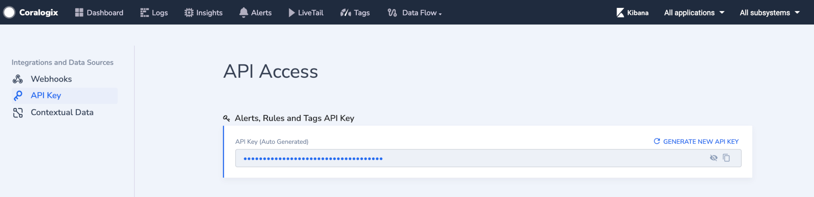

GitHub Actions allows you to perform numerous tasks automatically, including using the cURL command to insert a new tag when a release is made or when a pull request is closed for example.

This tutorial demonstrates how to build an automation that will create a new tag in Coralogix upon publishing a new release of your code.

## Coralogix Version Tags API Endpoint

This document includes cluster-dependent URLs.

Refer to the following table to select the correct Coralogix Version Tags API endpoint for the [domain](https://coralogixstg.wpengine.com/docs/coralogix-domain/) associated with your Coralogix account.

| **Domain** | **Region** | Endpoint |
| --- | --- | --- |
| coralogix.us | US1 | https://webapi.coralogix.us/api/v1/external/tags/ |
| coralogixstg.wpengine.com | EU1 | https://webapi.coralogixstg.wpengine.com/api/v1/external/tags/ |
| eu2.coralogixstg.wpengine.com | EU2 | https://webapi.eu2.coralogixstg.wpengine.com/api/v1/external/tags/ |
| app.coralogix.in | AP1 (IN) | https://webapi.app.coralogix.in/api/v1/external/tags/ |
| coralogixsg.com | AP2 (SG) | https://webapi.coralogixsg.com/api/v1/external/tags/ |

## Tutorial

**STEP 1**. Create your Action as a .yml file inside our repository in the workflows directory .github/workflows/my-tag-automation.yml.

**Note**:

- Remember to place the .github folder inside the root folder of your repository.

**STEP 2**. Add the content of your action.

- Add the name of the automation and the events that activate it.

```
name: "Create a tag"
 
on:
  release:
    types: [published]
```

- Add the 'job' of our automation -- the action that it will execute.

```
name: "Create a tag"
 
on:
  release:
    types: [published]

jobs:
  run-updater:
    runs-on: ubuntu-latest
    steps:
    - name: create a tag
      run: |
        curl --location --request POST '<Cluster-endpoint>' \
        --header 'Authorization: Bearer <Tags-api-key>' \
        --header 'Content-Type: application/json' \
        --data-raw '{ 
        "name": "'"${GITHUB_REF##*/}"'",
        "application": ["<My-app>"],
        "subsystem": ["<My-subsystem>"]
        }'
```

${GITHUB\_REF##\*/} = a github action variable holding the reference of the action , in this context its the tag of the release.

**<My-app>** - Your [Application name](https://coralogixstg.wpengine.com/docs/application-and-subsystem-names/). You can input more than one name, use the comma delimiter ‘,’ between the names.

**<My-subsystem>** - Your [Subsystem name](https://coralogixstg.wpengine.com/docs/application-and-subsystem-names/). You can input more than one name, use the comma delimiter ‘,’ between the names.

**<Cluster-endpoint>** - The endpoint depended on your Coralogix domain

**<Tags-api-key>** \- Alerts, Rules, and Tags API Key should be taken from Data Flow –> API Keys –> “Alerts, Rules and Tags API Key”



**STEP 3**. After publishing a new release, the Action will run, and a new tag in Coralogix will be created.

## Additional Resources

- For more information about GitHub Actions visit: [https://docs.github.com/en/actions/learn-github-actions/understanding-github-actions](https://docs.github.com/en/actions/learn-github-actions/understanding-github-actions).

- For more information about the usage of the cURL command with Coralogix tags visit: [https://coralogixstg.wpengine.com/docs/version-tags-with-curl/](https://coralogixstg.wpengine.com/docs/version-tags-with-curl/).

## Support

**Need help?**

Our world-class customer success team is available 24/7 to walk you through your setup and answer any questions that may come up.

Feel free to reach out to us **via our in-app chat** or by sending us an email at [support@coralogixstg.wpengine.com](mailto:support@coralogixstg.wpengine.com).
