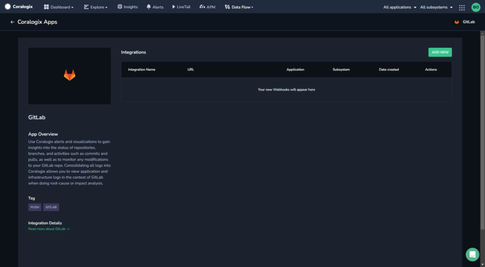
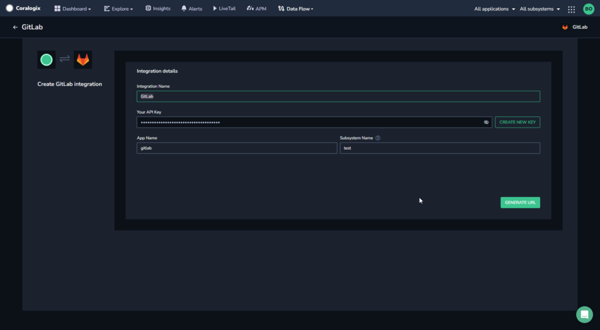
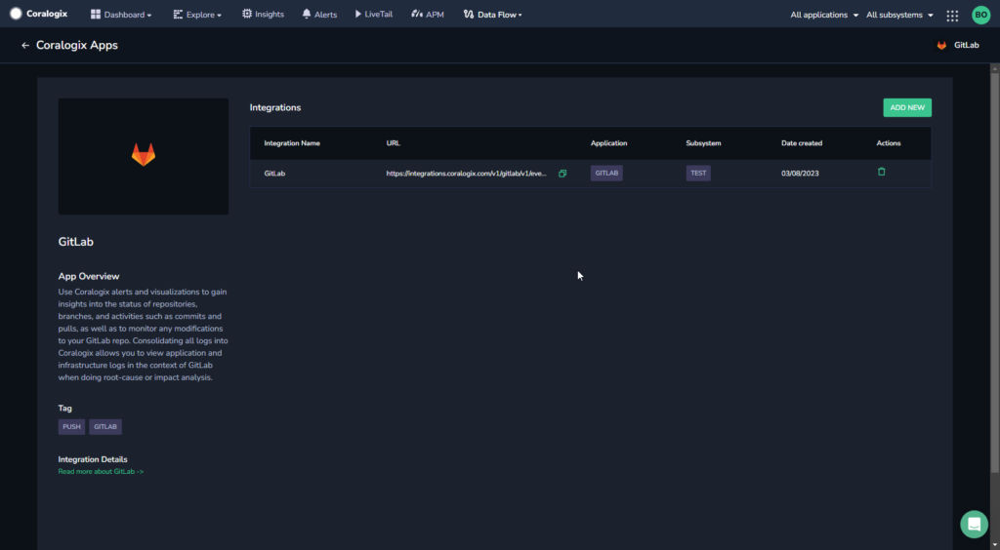
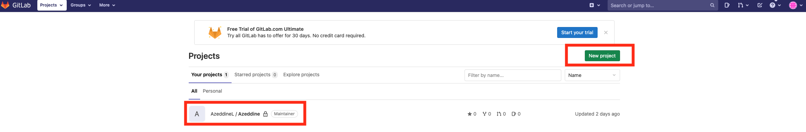
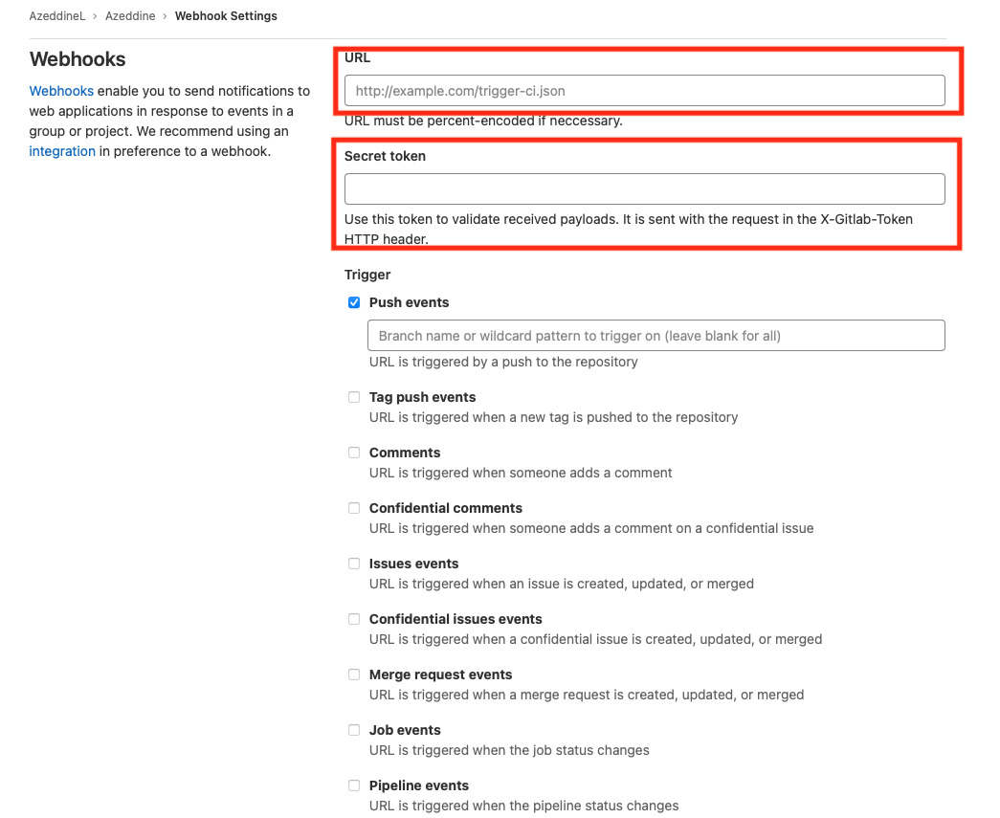
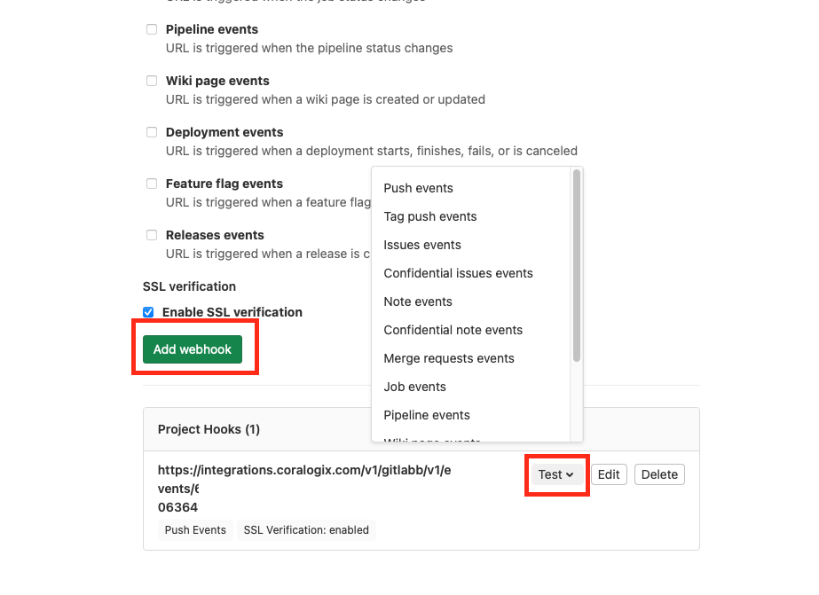

Collect your GitLab logs in the Coralogix platform using our automatic **Contextual Data Integration Package**. The package automatically generates a URL to be used when creating a GitLab webhook.

## Overview

GitLab is a comprehensive web-based platform that offers end-to-end solutions for version control, software development lifecycle management, and collaboration. Built around the Git version control system, GitLab provides features such as repository management, issue tracking, continuous integration and delivery (CI/CD), code review, and a range of tools for project planning and monitoring. Notably, GitLab can be deployed either as a cloud-based service or as a self-hosted instance, giving organizations flexibility in managing their codebase and development processes. This all-in-one platform fosters streamlined teamwork, efficient development workflows, and enhanced transparency in software projects.

Sending your GitLab logs to Coralogix streamlines log aggregation, strengthens monitoring capabilities, and enhances issue resolution for efficient software development. By directing GitLab logs into Coralogix, you gain a comprehensive view of your version control activities, enabling rapid anomaly detection, proactive debugging, and informed decision-making. This integration empowers development teams to optimize workflows, bolster system reliability, and maintain operational efficiency, leveraging Coralogix's analytics, alerts, and visualization tools to extract valuable insights from GitLab logs and ensure a collaborative and resilient software development environment.

## Get Started

**STEP 1.** In your navigation pane, click **Data Flow** > **Contextual Data**.

**STEP 2.** In the **Contextual Data** section, select **GitLab** and click **+** **ADD**.

**STEP 3.** Click **ADD NEW**.

**STEP 4.** Fill in the **Integration Details**:

- **Name.** Name your integration.

- **Your API Key**. Click **CREATE NEW KEY** to generate an API Key and name it.

- **Application Name and Subsystem Name**. Enter an [application and subsystem name](https://coralogixstg.wpengine.com/docs/application-and-subsystem-names/).

**STEP 5.** Click **GENERATE URL**. The URL for the integration will be automatically created. Use this when creating a GitLab webhook.

## Create GitLab Webhook

Create a GitLab webhook using your URL.

**STEP 1**. Log in to your GitLab account.

**STEP 2.** If you do not have a project, create one. If you have already done that, move to the next step.

**STEP 3.** On the left top corner click on your projects and select your project.

**STEP 4.** Select a project from your projects or click on **New project** to create a new project.

**STEP 5.** In the new screen that opens, select **Settings** > **Webhooks**.

**STEP 6.** In the URL field, enter the URL you generated in Coralogix.

**STEP 7.** In the **Secret token** field, enter the token section of the generated URL (the URL will look like this: https://integrations._cluster URL_/v1/gitlab/v1/events/<token>).

**STEP 8.** \[Optional\] Test your configuration and web-hook by clicking **Test**. If you get a response other than **200 OK** you should check the configuration is correct.

**STEP 8.** Once you finish the configuration, click on **Add webhook**.

## Support

**Need help?**

Our world-class customer success team is available 24/7 to walk you through your setup and answer any questions that may come up.

Feel free to reach out to us **via our in-app chat** or by sending us an email at [support@coralogixstg.wpengine.com](mailto:support@coralogixstg.wpengine.com).
