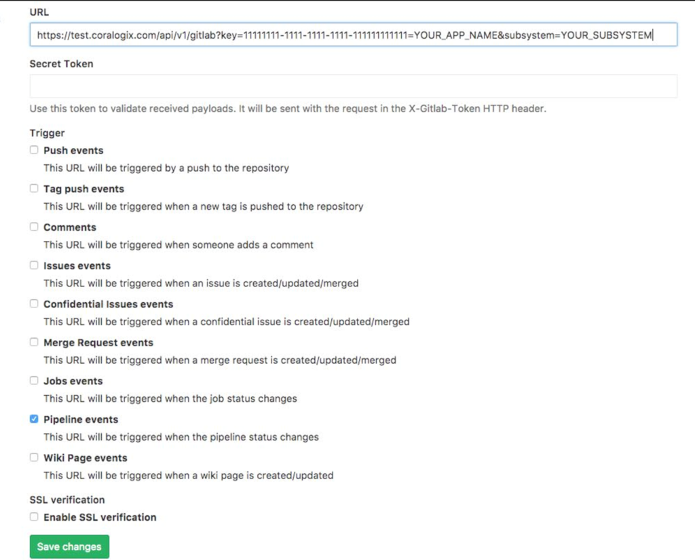

This tutorial demonstrates how to integrate Coralogix with your [GitLab](https://coralogixstg.wpengine.com/docs/gitlab-data-ingestion/) deployment pipelines.

## Configuration

**Use GitLab webhooks to inform Coralogix when a new build is issued**.

**STEP 1**. Log in to GitLab using your credentials and navigate to your project page.

**STEP 2.** Click **Settings** > Webhooks.

**STEP 3**. Add the following URL:

https://ng-api-http.**DOMAIN**/api/v1/external/gitlab?application=**APPLICATION\_NAME**&subsystem=**SUBSYSTEM\_NAME**&name=**TAG\_NAME**

Insert the following parameters:

**DOMAIN**: Coralogix [domain](https://coralogixstg.wpengine.com/docs/coralogix-domain/) associated with your account

**APPLICATION\_NAME**: [Application name](https://coralogixstg.wpengine.com/docs/application-and-subsystem-names/) as it appears in your Coralogix UI

**SUBSYSTEM\_NAME**: [Subsystem name](https://coralogixstg.wpengine.com/docs/application-and-subsystem-names/) as it appears in your Coralogix UI. Add one or more subsystem names separated by a comma.

**TAG\_NAME** - Tag name. If this parameter is not inserted, values are taken from GitLab payload fields _project.name_ and _object\_attributes.ref_, as explained [here](https://docs.gitlab.com/ee/user/project/integrations/webhook_events.html#pipeline-events).

**STEP 4**. Add a **Secret Token**. This can be found in your Coralogix UI by navigating to **Data Flow** > API Keys > Alerts, Rules and Tags API Key.

**Notes**:

- The **Secret Token** is obligatory.

- Input the **Secret Token** in the Secret Token field below the URL in GitLab.

**STEP 5**. Select **Pipeline events** as a trigger and click save changes.

## Additional Resources

<table><tbody><tr><td><strong>Documentation</strong></td><td><a href="https://coralogixstg.wpengine.com/docs/gitlab-data-ingestion/">GitLab Data Ingestion</a></td></tr></tbody></table>

## Support

**Need help?**

Our world-class customer success team is available 24/7 to walk you through your setup and answer any questions that may come up.

Feel free to reach out to us **via our in-app chat** or by sending us an email at [support@coralogixstg.wpengine.com](mailto:support@coralogixstg.wpengine.com).
