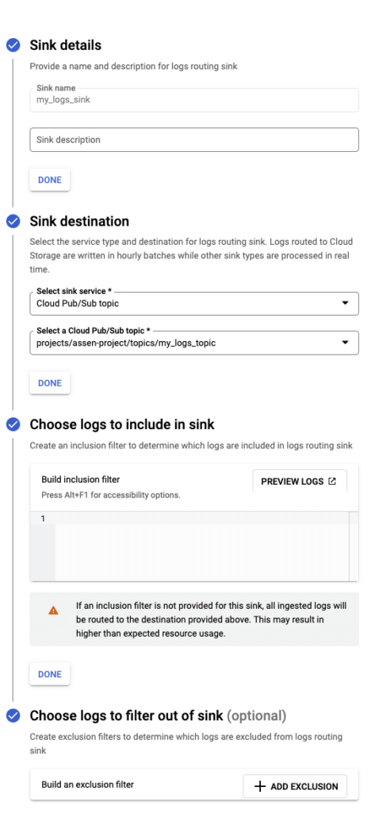

Coralogix offers a number of different approaches for collecting logs from your Google Cloud environments including using [GCP Log Explorer](https://coralogixstg.wpengine.com/docs/gcp-log-explorer/) and [Google Cloud Storage](https://coralogixstg.wpengine.com/docs/google-cloud-storage/).

The tutorial describes how to configure a Logs router to send logs to a Pub/Sub topic and deliver them to Coralogix using a push subscription on the topic.

The main advantage of using a push subscription is that it avoids running any additional software (i.e. functions) in your GCP account which can contribute to operational overhead and costs.

## Requirements

- Coralogix account

- GCP account with permissions to configure `Logging` and `Pub/Sub` services

### Query Parameters: Endpoint URL

When you create your subscription, you will need to set the correct endpoint URL using the following parameters:

- `domain`: Your Coralogix [domain](https://coralogixstg.wpengine.com/docs/coralogix-domain/)

- `key`: Your Coralogix [Send-Your-Data API key](https://coralogixstg.wpengine.com/docs/send-your-data-api-key/)

- `application` (**optional**): Overrides the default application name

- `subsystem` (**optional**): Overrides the default subsystem name

- `computer` (**optional**): Sets the computer name (otherwise there is no computer name)

- `application_name_source` (**optional**): Controls how application name is determined when the `application` parameter is not set
    
    - `project_id_label_or_log_name`: Default behavior. The `project_id` label will be used first. If it is not available, the second segment of the log name will be used.
    
    - `log_name`: We recommend trying this if you see numeric project IDs in the application name, but would prefer human readable project names. This does not affect folder IDs, which are always numeric.

- `log_message` (**optional**): Controls how GCP audit logs are transformed
    - Defaults to `LogEntry` if not specified
    
    - `Payload`: parse only payload field content of the log entry as log text
    
    - `LogEntry`: parse whole log entry, for example:

```
{
     "spanId": "abcdefghijk",
     "severity": "INFO",
     ...
     "jsonPayload": {
        ...
     },
     ...
     "receiveTimestamp": "2023-02-27T10:16:23.544899312Z",
     "timestamp": "2023-02-27T10:16:20.035098Z",
 }
```

## Configuration

To configure the ingestion of GCP log data to Coralogix, we will first create a new topic in Google Cloud Pub/Sub. Then we will configure the topic as a sink in the logs router and configure a subscription to push the data to Coralogix.

**STEP 1**. Log in to GCP console

**STEP 2**. Go to `Pub/Sub` / `Topics` and create a Topic

- Note - Uncheck the ‘Add a default subscription’ checkbox” We will create a subscription in a later step.

**STEP 3**. Go to `Logging` / `Logs Router` and create a Sink

- Select sink service: Cloud Pub/Sub topic

- Select the Cloud Pub/Sub topic created in the previous step

- Optionally: Choose which logs should be included/excluded



**STEP 4**. Go to `Pub/Sub` / `Subscriptions` and create a Subscription

- Select the topic created in step 2, and make the following adjustments:
    - Set Delivery type to 'Push'.
    
    - Set Endpoint URL to **https://ingress.<domain>/gcp/v1/logs?key=<api\_key>**. If you like to pass additional attributes to Coralogix, set the endpoint to **https://ingress.<domain>/gcp/v1/logs?key=<api\_key>&application=<application\_name>&subsystem=<subsystem\_name>**.
    
    - Set message retention to '1 day'.
    
    - Set Retry policy to 'Retry after exponential backoff delay' (keep the default backoff values).


## **Support**

**Need help?**

Our world-class customer success team is available 24/7 to walk you through your setup and answer any questions that may come up.

Feel free to reach out to us **via our in-app chat** or by sending us an email at [support@coralogixstg.wpengine.com](mailto:support@coralogixstg.wpengine.com).
