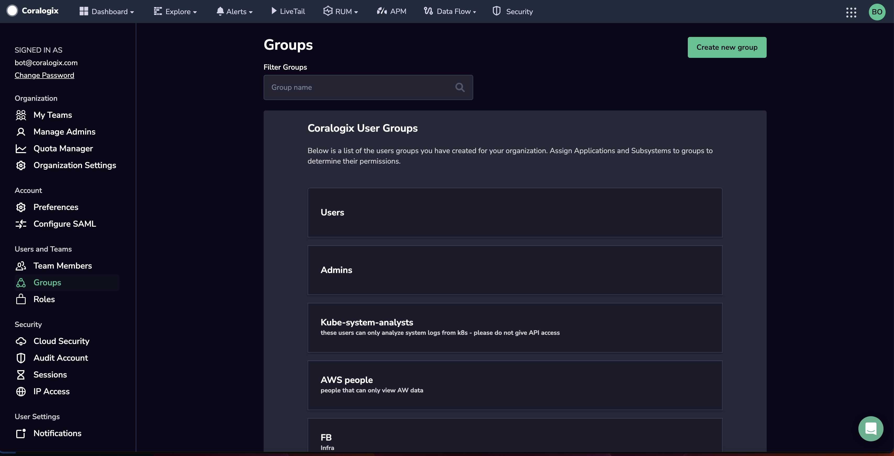
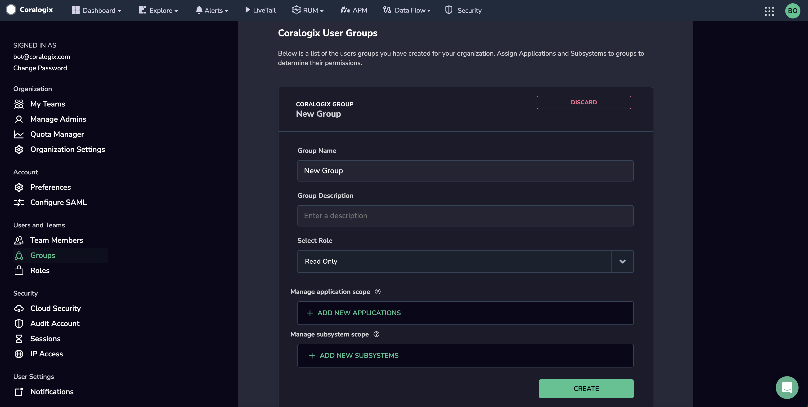

Streamline user management - role-based and data scope access - with **Groups**.

## Overview

### Role-Based Access Control (RBAC)

Coralogix users enjoy role-based access based on their membership in one or more Groups, each of which is assigned one or more [roles](https://coralogixstg.wpengine.com/docs/roles-permissions/).

### Data Scope

In addition, by using Groups, organizations can control the scope of user data by limiting access to particular applications and subsystems.

Only Organization and Platform administrators have the predefined permissions to manage Groups.

## Create a Group

**STEP 1.** Access your **settings** in the upper right-hand corner of the Coralogix toolbar.

**STEP 2.** In the left-hand sidebar, click **Groups**. A list of existing groups will appear.

**Step 3.** Click **Create New Group**.

**STEP 4.** Enter the new group details.

### Group Name & Description

Enter a name and description for the group.

### Select Role

Select the [role](https://coralogixstg.wpengine.com/docs/roles-permissions/) for users in the group.

### Application & Subsystem Scope

Add applications and subsystems to which the group users may have access. For example, choosing the application “AWS” will give group members access to AWS-related information only.

**Notes**:

- You can also choose a different **filter type** to include several applications that start and end or include a search term.

- If no applications or subsystems are added, users in the group will have access to all applications and subsystems.

**STEP 5.** Click **CREATE**.

## Migrate Groups from Legacy to Custom Roles

Legacy roles are predefined system roles from our sunsetted role management system. Existing customers must migrate the legacy roles assigned to their users to [system and custom roles](https://coralogixstg.wpengine.com/docs/roles-permissions/) to prevent a loss of role-based access for your users.

Select an existing Group from your list and modify the role in the **Select Role** drop-down menu to do so. Unselect the legacy role and choose a different role in its place.

### System Roles

Coralogix offers seven predefined system roles.

| System Role | Description |
| --- | --- |
| Org Admin | Organization admins manage all teams and user access and settings. They can also manage and configure all Coralogix resources. They have full access to billing information and can revoke API keys. They can also promote users with fewer permissions to administrators. |
| Platform Admin | Platform admins have identical permissions to Org admins, except for management and read-only access to organization settings. |
| Data Admin | Data admins can view and modify all Coralogix monitoring features. They may not view and manage organization settings and are limited in their access to team settings. |
| Observability Lead | Observability leads can view all Coralogix monitoring features but are limited in their management and configuration permissions. They may not view and manage organization settings and are limited in their access to team settings. |
| Standard User | Read-only users do not have access to make changes within Coralogix. This comes in handy when you’d like to share specific read-only views with a client or when a member of one team needs to share a dashboard or other resource with someone outside their team. |
| Read-Only User | Read-only users do not have access to make changes within Coralogix. This comes in handy when you’d like to share specific read-only views with a client, or when a member of one team needs to share a dashboard or other resource with someone outside their team. |
| No Access User | Users have no permissions. Use this system role as a baseline to create custom roles with limited permissions. |
| Security User | Security users can perform daily security tasks and manage related configurations, such as incident investigation, alert configuration, security posture visibility, and extension deployment. |

### Legacy Roles

The list below presents the types of legacy roles previously assigned to users.

| Permissions | Read Only | Admin | User | Basic User | Data Analyst | Interface User |
| --- | --- | --- | --- | --- | --- | --- |
| Explore Screen - Create / Delete Saved Views | ✔ | ✔ | ✔ | ✔ | ✔ | ✔ |
| Explore Screen - Create Widgets |  | ✔ | ✔ | ✔ | ✔ | ✔ |
| Explore Screen - Delete Widgets |  | ✔ |  |  |  |  |
| Insights | ✔ | ✔ | ✔ | ✔ | ✔ | ✔ |
| Livetail | ✔ | ✔ | ✔ | ✔ | ✔ | ✔ |
| Alerts - View Alerts | ✔ | ✔ | ✔ | ✔ | ✔ | ✔ |
| Alerts - Create / Delete / Modify Alerts |  | ✔ | ✔ |  |  | ✔ |
| Alerts - Delete alerts created by someone else |  | ✔ | ✔ |  |  | ✔ |
| Data Flow - Webhooks |  | ✔ | ✔ | ✔ |  | ✔ |
| Data Flow - API Key (Logs query key) |  | ✔ | ✔ | ✔ |  |  |
| Data Flow - Archive Queries | ✔ | ✔ | ✔ | ✔ | ✔ | ✔ |
| Data Flow - Setup Archive |  | ✔ | ✔ | ✔ |  | ✔ |
| Settings - Preferences |  | ✔ | ✔ | ✔ |  | ✔ |
| Settings - Notifications |  | ✔ | ✔ | ✔ |  | ✔ |
| Settings - Can invite team members |  | ✔ |  |  |  |  |
| Coralogix Dashboards - Read Coralogix Dashboards | ✔ | ✔ | ✔ | ✔ | ✔ | ✔ |
| Coralogix Dashboards - Update Coralogix Dashboards |  | ✔ | ✔ | ✔ | ✔ | ✔ |
| Coralogix Dashboards - Create / Delete visualizations and dashboards |  | ✔ | ✔ | ✔ | ✔ | ✔ |
| Grafana - Read Grafana dashboards | ✔ | ✔ | ✔ | ✔ | ✔ | ✔ |
| Grafana - Update Grafana dashboards |  | ✔ | ✔ | ✔ | ✔ | ✔ |
| Grafana - Create / Delete visualizations and dashboards |  | ✔ | ✔ | ✔ | ✔ | ✔ |
| View RUM | ✔ | ✔ | ✔ | ✔ | ✔ | ✔ |
| Read incident data | ✔ | ✔ | ✔ | ✔ | ✔ | ✔ |
| Acknowledge incidents |  | ✔ | ✔ |  |  | ✔ |

## Additional Resources

<table><tbody><tr><td>Documentation</td><td><a href="https://coralogixstg.wpengine.com/docs/roles-permissions/"><strong>Roles &amp; Permissions</strong></a> <strong><a href="https://coralogixstg.wpengine.com/docs/user-team-management/">Teams</a></strong></td></tr></tbody></table>

## Support

**Need help?**

Our world-class customer success team is available 24/7 to walk you through your setup and answer any questions that may come up.

Feel free to contact us **via our in-app chat** or by emailing [support@coralogixstg.wpengine.com](mailto:support@coralogixstg.wpengine.com).
