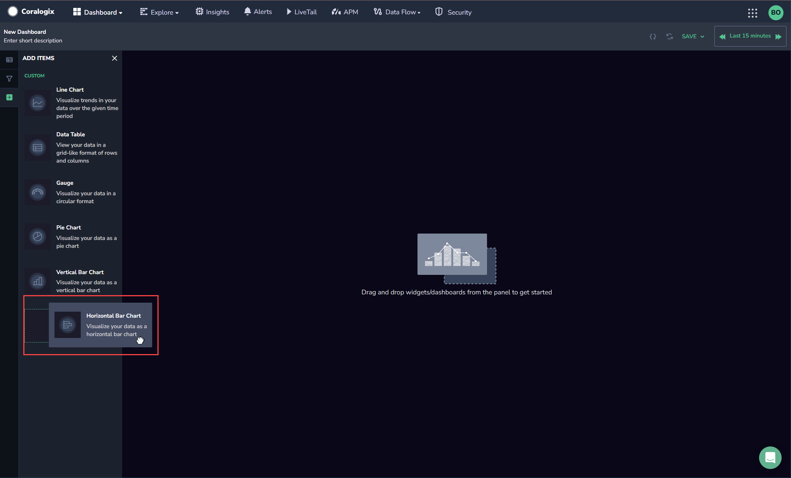
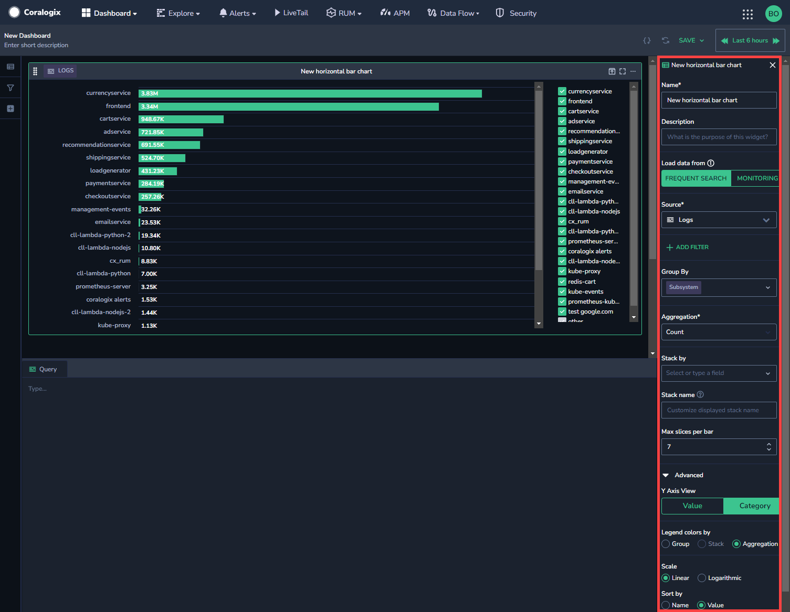
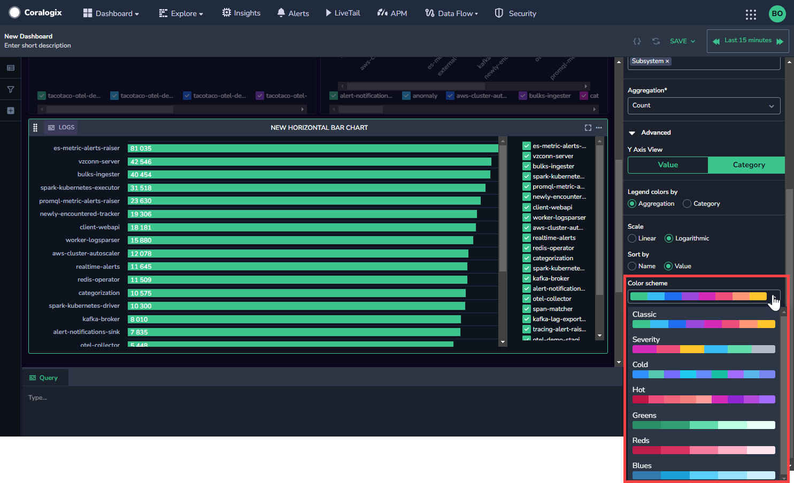

The horizontal bar chart widget in Coralogix offers a new way to view your data. With horizontal bar charts, your data is sorted by value, in descending order by default. With [vertical bar charts](https://coralogixstg.wpengine.com/docs/custom-dashboards-bar-charts/), data is usually sorted alphabetically by column name.

### Create a Horizontal Bar Chart

**Create a customized horizontal bar chart visualization.**

**STEP 1**. Drag and drop the **Horizontal Bar Chart** widget from the left-hand sidebar to get started.

**STEP 2**. Set the definitions for your Bar Chart in the right-hand sidebar.

- **Name & Description**. Create a name and description.

- **Load data from.** Select whether to load data from [Frequent Search](https://coralogixstg.wpengine.com/docs/optimize-log-management-costs/#frequent-search-data-high-priority) or [Monitoring](https://coralogixstg.wpengine.com/docs/optimize-log-management-costs/#monitoring-data-medium-priority).

- **Source**. Select a data source.
    - If the **Source** chosen is metrics, specify the metric or desired PromQL in the **Query** field. Use free text to search for a metric of your choice. As you do so, all relevant metrics will appear. Hover over any metric to view its system-generated metadata labels. Hover over a label to see its values.
    
    - When creating a bar chart with metrics as the Source, the categories specified in the PromQL query appear automatically in the Group By field. Within the Group By field, reordering the categories by dragging and dropping is possible.
    
    - Drag and drop categories from the **Category** field into the **Stacking** field, to stack by a particular category.

- **ADD FILTER.** \[Optional\] Add a filter to your bar chart.
    - As opposed to the dashboard filter in the left-hand sidebar which affects the entire dashboard, this filter only affects the widget.
    
    - The widget and dashboard filters operate in parallel to one another and intersect. If they negate one another, dashboard filters override widget filters.

- **Category.** Select the fields by which you want to sort your bar chart from the dropdown menu.

- **Aggregation**: Aggregate by **Count**, **Count Distinct**, **Sum**, **Min**, **Max**, and/or **Average**.
    - In Bar charts, changing the aggregation type will change the type of data you see.
    
    - For example, aggregating by Count, might show you the number of people in a country. On the other hand when aggregating by Average, for example, you need to provide additional parameters, such as height, which will give you a bar chart displaying the average height by country.

- **Stack By.** \[Optional\] Select a field by which to stack the chart. This shows you a second layer of data on the chart.

- **Advanced.** Select from the following advanced options.
    
    - **Y AXIS View.** Select whether the Y-axis of the chart should show the value or the category.
    
    - **Color Scheme.** Select the color scheme for your chart.
    
    - 
    
    - **Legend Colors By.** Select whether you want your legend colors to be by aggregation or by category. By default the horizontal bar chart is by aggregation, which means a single color will be shown for all bars.
    
    - **Scale.** Select whether you want the scale of the bar chart to be **Logarithmic** or **Linear**. The default setting is linear, however if you have large differences between the different values, it can be helpful to show the logarithmic scale instead. For example, if the majority of your values are under 1k and one value is 10k, using the logarithmic scale will show you an easier to read bar chart than the linear scale.
    
    - **Sort By.** Select whether to sort the chart by column name or by value. By default the horizontal bar chart is sorted by value.
    
    - **Max Bars Per Graph.** Select the maximum number of bars you want to show per graph.
    
    - **Group Name.** \[Optional\] Customize the displayed group name.
    
    - **Unit.** \[Optional\] Select the unit to display in the bar chart.

**STEP 3.** \[Optional\] If you want to save your dashboard for future use, click **SAVE** in the upper right hand corner.

## Additional Resources

<table><tbody><tr><td>Documentation</td><td><strong><a href="https://coralogixstg.wpengine.com/docs/custom-dashboards/">Custom Dashboards </a><a href="https://coralogixstg.wpengine.com/docs/custom-dashboards-line-charts/">Line Charts </a><a href="https://coralogixstg.wpengine.com/docs/custom-dashboards-data-tables/">Data Tables </a><a href="https://coralogixstg.wpengine.com/docs/custom-dashboards-gauges/">Gauges </a><a href="https://coralogixstg.wpengine.com/docs/custom-dashboards-pie-charts/">Pie Charts</a></strong> <strong><a href="https://coralogixstg.wpengine.com/docs/custom-dashboards-bar-charts/">Vertical Bar Charts</a></strong></td></tr></tbody></table>

## Support

**Need help?**

Our world-class customer success team is available 24/7 to walk you through your setup and answer any questions that may come up.

Feel free to reach out to us **via our in-app chat** or by sending us an email at [support@coralogixstg.wpengine.com](mailto:support@coralogixstg.wpengine.com).
