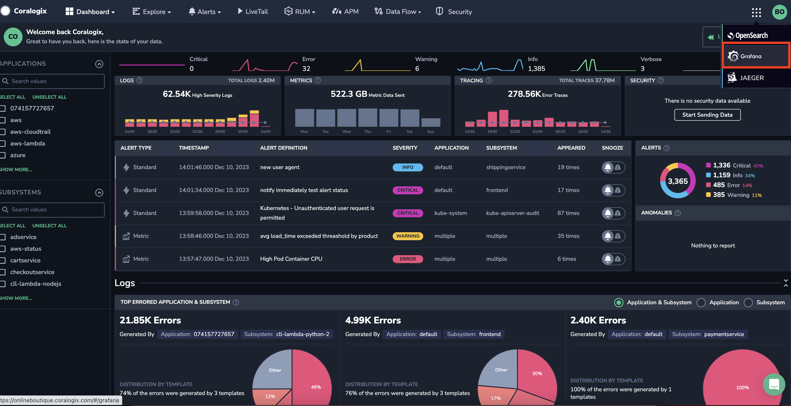
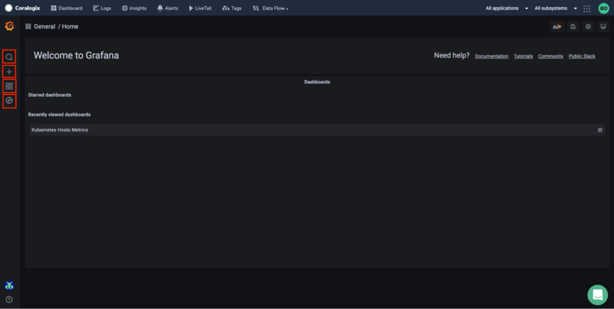
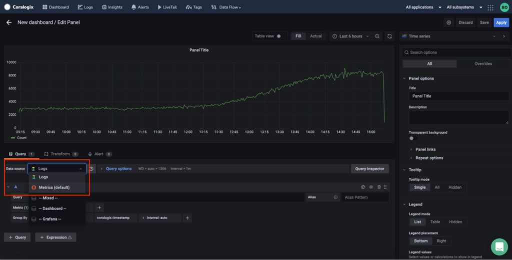
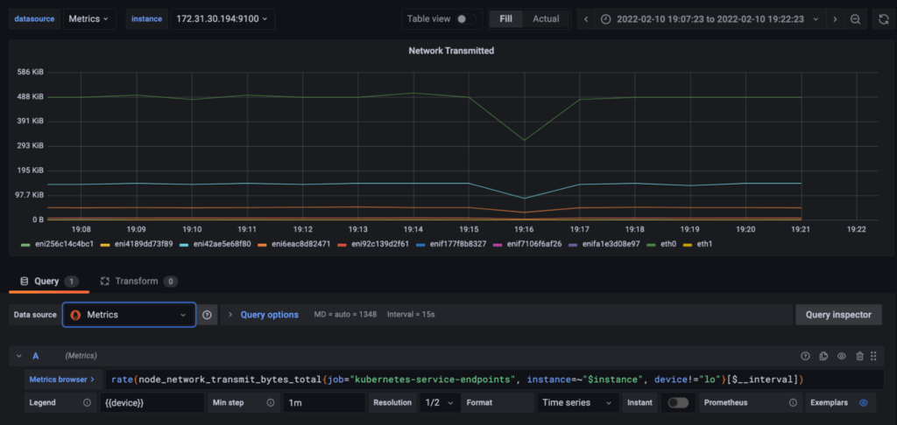

With Coralogix’s cutting-edge visualization capabilities, you can instantly switch between views to see and better understand your data.

You can now visualize your data using Coralogix's Hosted Grafana without having to integrate a personal Grafana instance with your Coralogix account.

Use Grafana to visualize your logs and metrics with all the functions you are already familiar with. You will be able to access all Coralogix data sources automatically without the need for any plugins.

On the right side of the top menu, click the open-source option and choose Grafana.

Grafana’s main screen is displayed as part of Coralogix, where you can Search, Create and Edit your dashboards. Explore and navigate between Grafana pages.

You can query your logs and metrics in real-time to get all the insight you need.

**Be sure to select the correct data source when creating a panel: Logs or Metrics.**

Logs are queried using Lucene (the same query syntax of the Coralogix Logs screen)

Metrics should be queried with PromQL. For more information and ‘How To’ - visit this [blog post with our top PromQL tips](https://coralogixstg.wpengine.com/blog/promql-tutorial-5-tricks-to-become-a-prometheus-god/).

_Note: Coralogix's Hosted Grafana instance(s) are currently running Grafana version 8.2.7_

**Some Limitations**:

- Alerting is disabled

- Grafana Live Dashboard is disabled

- Dashboard minimum interval is 10 seconds

- Grafana Editor - Coralogix admin

- Grafana Viewer - All users
