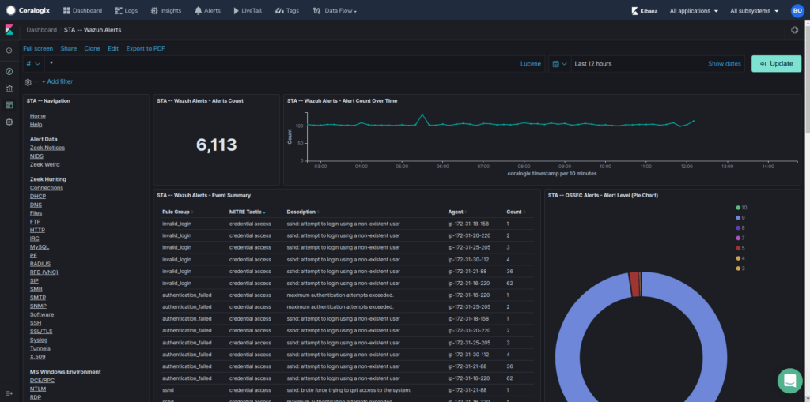
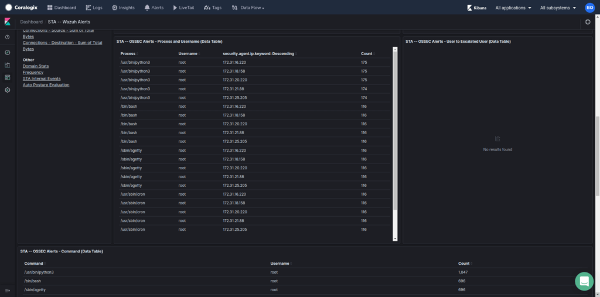
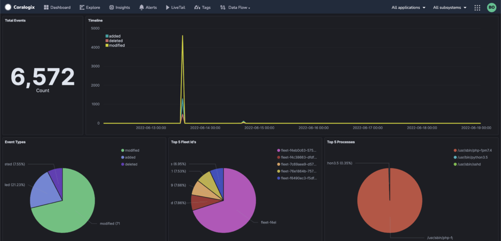

Wazuh, a fork of the famous OSSEC project, is an agent-based solution for the detection of malicious activity at the host level. It can detect rootkits, malicious processes running on the host, and many other types of malicious network activities. The Coralogix STA can function as a Wazuh manager, allowing Wazuh agents to connect to it, pull policies from it, and forward their logs to it. These logs will be enriched and forwarded to Coralogix for further processing.

Once you have successfully installed the STA in your environment, you can configure Wazuh agents to connect to it by completing the following steps:

1. Find out the relevant Wazuh NLB name (relevant only for cloud installations):
    1. If you have installed the STA by using CloudFormation, open your AWS CloudFormation console and locate the stack you have deployed. In the list of the resources that were deployed (in the "Resources" tab) locate the ID of the "WazuhNLB" that was deployed (should be something like 'arn:aws:elasticloadbalancing:eu-west-1:746123456762:loadbalancer/net/STA-N-Wazuh-UJZ0XTYPZR41/1773e22e13f084de')
    
    3. If you have installed the STA by using Terraform, run the following command in the folder you applied the Terraform template from: `terraform state show 'module.sta_ng.module.sta_ng-spotfleet-small-wazuh1-eip1[0].aws_lb.WazuhNLB'`. Take note of the id of the NLB. (should be something like 'arn:aws:elasticloadbalancing:eu-west-1:746123456762:loadbalancer/net/STA-N-Wazuh-UJZ0XTYPZR41/1773e22e13f084de')

3. Find out the relevant Wazuh NLB DNS name:
    1. If you have installed the STA using either CloudFormation or Terraform, open your AWS EC2 console and navigate to the Load Balancers section and then search for the value you took note of at the previous step. Copy the DNS name of that load balancer (Should be something like STA-N-Wazuh-UXYZXYZXYR41-1234e12e12f064ed.elb.eu-west-1.amazonaws.com)
    
    3. If you are using the STA in an on-prem environment just use the STA's host name

5. WAZUH\_MANAGER environment variable is the value you took a note of at the previous step (the STA's Wazuh NLB DNS name). make sure to set `WAZUH_MANAGER` when encountered in next steps.

7. Install the Wazuh agent on the relevant machines:

- In case you mirroring traffic using [Virtual Tap](https://coralogixstg.wpengine.com/docs/coralogix-sta-virtual-tap/) and `Wazuh` wasn't disabled, skip this step

- In case you mirroring traffic using [Virtual Tap](https://coralogixstg.wpengine.com/docs/coralogix-sta-virtual-tap/) and `Wazuh` was disabled, update docker command with the following code (for additional information regarding `CONFIGURATION_S3` and `TAP_INTERFACE` see Virtual Tap's URL):

```bash
docker run -d –name sta-wazuh_manager \
-e "WAZUH_MANAGER=<EXTRACTED_WAZUH_NLB_DNS_NAME>" \
-e “STA_SNIFFING_NLB=s3://<CONFIGURATION_S3>” \
-e “TAP_INTERFACE=<TAP_INTERFACE>” \
-e ‘STA_SNIFFING_FILTER=not dst port 4789’ \
–privileged –net host coralogixrepo/sta-virtual-tap-docker
```

- To install using [Virtual Tap installation](https://coralogixstg.wpengine.com/docs/coralogix-sta-virtual-tap/) but only `Wazuh` without mirroring traffic:

```bash
docker run -d –name sta-wazuh_manager \
-e "WAZUH_MANAGER=<ADD_EXTRACTED_WAZUH_NLB_DNS_NAME>" \
-e "STA_DISABLE_TAP=TRUE" \
–privileged –net host coralogixrepo/sta-virtual-tap-docker
```

- To install `Wazuh` using bare metal installation, run the following code:
    - in AWS/AZURE this should be set as the instances' user-data
    
    - in GCP this should be set as the instance's startup script

**Ubuntu/Debian**:

```bash
#!/bin/bash 

export WAZUH_MANAGER="<ADD_EXTRACTED_WAZUH_NLB_DNS_NAME>" 


wget https://packages.wazuh.com/4.x/apt/pool/main/w/wazuh-agent/wazuh-agent_4.3.10-1_amd64.deb
sudo -E dpkg -i wazuh-agent_4.3.10-1_amd64.deb
echo 'wazuh_command.remote_commands=1' | sudo tee -a /var/ossec/etc/local_internal_options.conf
echo 'logcollector.remote_commands=1' | sudo tee -a /var/ossec/etc/local_internal_options.conf
echo 'sca.remote_commands=1' | sudo tee -a /var/ossec/etc/local_internal_options.conf
sudo mkdir -p /wazuh-custom-commands    
echo 'IyEvYmluL2Jhc2gKCmRmIC1oIHwgZ3JlcCAtdiAnXi9kZXYvbG9vcFswLTldJyB8IHdoaWxlIElGUz0gcmVhZCAtciBsaW5lOwpkbwogIGVjaG8gImRpc2stdXNhZ2U6ICIkbGluZQpkb25lCg==' | base64 -d | sudo tee /wazuh-custom-commands/custom-df.sh    
echo 'IyEvYmluL2Jhc2gKCnBzIC1lZmwgfCB3aGlsZSBJRlM9IHJlYWQgLXIgbGluZTsKZG8KICBlY2hvICJwcm9jZXNzZXMtbGlzdDogIiRsaW5lCmRvbmUK' | base64 -d | sudo tee /wazuh-custom-commands/custom-ps.sh    
sudo chmod +x /wazuh-custom-commands/custom-df.sh    
sudo chmod +x /wazuh-custom-commands/custom-ps.sh
sudo systemctl daemon-reload
sudo systemctl enable wazuh-agent.service
sudo service wazuh-agent start
sleep 60
sudo service wazuh-agent restart

```

**RedHat**:

```bash
#!/bin/bash 

export WAZUH_MANAGER="<ADD_EXTRACTED_WAZUH_NLB_DNS_NAME>" 


sudo rpm --import https://packages.wazuh.com/key/GPG-KEY-WAZUH    
sudo echo [wazuh] &gt; /etc/yum.repos.d/wazuh.repo     
sudo echo gpgcheck=1 &gt;&gt; /etc/yum.repos.d/wazuh.repo  
sudo echo gpgkey=https://packages.wazuh.com/key/GPG-KEY-WAZUH &gt;&gt; /etc/yum.repos.d/wazuh.repo  
sudo echo enabled=1  &gt;&gt; /etc/yum.repos.d/wazuh.repo  
sudo echo name=EL-Wazuh &gt;&gt; /etc/yum.repos.d/wazuh.repo  
sudo echo baseurl=https://packages.wazuh.com/4.x/yum/  &gt;&gt; /etc/yum.repos.d/wazuh.repo  
sudo echo protect=1  &gt;&gt; /etc/yum.repos.d/wazuh.repo  
sudo -E yum install wazuh-agent audit -y 
echo 'wazuh_command.remote_commands=1' | sudo tee -a /var/ossec/etc/local_internal_options.conf    
echo 'logcollector.remote_commands=1' | sudo tee -a /var/ossec/etc/local_internal_options.conf
echo 'sca.remote_commands=1' | sudo tee -a /var/ossec/etc/local_internal_options.conf    
sudo mkdir -p /wazuh-custom-commands    
echo 'IyEvYmluL2Jhc2gKCmRmIC1oIHwgZ3JlcCAtdiAnXi9kZXYvbG9vcFswLTldJyB8IHdoaWxlIElGUz0gcmVhZCAtciBsaW5lOwpkbwogIGVjaG8gImRpc2stdXNhZ2U6ICIkbGluZQpkb25lCg==' | base64 -d | sudo tee /wazuh-custom-commands/custom-df.sh    
echo 'IyEvYmluL2Jhc2gKCnBzIC1lZmwgfCB3aGlsZSBJRlM9IHJlYWQgLXIgbGluZTsKZG8KICBlY2hvICJwcm9jZXNzZXMtbGlzdDogIiRsaW5lCmRvbmUK' | base64 -d | sudo tee /wazuh-custom-commands/custom-ps.sh    
sudo chmod +x /wazuh-custom-commands/custom-df.sh    
sudo chmod +x /wazuh-custom-commands/custom-ps.sh    
sudo systemctl daemon-reload    
sudo systemctl enable wazuh-agent    
sudo systemctl start wazuh-agent

```

**Windows** (Powershell):

```powershell
Invoke-WebRequest -Uri https://packages.wazuh.com/4.x/windows/wazuh-agent-4.3.0-1.msi -OutFile wazuh-agent.msi -UseBasicParsing `
wazuh-agent.msi /quiet WAZUH_MANAGER=<ADD_EXTRACTED_WAZUH_NLB_DNS_NAME> `
Start-Sleep -Seconds 30 `
Start-Service -ServiceName WazuhSvc
```

2. Connect to the STA via SSH using the key pair you specified during the installation of the STA.
3. Run the command `sta-wazuh-list-agents`. You should get something like this with the hostname of the monitored instance:  
    `Available agents:   ID: 001, Name: ip-192-168-1-2, IP: any`
4. You should be able to see logs from the monitored instance that indicate interesting actions that took place on the monitored instance as recorded by Wazuh.
5. You can review the data from Wazuh by using the Wazuh alerts and Wazuh file integrity monitor dashboards:

<figure>



<figcaption>

Wazuh Alerts Overview

</figcaption>

</figure>

<figure>



<figcaption>

Processes on Wazuh agents

</figcaption>

</figure>

<figure>



<figcaption>

File Integrity Monitor

</figcaption>

</figure>

Good luck (:

If you have any questions or need any additional help, please contact our support team via our 24/7 in-app chat!
