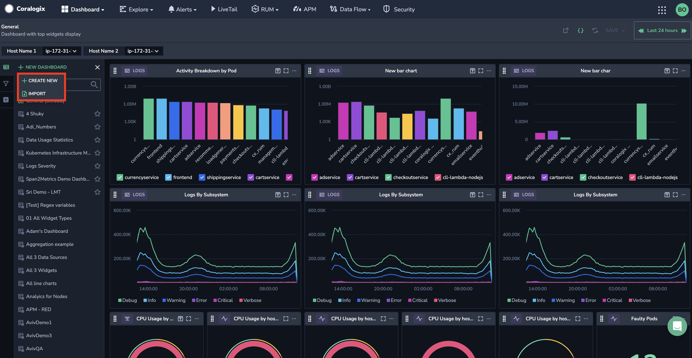
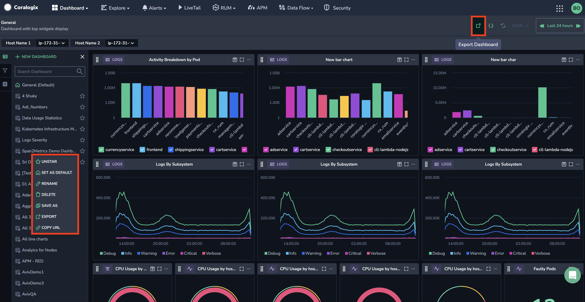
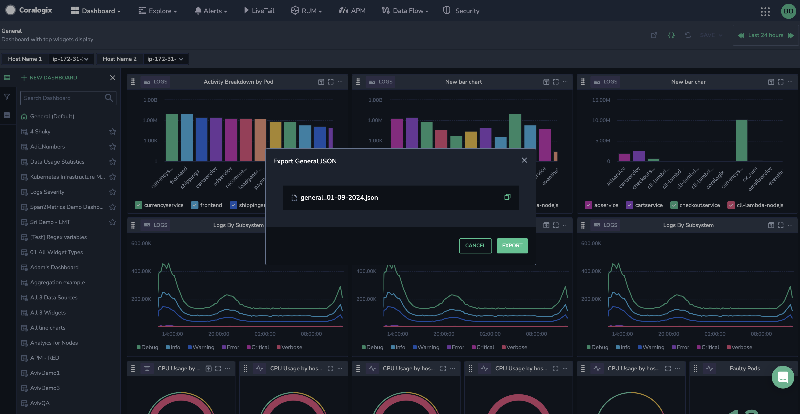

Effortlessly share your [custom dashboards](https://coralogixstg.wpengine.com/docs/custom-dashboards/) within your organization by importing and exporting them, eliminating the need to recreate them and minimizing overhead.

## Import a Custom Dashboard

**STEP 1.** Hover over **\+ New Dashboard** above the dashboard list.

**STEP 2.** Click **IMPORT**.

**STEP 3.** In the popup that appears, select a JSON file to upload or paste your copied JSON file.

**STEP 4.** Click **IMPORT**.

## Export a Custom Dashboard

**STEP 1.** Click the **Export** button on the top right-hand side of the dashboard, or click on the ellipsis next to the dashboard name in the right-hand column and select **EXPORT**. The latter option allows you to export a dashboard not currently in use.

**STEP 2.** In the popup that appears, click **EXPORT**. Click on the copy icon to copy the dashboard JSON file.

## Additional Resources

<table><tbody><tr><td>Documentation</td><td><strong><a href="https://coralogixstg.wpengine.com/docs/custom-dashboards/">Custom Dashboards</a></strong></td></tr></tbody></table>

## Support

**Need help?**

Our world-class customer success team is available 24/7 to walk you through your setup and answer any questions that may come up.

Contact us **via our in-app chat** or by emailing [support@coralogixstg.wpengine.com](mailto:support@coralogixstg.wpengine.com).
