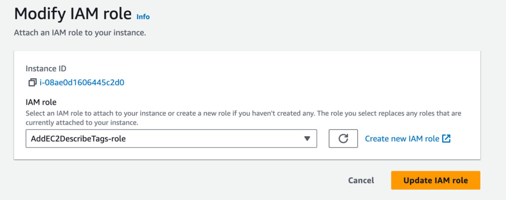

This tutorial demonstrates how to set up an EC2 instance with OpenTelemetry Collector.

## Setup

### Installation

**STEP 1**. Create an EC2 instance.

**STEP 2**. Download and install OpenTelemetry. On [this page](https://opentelemetry.io/docs/collector/installation/), select the package for your OS. **Before downloading it**, edit the name of the package to include `otelcol-contrib` instead of `otelcol`.

For example, replace

```
 wget <https://github.com/open-telemetry/opentelemetry-collector-releases/releases/download/v0.86.0/otelcol_0.86.0_linux_amd64.deb>
```

with

```
wget <https://github.com/open-telemetry/opentelemetry-collector-releases/releases/download/v0.86.0/otelcol-contrib_0.86.0_linux_amd64.deb>
```

### Configuration

Edit `/etc/otelcol-contrib/config.yaml` using this example configuration:

```
receivers:
  filelog:
    start_at: beginning
    include:
      - /example.log
    include_file_path: true
    # Specify multiline pattern only if there are multiline logs like stack errors.
    # Usually log entries are in single line and this setting can be omit.
    # multiline: {line_start_pattern: "\\\\n"}
  hostmetrics:
      collection_interval: 30s
      scrapers:
        cpu:
        memory:
processors:
  batch:
    send_batch_size: 1024
    send_batch_max_size: 2048
    timeout: "1s"
  resourcedetection:
    detectors: [env, ec2, system]
exporters:
  coralogix:
    domain: "Domain"
    private_key: "Private key"
    application_name: "Application Name"
    subsystem_name: "Subsystem Name"
    timeout: 30s

service:
  pipelines:
    logs:
      receivers: [ filelog ]
      processors: [resourcedetection, batch]
      exporters: [ coralogix ]
    metrics:
      receivers: [ hostmetrics ]
      processors: [resourcedetection, batch]
      exporters: [ coralogix ]

```

**Notes**:

- Coralogix recommends the default otel-integration chart settings for batch processors in all collectors. Learn more [here](https://coralogix.com/docs/faqs-kubernetes-observability-using-opentelemetry/#how-do-i-optimize-batch-sizing?).

- Learn more about [receivers and exporters](https://github.com/open-telemetry/opentelemetry-collector-contrib/tree/main/exporter/coralogixexporter), the [`filelog` receiver](https://github.com/open-telemetry/opentelemetry-collector-contrib/tree/main/receiver/filelogreceiver), and the [`hostmetrics` receiver](https://github.com/open-telemetry/opentelemetry-collector-contrib/tree/main/receiver/hostmetricsreceiver).

## Collect EC2 Tags \[Optional\]

To add EC2 tags, add a role to your instance.


### Create a New Policy

**STEP 1**. Navigate to **IAM** > **Policies**. Click **Create policy**.

**STEP 2**. Select the following options.


**STEP 3**. Enter a policy name. Click **Save**.

### Create a New Role

**STEP 1**. Navigate to **IAM** > **Roles**. Click **Create role**.

**STEP 2**. Select the following options.


**STEP 3**. Click **Next**.

**STEP 4**. Click on the checkbox next to the rule you just created.

**STEP 5**. Enter a rule name. Click **Create rule**.

### Add IAM Role to Your Instance

**STEP 1**. Open your instance from the EC2 instance screen.

**STEP 2**. Add the IAM role to the empty IAM.


**STEP 3**. Select the IAM role. Click **Update IAM role**.



**STEP 4**. Allow tags in the metadata instance.


**STEP 5**. Update the `resourcedetection` processor at the processors.

```
resourcedetection:
    # ecs & docker detectors not required when using ecslogresourcedetection for logs
    detectors: [env, ec2, system]
    ec2:
      tags:
        - ^TagName$
    timeout: 2s
    override: false

```

**Notes**:

- It is mandatory to specify the tags parameter, as it is not added by default.

- Set any Regex to limit the number of tags or use `^.*$` to get all tags.

## Validation

Start Otel to validate your setup, using this example from Ubuntu Linux.

```
/usr/bin/otelcol-contrib --config=file:/etc/otelcol-contrib/config.yaml

```

## Support

**Need help?**

Our world-class customer success team is available 24/7 to walk you through your setup and answer any questions that may come up.

Feel free to contact us **via our in-app chat** or by emailing [support@coralogixstg.wpengine.com](mailto:support@coralogixstg.wpengine.com).
