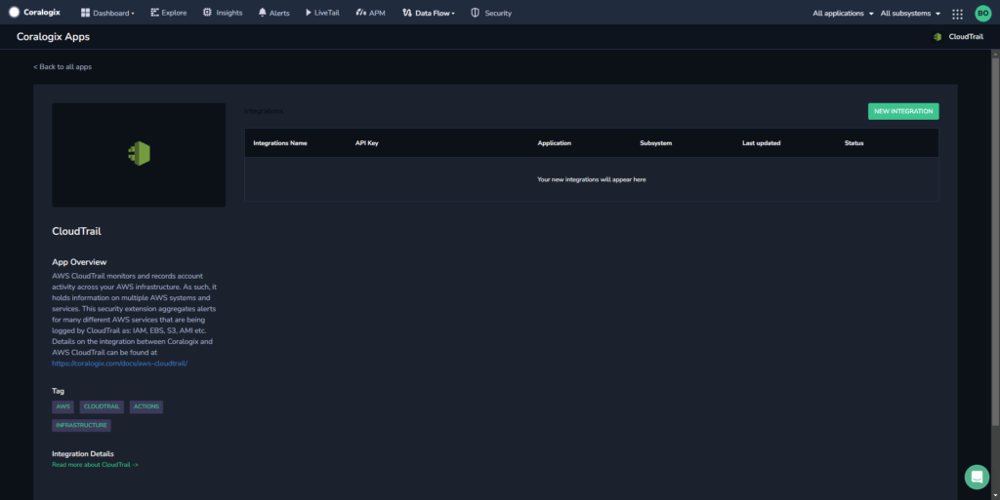
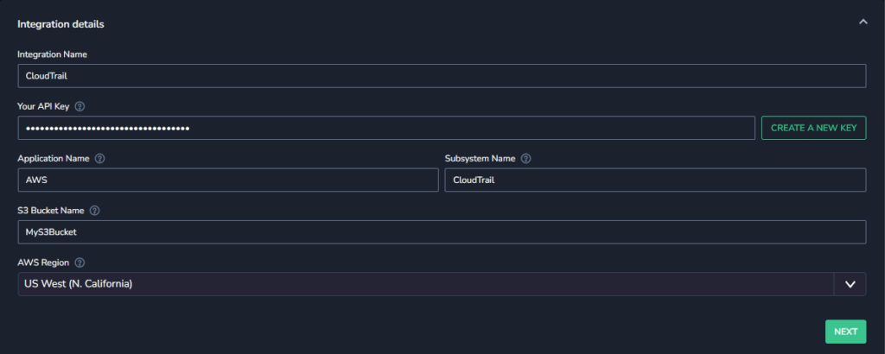
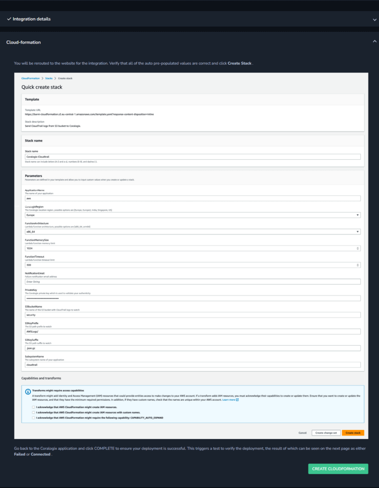
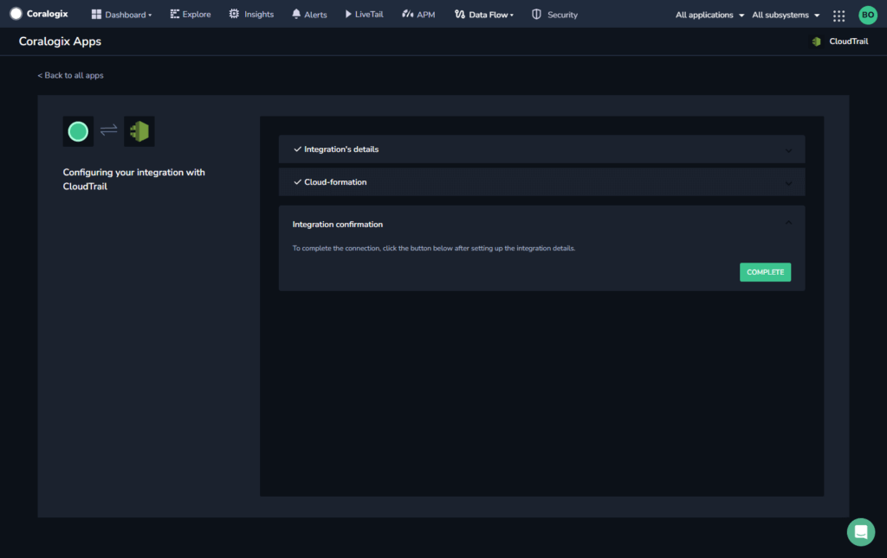
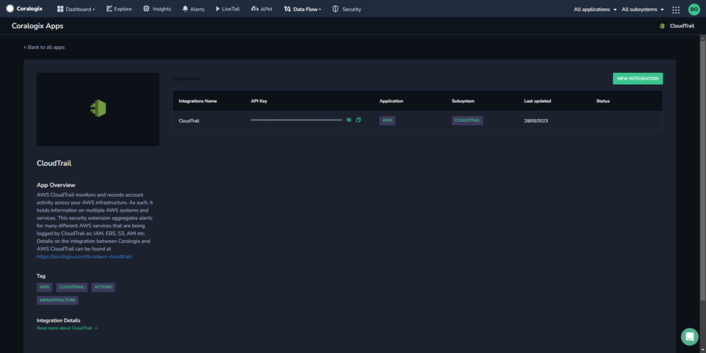

Access our **Integration Packages** to access a series of integrations in a one-step process. Use this to extend your platform capabilities with packages and sources, without expending unnecessary time and resources.

## Prerequisites

Verify you are signed into your cloud provider with your credentials.

## Access an Integration Package

**STEP 1.** In your navigation pane, click **Data Flow** > **Extensions**. View the list of available integrations.

**STEP 2.** Select the integration of choice.

**STEP 3.** View application details in the **App Overview**. For more information, click **Integration Details**. You will also see a list of [extension packages](https://coralogixstg.wpengine.com/docs/extension-packages/) available for the integration of choice.

**STEP 4.** Click **\+ NEW INTEGRATION**.

**STEP 5.** Input the Integration Details.

- Input an existing Coralogix [Send-Your-Data API key](https://coralogixstg.wpengine.com/docs/send-your-data-api-key/) or click **[CREATE NEW KEY](https://coralogixstg.wpengine.com/docs/send-your-data-api-key/)**.

- Input [Application and Subsystem names](https://coralogixstg.wpengine.com/docs/application-and-subsystem-names/).

- Input [S3 Bucket](https://coralogixstg.wpengine.com/docs/archive-s3-bucket-forever/) Name, if applicable.

- Select your region from the dropdown list.

- Fill any other relevant fields.

**STEP 6.** Click **NEXT**.

**STEP 7.** View the instructions for your integration. Click **CREATE**.

**STEP 8.** You will be rerouted to the website for the integration. Verify that all of the auto pre-populated values are correct and click Create Stack.

**STEP 9.** Go back to the Coralogix application and click **COMPLETE** to close the module and go back to the integration page.

**STEP 10.** View your integration information.

**STEP 11.** Deploy the [extension package](https://coralogixstg.wpengine.com/docs/extension-packages/) of your choice to complement your integration needs.

**STEP 12.** Once the verification process is complete and you have deployed your extension package, view your logs in your Coralogix dashboard.

## Additional Resources

<table><tbody><tr><td>Documentation</td><td><a href="https://coralogixstg.wpengine.com/docs/extension-packages/"><strong>Extension Packages</strong></a></td></tr></tbody></table>

## Support

**Need help?**

Our world-class customer success team is available 24/7 to walk you through your setup and answer any questions that may come up.

Feel free to reach out to us **via our in-app chat** or by sending us an email at [support@coralogixstg.wpengine.com](mailto:support@coralogixstg.wpengine.com).
