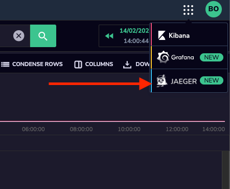
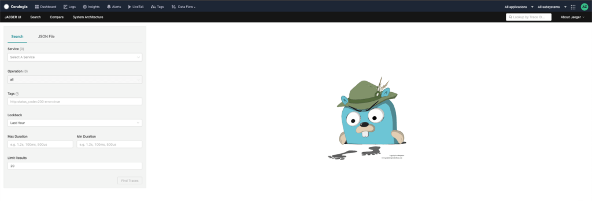
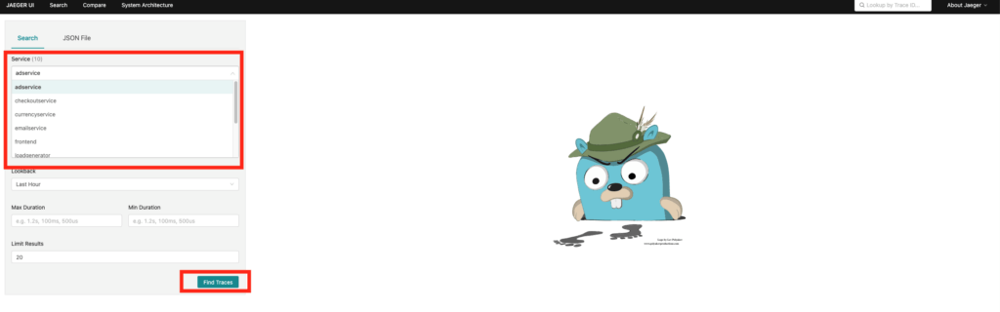
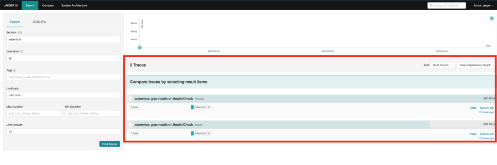
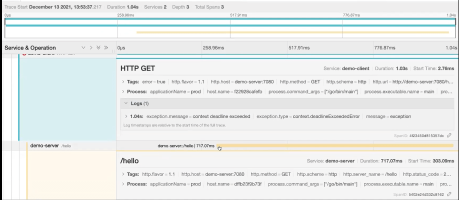

With the help of Coralogix, you can now monitor trace information. Keep an eye on requests which allow you to monitor latency, and know how much time a request would take to finish.

You will also be able to better troubleshoot, pinpoint bottlenecks, and identify which service or services are contributing to the application latency.

First, you'll need to [connect Jaeger to your Coralogix account](https://coralogixstg.wpengine.com/docs/opentelemetry-tracing/) to start collecting your tracing data.

## In the Navigation

Once you start sending tracing data, you can view it by clicking on the dotted menu in the top right corner, and selecting Jaeger.

Once in the Jaeger UI, you can select any service from the services you are collecting tracing for and hit search to see the results.

You can search by:

- Service.
- Tags.
- Max and Min Duration.
- Operation.

## Direct from the Logs Screen

You can also view the trace for a specific log via the [Logs Screen](/tutorials/logs-screen/) by creating a custom [Coralogix Action](/tutorials/coralogix-action-extension/).

To add an [Action](https://coralogixstg.wpengine.com/tutorials/coralogix-action-extension/) that links your logs to traces, go to Logs > Settings > Manage actions and add a new action “View Trace” with the following URL structure:

_https://YOUR\_TEAM\_NAME.com/tracing/trace/{{$d.YOUR\_TRACE\_ID\_KEY}}?uiFind={{$d.YOUR\_SPAN\_ID\_KEY}}_

You can then use this custom Action by clicking on the 3 dots on the log line you want to view the trace for. Then select Actions and click on your new "View Trace" action to open the Jaeger UI.

Here, you can see the flow, the time it took for the request to finish, and the different services that were executed.

Our support team is always here 24/7 to assist you with anything you need. Send us an email to support@coralogixstg.wpengine.com, or simply log in to your account and send us a message via our in-app chat.

In addition to providing trace visualizations in the Jaeger UI, Coralogix offers hosted visualizations for [logs in Kibana](https://coralogixstg.wpengine.com/tutorials/kibana-view/) and for [metrics in Grafana](/tutorials/hosted-grafana-view/).
