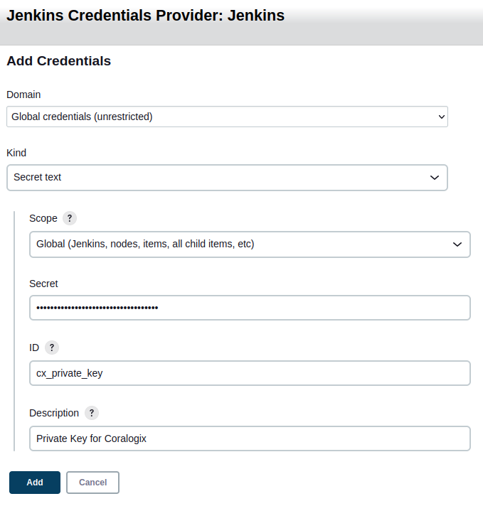
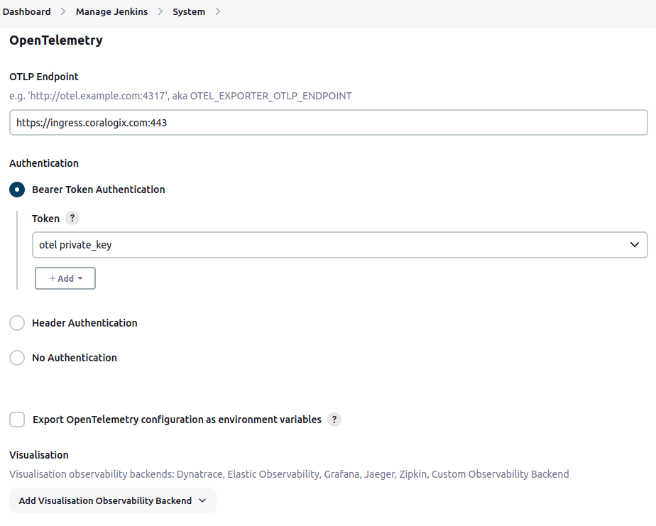

Monitoring Jenkins telemetry is critical to understanding what is causing delays and failures in your CI/CD pipelines. Coralogix leverages the OpenTelemetry plugin for Jenkins to monitor metrics and traces. Logs and tagging are supported using our [Coralogix plugin for Jenkins](https://coralogix.com/docs/jenkins/).

## Supported OS

Linux, Windows, macOS

## Prerequisites

- Jenkins server

- Jenkins account with permissions to add plugins and “system” configuration adjusted

## Installation

**STEP 1**. To install the OpenTelemetry plugin for Jenkins, navigate to **Manage Jenkins** > **Plugins** > **Available Plugins** and search for **OpenTelemetry Plugin**.

**STEP 2**. Select the checkbox to the left of the plugin and click **Install**.

**STEP 3**. Restart Jenkins.

## Configuration

Configure the OpenTelemetry plugin by accessing the system configuration under **Manage** **Jenkins** > **System**. Scroll down to locate the **OpenTelemetry** section.

**STEP 1**. Configure the [OpenTelemetry endpoint](https://coralogix.com/docs/coralogix-endpoints/#opentelemetry) adjusted for your [Coralogix domain](https://coralogix.com/docs/coralogix-domain/).

**STEP 2**. Under **Authentication**, create a Bearer Token Authentication token by clicking **+Add**. You’ll want to create a **Secret text** similar to the example below.



**STEP 3**. Once you’ve created the credential, select it in the **Token** dropdown.

At this point, your configuration should look similar to this:



## Advanced Configuration

**STEP 1**. In the Advanced Configuration section, set a **Service name** for all the payloads submitted by the OpenTelemetry plugin. Choose something that is appropriate for your deployment. You can adjust the **Disabled resource providers** and **Steps to be ignored** if needed or leave the default options.

**STEP 2**. In **Configuration properties**, you will set the OpenTelemetry Java SDK configuration. At a minimum, add the following two lines:

```
otel.exporter.otlp.protocol=http/protobuf
otel.resource.attributes=cx.application.name=Jenkins-otel,cx.subsystem.name=Jenkins-otel

```

The otel.exporter.otlp.protocol sets the OTLP exporter to use the http/protobuf protocol instead of grpc, as this is our preferred protocol. The otel.resource.attributes is needed to set your application name and subsystem. You can add additional resource attributes as needed by appending additional key-value pairs using comma separations.

**STEP 3**. Set your **Service namespace** to something appropriate for your use case.

## Optional Configuration

This section will detail some of the optional configurations that can be made.

### **Export OpenTelemetry Configuration as Environment Variables**

The “Export OpenTelemetry configuration as environment variables” checkbox allows you to capture all of the configured OpenTelemetry SDK values as environment variables. This feature is necessary if you intend to install any of the optional **Extensions** that can instrument non-Jenkins executables like Maven, Ansible, and others. You can read about the extension in the [OpenTelemetry documentation](https://github.com/jenkinsci/opentelemetry-plugin?tab=readme-ov-file#other-cicd-tools-supporting-opentelemetry-traces).

**Notes:**

- This setting will expose your Coralogix private key in the OTEL\_EXPORTER\_OTLP\_HEADERS variable.

- You may also have other services running on your Jenkins hosts that also use/set these environment variables. Be aware of that before enabling as it could affect other services.

### Disabled Resource Providers

The “Disabled resource providers” section allows you to disable any resource provider processors that would otherwise generate metadata to enrich your Traces and Metrics. Sometimes, you can get conflicting metadata by having too many resource providers enabled by default. You can disable specific providers using this setting. You can read about the available resource providers for the Java SDK [here](https://github.com/open-telemetry/opentelemetry-java-instrumentation/tree/main/instrumentation/resources/library/src/main/java/io/opentelemetry/instrumentation/resources).

### Logs Exporter

While we **recommend** our [Coralogix plugin for Jenkins](https://coralogix.com/docs/jenkins/) for logs and tags, you can use the OpenTelemetry plugin to collect logs instead. Beware that this option has limitations regarding the scope of logging from the OpenTelemetry Collector. To enable logs exporting, you’ll need to add two additional lines to the **Configuration Properties** under **Advanced**:

```
otel.logs.exporter=otlp
otel.logs.mirror_to_disk=true

```

This will enable the OpenTelemetry plugin to submit system, audit, and pipeline logs to Coralogix. However, the scope of pipeline logs is limited to anything that is executed directly by the Jenkins agents. If you install the appropriate Extensions in your environment, you can capture external applications, such as Maven or Ansible.

### **Disable Metric or Trace Pipeline**

If you only want metrics or traces, you can disable the other pipeline by setting the appropriate exporter configuration to `none` in the “Configuration Properties” under Advanced like below:

```
otel.traces.exporter=none
OR
otel.metrics.exporter=none
```

## Validation

After configuring the Opentelemetry plugin, restart your Jenkins instance. Upon logging back in, you should start seeing a variety of metrics and traces being submitted to the Coralogix platform aligned with your configured application and subsystem names.

## Troubleshooting

If you don’t see any metrics or traces arriving in your Coralogix account, make sure to double-check your configurations of the OpenTelemetry plugin. You can use the **Noteworthy active configuration properties** and **Active resource attributes** section of the **Advanced configuration** to quickly see what settings the Java OpenTelemetry SDK is using.

If all Jenkins configuration is as expected, double-check your Jenkins host’s environment variables as other OpenTelemetry-based applications could be setting variables conflicting with the Jenkins OpenTelemetry plugin.

If all your settings are correct, ensure your Jenkins nodes can reach the ingress endpoint. Be aware of any Proxies or security appliances/applications in the egress route to the internet.

If the endpoint is reachable but you still don’t see any payloads, try submitting to a local OpenTelemetry Collector instead of directly to Coralogix. Review our OpenTelemetry Collector documentation for steps to deploy locally. Once deployed locally, adjust the OTLP Endpoint in the configuration to point to your locally hosted OpenTelemetry Collector.

## Additional Resources

<table><tbody><tr><td>Documentation</td><td><strong><a href="https://plugins.jenkins.io/opentelemetry/">OpenTelemetry Plugin for Jenkins</a><br><a href="https://opentelemetry.io/docs/languages/java/automatic/configuration/">OpenTelemetry Documentation for Java SDK and API</a></strong></td></tr></tbody></table>

## Support

**Need help?**

Our world-class customer success team is available 24/7 to walk you through your setup and answer any questions that may come up.

Contact us **via our in-app chat** or by emailing [support@coralogix.com](mailto:support@coralogix.com).
