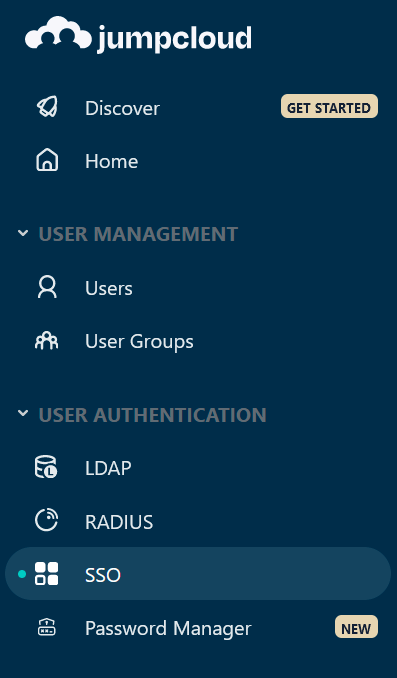
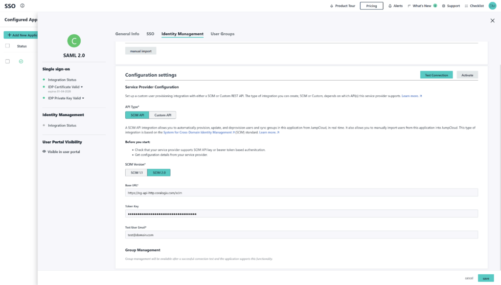
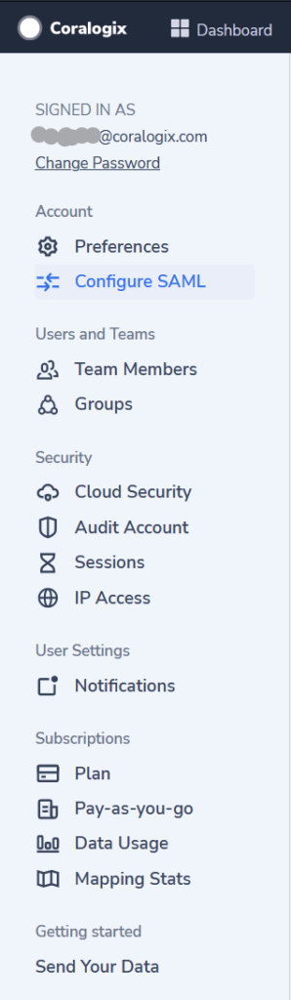
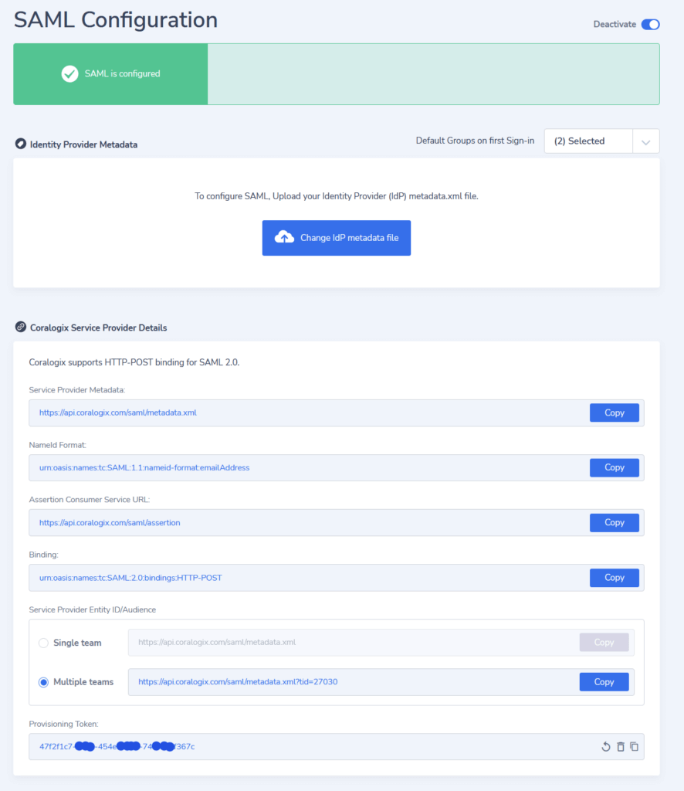
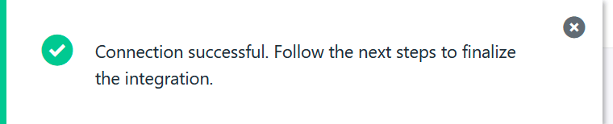
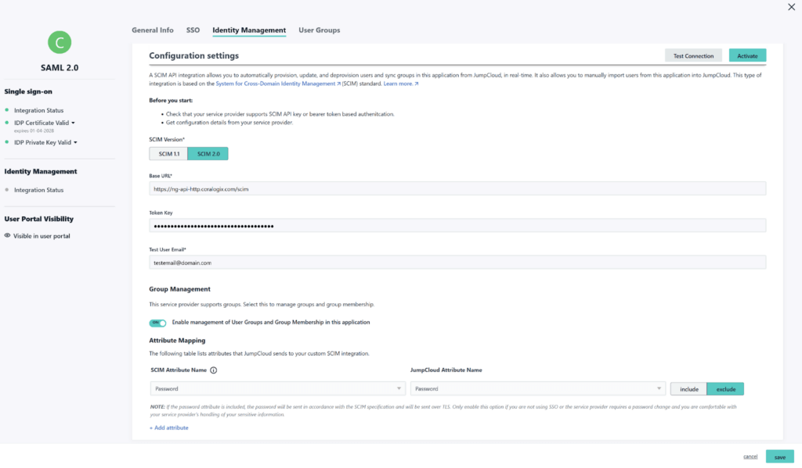
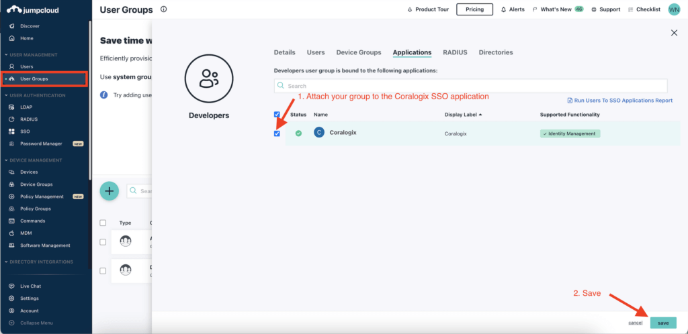

Send your logs to Coralogix using the [JumpCloud SCIM Identity Management Integration](http://Custom SCIM Identity Management integration).

The Custom SCIM Identity Management integration allows you to provision, update, and deprovision users and groups from JumpCloud in applications that support SCIM. Leverage this integration to centralize user lifecycle management, sync user data, manage groups, and control access and authorization from the JumpCloud Admin Portal.

## Configuration

**STEP 1. Single Sign-On**

Login to JumpCloud portal. Select **SSO** \> **Coralogix SSO application**

**STEP 2. Service Provider Configuration**

- Navigate to the **Identity Management** tab.

- Input the **Base URL** as one of the following values for **SCIM Connector Base URL**. The URL should correspond to the Coralogix [domain](https://coralogixstg.wpengine.com/docs/coralogix-domain/) where your data is stored.

<table><tbody><tr><td><strong>Region</strong></td><td><strong>Tenant URL</strong></td></tr><tr><td>US1</td><td><a href="https://ng-api-http.coralogix.us/scim">https://ng-api-http.coralogix.us/scim</a></td></tr><tr><td>EU1</td><td><a href="https://ng-api-http.coralogixstg.wpengine.com/scim">https://ng-api-http.coralogixstg.wpengine.com/scim</a></td></tr><tr><td>EU2</td><td><a href="https://ng-api-http.eu2.coralogixstg.wpengine.com/scim">https://ng-api-http.eu2.coralogixstg.wpengine.com/scim</a></td></tr><tr><td>AP1 (IN)</td><td><a href="https://ng-api-http.app.coralogix.in/scim">https://ng-api-http.app.coralogix.in/scim</a></td></tr><tr><td>AP2 (SG)</td><td><a href="https://ng-api-http.coralogixsg.com/scim">https://ng-api-http.coralogixsg.com/scim</a></td></tr></tbody></table>

- Add the **Token Key**. This can be found in your Coralogix team settings > **Configure SAML** > **Provisioning Token**

- Input the email address of a user that belongs to one of the relevant groups in your SSO under **Test User Email**.

**STEP 3. Test Connection**

- Click **Test Connection.**  You should see the following popup confirming the connection was successful:

- Ensure **Group management** is **enabled**.

**STEP 4. Activation**

- Click **Activate.**

- Click **Save.**

**Step 5. Assign your groups to the Coralogix SSO application**

- Go to JumpCloud "User Groups".

- For each group that should be managed by SCIM, attach it to the Coralogix SSO application as shown below.

## **Support**

**Need help?**

Our world-class customer success team is available 24/7 to walk you through your setup and answer any questions that may come up.

Feel free to reach out to us **via our in-app chat** or by sending us an email at [support@coralogixstg.wpengine.com](mailto:support@coralogixstg.wpengine.com).
