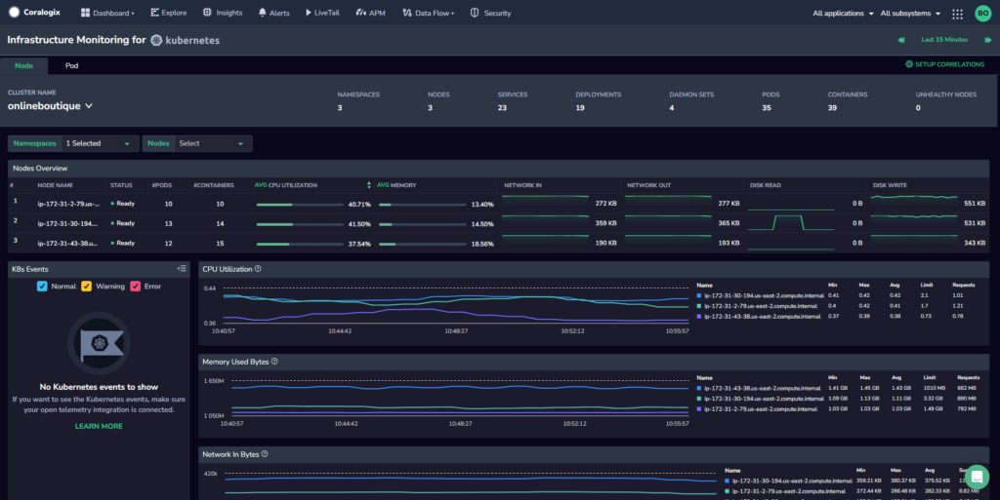
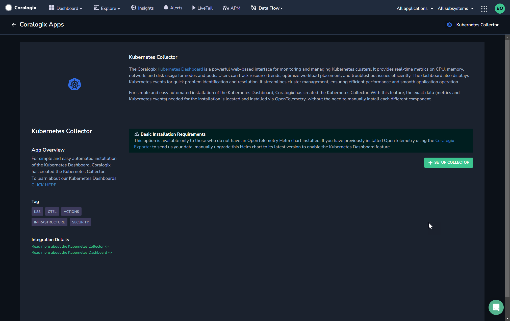
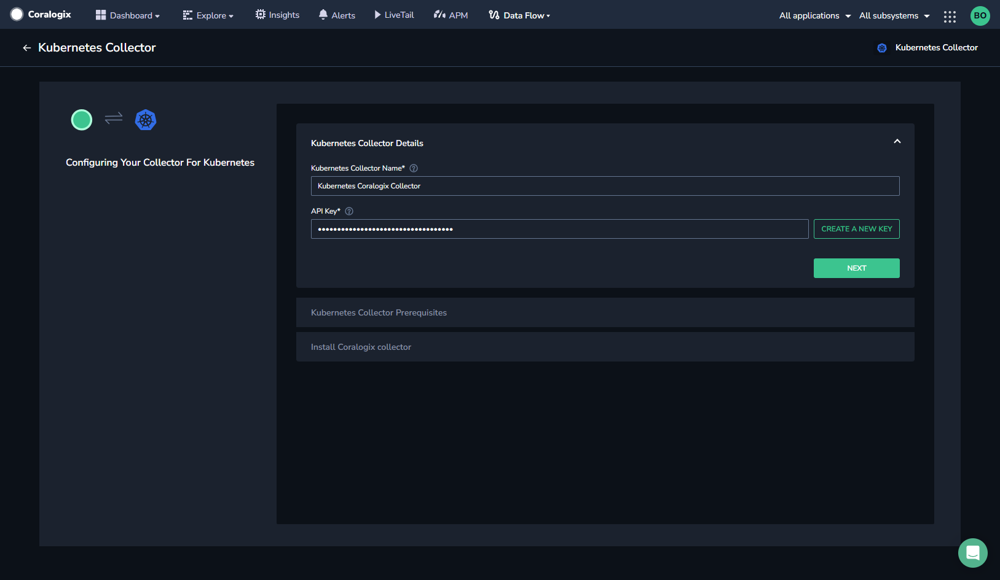
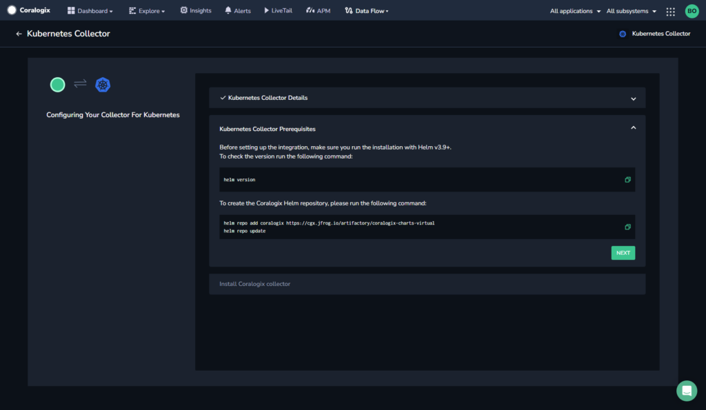
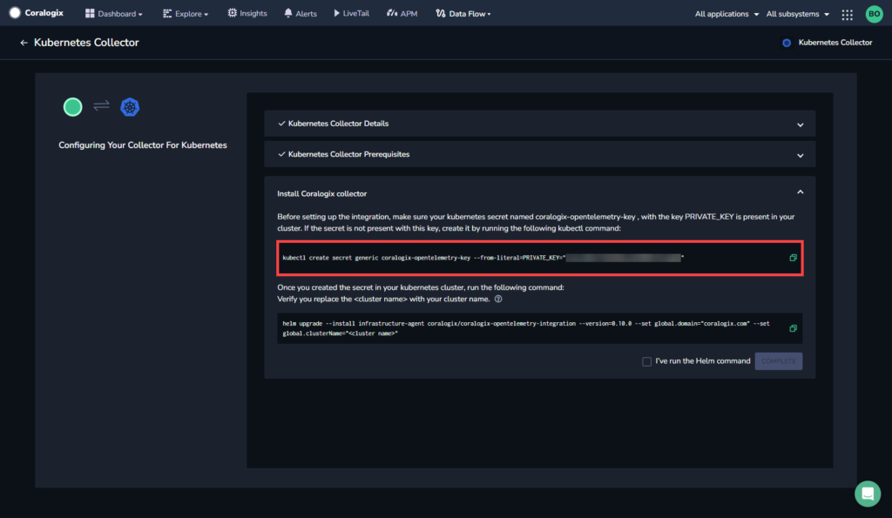
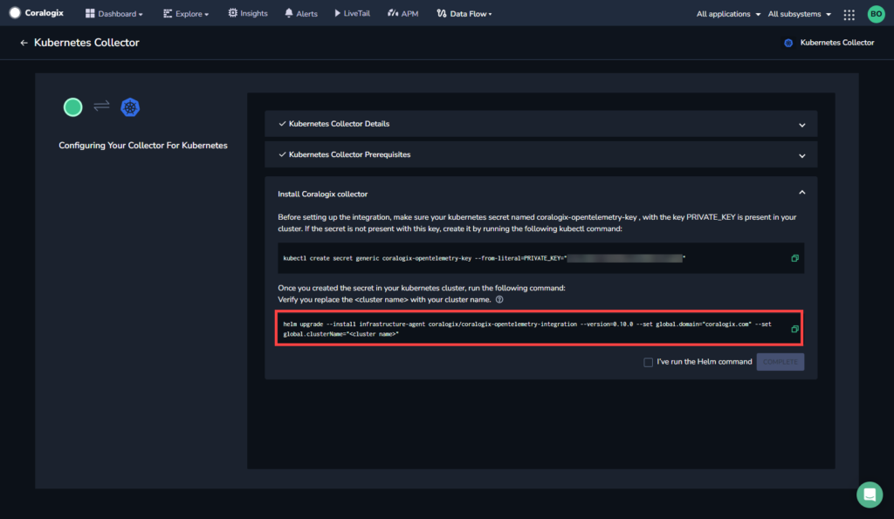
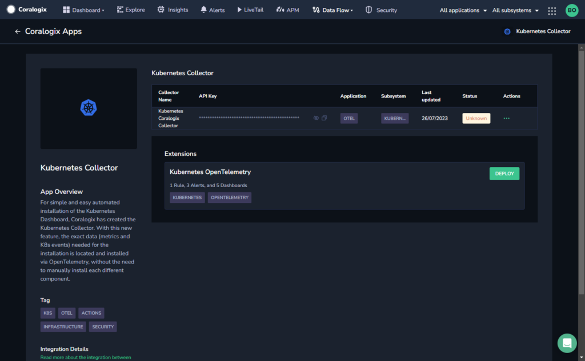
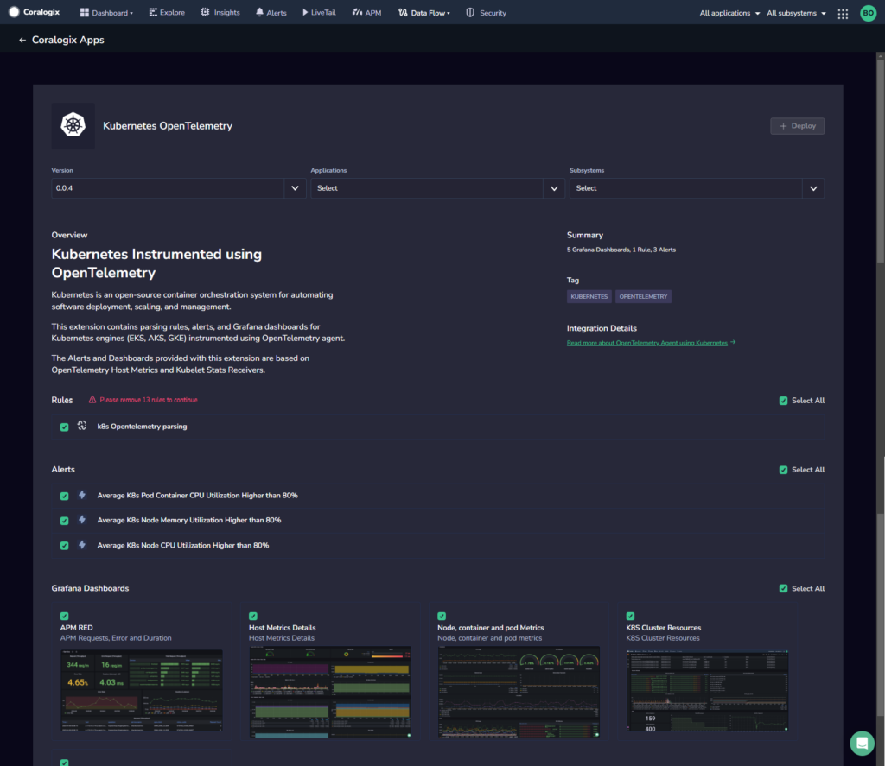

Our [Kubernetes Dashboard](https://coralogixstg.wpengine.com/docs/kubernetes-dashboard/) is a powerful web-based interface for monitoring and managing Kubernetes clusters. It provides real-time metrics on CPU, memory, network, and disk usage for nodes and pods. Users can track resource trends, optimize workload placement, and troubleshoot issues efficiently. The dashboard also displays Kubernetes events for quick problem identification and resolution. It streamlines cluster management, ensuring efficient performance and smooth application operation.

For simple and easy automated installation of the Kubernetes Dashboard, Coralogix has created **Kubernetes Infrastructure Monitoring.** With this new feature, the exact data (metrics and K8s events) needed for the installation is located and installed via OpenTelemetry, without the need to manually install each different component.

## How It Works

Kubernetes Infrastructure Monitoring is a preset of the OpenTelemetry Collector. It was designed to collect that information which is required to allow the Kubernetes Dashboard and its associated out-of-the-box features to function. The integration includes receivers and processors that are configured to enhance your telemetry data and push it to Coralogix.

## Before You Begin

- In order to successfully set up Kubernetes Infrastructure Monitoring, you may **not** have an OpenTelemetry Helm chart installed.

- If you have previously installed [OpenTelemetry using the Coralogix Exporter](https://github.com/open-telemetry/opentelemetry-collector-contrib/tree/main/exporter/coralogixexporter), manually upgrade this Helm chart to its [latest version](https://github.com/coralogix/telemetry-shippers/tree/master/otel-integration/k8s-helm) to enable the Kubernetes Dashboard feature.

- Before installing the Kubernetes Dashboard, ensure you have the following prerequisites installed:
    - Kubernetes version 1.24+
    
    - Helm version 3.9+

## Configuration

Install the Kubernetes Dashboard using Kubernetes Infrastructure Monitoring.

**STEP 1.** In your Coralogix toolbar, navigate to **Data Flow** > **Integrations**.

**STEP 2.** From the Integrations section, select ****Kubernetes Infrastructure Monitoring****.

**STEP 3.** Click **\+ SETUP COLLECTOR**.

**STEP 4.** Enter a name for your integration.

**STEP 5.** Enter a [Send-Your-Data API key](https://coralogixstg.wpengine.com/docs/send-your-data-api-key/) or click **CREATE A NEW KEY** to generate a new dedicated API key.

**STEP 6.** Click **NEXT**.

**STEP 7.** Check the Helm version by using the `helm version` command. ****Kubernetes Infrastructure Monitoring**** requires Helm v3.9 or above.

**STEP 8.** Create the Coralogix Helm repository by copying the `helm repo add` command and running it. Click **NEXT**.

**STEP 9.** Before setting up the integration, make sure your Kubernetes secret named `coralogix-opentelemetry-key` , containing your `PRIVATE_KEY`, is present in your cluster. If it is not, create it by copying and running the command shown in the installer.

**STEP 10.** Copy and run the `helm upgrade` command shown in the installer. Make sure you replace the `<cluster name>` with your Kubernetes cluster name.

**STEP 11.** Mark the checkbox to confirm you have run the Helm command. Click **COMPLETE**.

## Kick-Start Your Monitoring

Coralogix offers a variety of out-of-the-box data [extensions](https://coralogixstg.wpengine.com/docs/extension-packages/). Each tailored extension unlocks a set of predefined items – alerts, parsing rules, dashboards, saved views, actions, and more – allowing you to jumpstart Coralogix monitoring of your external-facing resources.

When you configure Kubernetes Infrastructure Monitoring, the associated Kubernetes OpenTelemetry extension package is automatically deployed.

This package provides you with a series predefined features, allowing you to hit the ground running and instantly monitor your data. It includes:

- Predefined alerts

- Predefined parsing rules

- Predefined Grafana dashboards

## Additional Resources

<table><tbody><tr><td>Documentation</td><td><a href="https://coralogixstg.wpengine.com/docs/kubernetes-dashboard/"><strong>Kubernetes Dashboard</strong></a> <strong><a href="http://www.coralogixstg.wpengine.com/docs/kubernetes-dashboard-cluster-view">Kubernetes Dashboard Cluster View</a></strong></td></tr></tbody></table>

## Support

**Need help?**

Our world-class customer success team is available 24/7 to walk you through your setup and answer any questions that may come up.

Feel free to reach out to us **via our in-app chat** or by sending us an email at [support@coralogixstg.wpengine.com](mailto:support@coralogixstg.wpengine.com).
