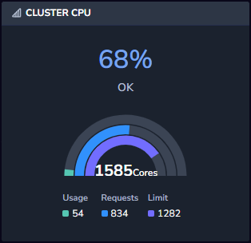
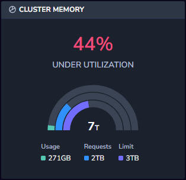
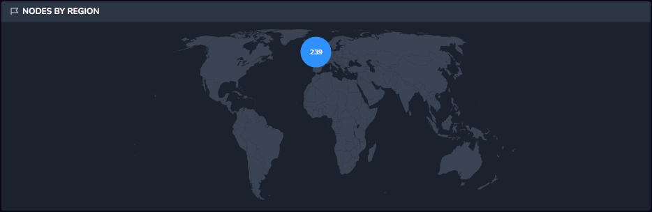
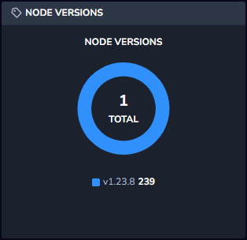
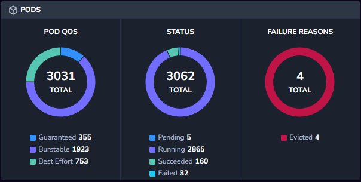
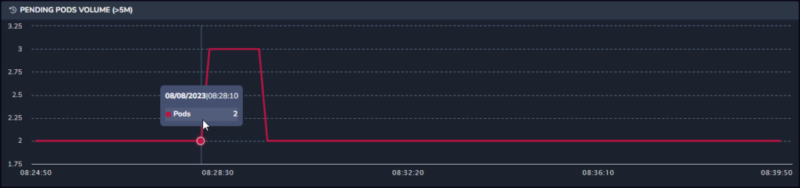
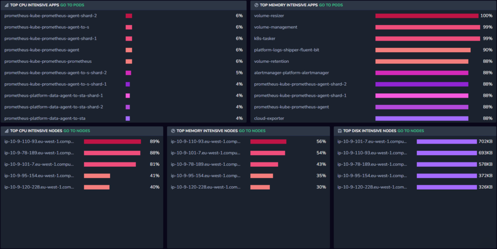

* * *

With the rise in use of Kubernetes to automate the deployment, management and scaling of containerized applications or micro-services, organizations have brought agility to deployments and cut costs. But this transition has not been without challenges. As teams are tasked with overseeing a dynamic combination of virtual machines, containers, and applications, it may become difficult to anticipate and diagnose performance issues across large distributed systems.

This is where Coralogix comes in, providing comprehensive visibility into the health and performance of your Kubernetes environments. With our [Kubernetes Dashboard](https://coralogixstg.wpengine.com/docs/kubernetes-dashboard/), managers, developers, and operations teams can effortlessly visualize and monitor their complex Kubernetes environment and gain actionable insights.

For those customers using the [Coralogix Kubernetes Collector](http://www.coralogixstg.wpengine.com/docs/kubernetes-collector), the **Kubernetes Dashboard Cluster View** is an invaluable addition to the Coralogix Kubernetes Dashboard. It provides admins and DevOps personnel with a high-level overview of their environment, allowing them to understand trends and leads before drilling down into specific problems. Use this feature to gain insights into past issues or to proactively prevent future ones.

## **How Can I Use the Cluster View?**

**Cluster View** presents the current status of your Kubernetes clusters with a variety of different widgets designed to help you view and manage your Kubernetes clusters, pods and nodes. Take a look at these use-cases to get a feel for the many ways that the **Cluster View** can serve you.

### Use Case 1: Monitoring and Troubleshooting Cluster Health

A DevOps engineer would like to see the status of all pods in a cluster including the Quality of Service (QOS), pod status, and reasons for unhealthy pods.

The **Cluster View** provides a comprehensive solution for DevOps engineers to monitor and troubleshoot the health of pods within a Kubernetes cluster. With its intuitive interface and powerful features, the dashboard allows engineers to quickly assess the status of pods based on Quality of Service (QoS), identify any unhealthy pods, and understand the reasons behind their unhealthy state.

### Use Case 2: Resource Optimization

As a DevOps engineer responsible for managing a Kubernetes cluster, you need a way to quickly identify the nodes and applications that are consuming the highest amount of resources. Additionally, you want the ability to drill down into the specific causes of high resource usage to optimize the cluster's performance and cost efficiency.

Within the **Cluster View**, you can also identify applications or micro-services that are placing the highest demands on the cluster's resources. The dashboard provides visualizations that highlight the resource usage of different applications, allowing you to identify the ones causing the most strain. Once you identify the nodes or applications with high resource usage, you can drill down into specific details using the Kubernetes Dashboard. By clicking on a particular node or application, you can access detailed logs, metrics, and performance data related to the selected entity.

## What is Included?

The **Cluster View** contains a set of widgets that allow you to assess your Kubernetes clusters, helping you make business decisions and enabling you to solve existing problems and prevent potential problems before they occur.

### Cluster CPU

The Cluster CPU widget displays how much of the cluster’s total CPU is currently in use. It shows the CPU usage (how many nodes are in use), requests (how many nodes have requested usage) and limit (when to kill or restart the service), as well as showing you the total CPU percentage currently in use.

The widget also shows you what the current utilization status is and warns if the cluster is being under or over-utilized. This allows you to avoid paying for unused resources.

### Cluster Memory

The Cluster Memory widget displays how much of the cluster’s total memory is currently in use. It shows the memory usage, requests and limit. The widget also shows you what the current utilization status is and warns if the cluster is being under or over-utilized. This allows you to avoid the risk of applications being thrown out or apps being killed if the node they are on reaches capacity.

### Nodes by Region

The Nodes by Region widget displays the spread of nodes throughout the globe based on your AWS region location.

### Node Versions

The Node Versions widget shows the current Kubelet versions in use in the cluster’s nodes, allowing you to avoid the use of outdated versions that can cause problems going forward. The widget shows the current version, how many nodes are using the current version, and the previous two versions in use.

### Pods

The Pods widget consists of three statistics about pods:

- **Pod Quality of Service (QoS)** is measured by three levels: Guaranteed (pods which have requests and limits defined), Burstable (pods which have either requests or limits defined, but not both), and Best-Effort (pods which have neither requests nor limits defined). When there is a lack of resources, pods which have guaranteed QOS will be prioritized over pods which have burstable QOS, and those will be prioritized over pods with the best-effort QOS.

- **Status** shows how many pods are running, how many are pending, how many succeeded and how many failed.

- ****Failure Reasons**** breaks down the failed pods and specifies what the different reasons are for the pods failing. Note that not all failed pods are reported with the reason, so the number of failed pods vs. failure reasons might not match 1 to 1.

### Pending Pods Volume

The Pending Pods Volume widget shows the number of pods that were in Pending status for more than 5 minutes within the timeframe selected at the top right hand side of the dashboard. This lets you see if there are trends the number of pods in pending state for any given timeframe.

### Apps and Nodes Tables

Apps are applications that are deployed and managed using Kubernetes features and resources. These include various components such as Deployments, DaemonSets, and StatefulSets, etc. The apps and nodes tables show you the top 10 services for each of the following tables.

- **Top CPU intensive apps** - Most CPU intensive apps by average over the selected time range.

- **Top memory intensive apps** - Most memory intensive apps by average over the selected time range.

- **Top CPU intensive nodes** - Most CPU intensive nodes by average over the selected time range.

- **Top memory intensive nodes** - Most memory intensive nodes by average over the selected time range.

- **Top disk intensive nodes** (for both reading and writing) - Most disk intensive nodes by average over the selected time range.

## Additional Resources

<table><tbody><tr><td>Documentation</td><td><a href="https://coralogixstg.wpengine.com/docs/kubernetes-dashboard/"><strong>Kubernetes Dashboard</strong></a> <a href="http://www.coralogixstg.wpengine.com/docs/kubernetes-collector"><strong>Kubernetes Collector</strong></a></td></tr></tbody></table>

## Support

**Need help?**

Our world-class customer success team is available 24/7 to walk you through your setup and answer any questions that may come up.

Feel free to reach out to us **via our in-app chat** or by sending us an email at [support@coralogixstg.wpengine.com](mailto:support@coralogixstg.wpengine.com).
