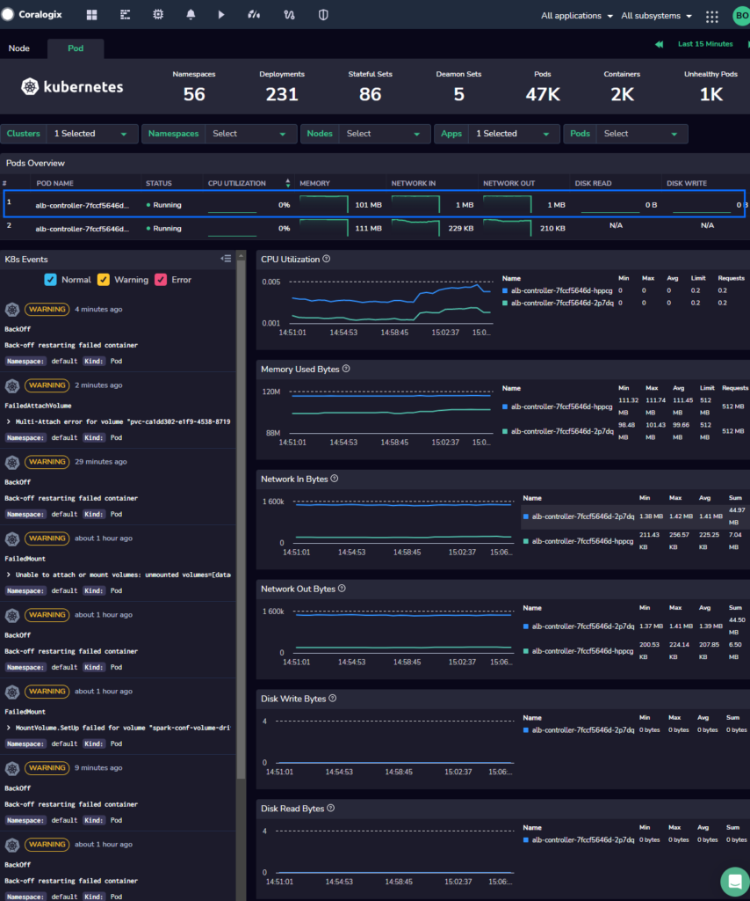
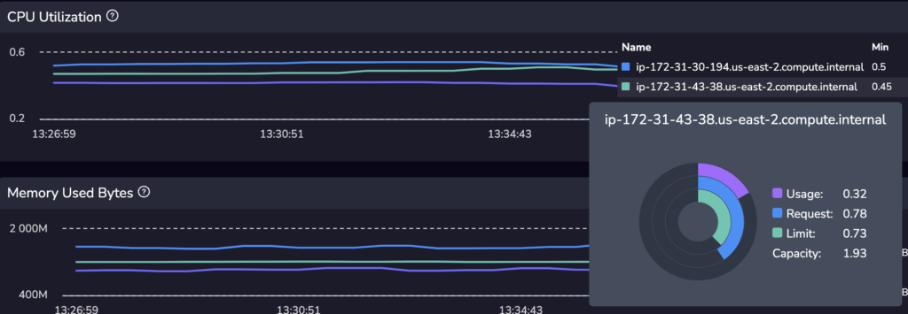
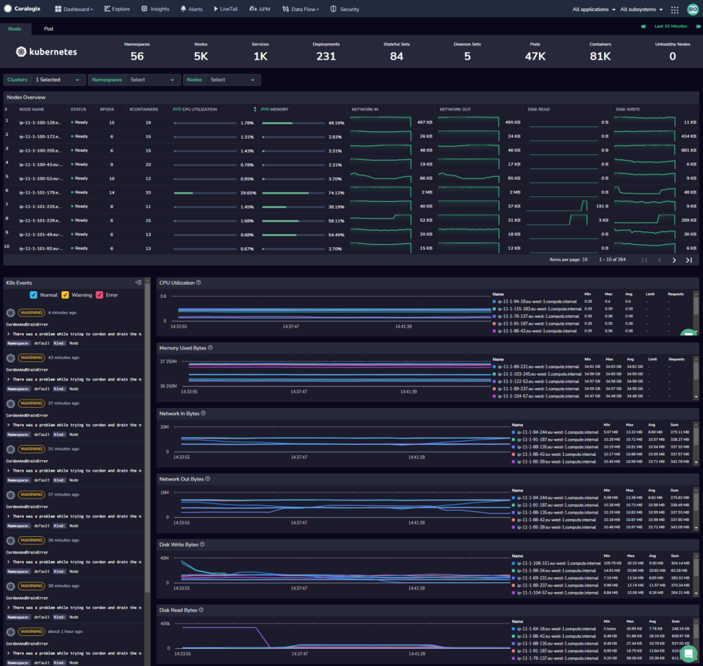
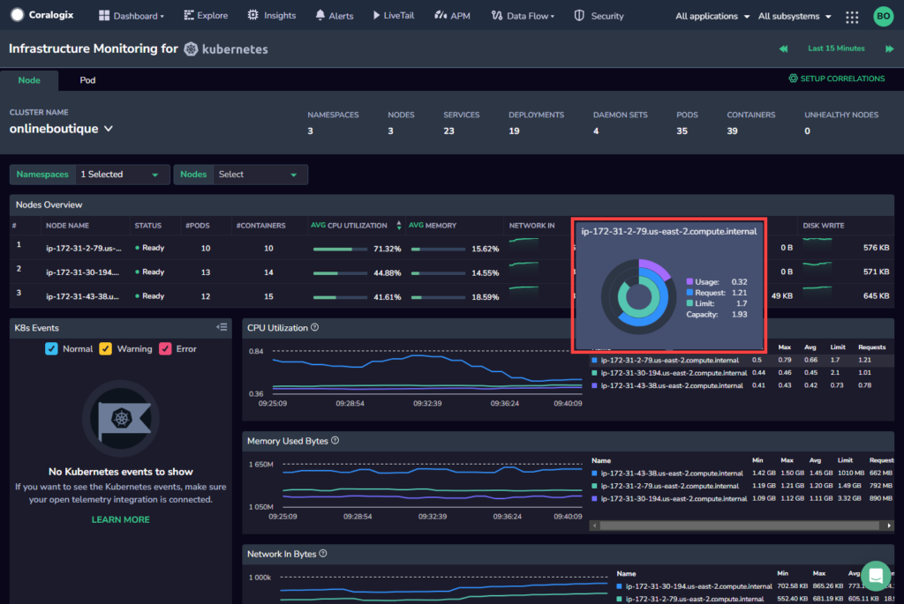
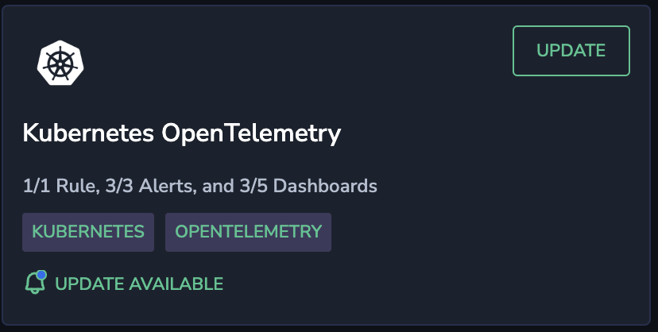

With the increasing use of Kubernetes to automate the deployment, management, and scaling of containerized applications or micro-services, organizations have gained agility in deployments and reduced costs. However, this transition has not been without challenges. As teams oversee a dynamic combination of virtual machines, containers, and applications, it can be difficult to anticipate and diagnose performance issues across large distributed systems.

This is where Coralogix comes in. We provide comprehensive visibility into the health and performance of Kubernetes environments using the **Kubernetes Dashboard**. This powerful web-based interface monitors and manages Kubernetes clusters, providing real-time metrics on CPU, memory, network, and disk usage for nodes and pods. Users can track resource trends, optimize workload placement, and efficiently troubleshoot issues. The dashboard also displays Kubernetes events for quick problem identification and resolution. It streamlines cluster management, ensuring efficient performance and smooth application operation.

Moreover, our [Streama© architecture](https://coralogixstg.wpengine.com/how-it-works/) allows you to monitor your data on this dashboard at a third of the cost, without prior indexing.

By using this feature, managers, developers, and operations teams can effortlessly visualize and monitor their complex Kubernetes environment, and gain actionable insights using analysis tools driven by machine learning, including forecasting and anomaly detection.

## Overview

Our **Kubernetes Dashboard** grants you a full and complete picture of the services that power your applications.

- **System Overview**. Access comprehensive information for all of the clusters, nodes, and pods operating in your system.

- **Resource Graphs**. Monitor the status of CPU utilization, network bytes, and disk bytes within and across all services.

- **K8 Events**. View all Kubernetes events - automatically generated objects created in response to state changes in your node and pods - that occurred in a particular context.

## **How Can I Use the Kubernetes Dashboard?**

Look at these use cases to get a feel for the many ways the **Kubernetes Dashboard** can serve you.

**Troubleshoot System Issues**

Company A experiences timeouts for applications that call services hosted on a Kubernetes Cluster. The operator navigates to the **Kubernetes Dashboard**, inspects nodes and pods, and identifies a node that has repeatedly maxed out its CPU. The operator determines which service is causing problems by examining traces and initiating remediation.

**Optimize Resource Use**

Company B seeks to optimize its cluster costs as part of its continuous improvement. The operator opens the **Kubernetes Dashboard** in Coralogix, inspects the company’s nodes, and observes a memory pattern where nodes are maxed out but CPU usage is only around 25%.

This indicates that the Company is not selecting the correct type of nodes for their workloads; their workloads are very memory intensive, but not CPU intensive. They begin work to switch their node type from a compute-optimized instance to a memory-optimized instance.

## Setup

Two **Kubernetes Dashboard** setup options are available.

### Coralogix OpenTelemetry Helm Deployment

- \[**Recommended**\] If you have previously installed OpenTelemetry using the Coralogix Exporter to send us your data or wish to do so now, manually upgrade this Helm chart to its [latest version](https://github.com/coralogix/telemetry-shippers/tree/master/otel-integration/k8s-helm) to enable the Kubernetes Dashboard feature.

- For a lightweight and semi-automated installation of the Kubernetes dashboard, use the [Coralogix Kubernetes Collector](http://www.coralogixstg.wpengine.com/docs/kubernetes-collector). This option is available only to those who do **not** have an OpenTelemetry Helm chart installed. It was designed to collect only the required information to allow the **Kubernetes Dashboard** and its associated out-of-the-box features to function. The Collector includes receivers and processors that are configured to enhance your telemetry data and push it to Coralogix.

### Using Your Own OpenTelemetry or Prometheus

- Customers using their own [OpenTelemetry](https://coralogixstg.wpengine.com/docs/opentelemetry/) or [Prometheus](https://coralogixstg.wpengine.com/docs/prometheus/) to collect their Kubernetes events can employ these existing integrations to set up the **Kubernetes Dashboard** by sending us your missing metrics or labels.

**STEP 1.** In your Coralogix toolbar, navigate to **Dashboard** > **K8s Dashboard**.

**STEP 2.** Under **I’ve Installed**, select **OpenTelemetry** or **Prometheus** and click **GO →**.

**STEP 4.** If all the metrics and labels are present, the **Kubernetes Dashboard** is opened. If there are missing metrics or labels, a screen appears detailing the missing metrics and/or labels.

**STEP 5.** Provide any missing metrics or labels. Click **DONE, RELOAD MY DATA →** to continue to the **Kubernetes Dashboard**.

## Engage with Your Kubernetes Dashboard

Access your Kubernetes dashboard in your Coralogix toolbar by navigating to **Dashboard** > **k8s Dashboard.** Click on either the **Nodes** or **Pods** tab. For each, you will be presented with a **System Overview**, **Resource Graphs**, **K8 Events**.

### System Overview

View comprehensive information for all of the clusters, nodes, and pods operating in your system.

- **Nodes**. Filter by **Cluster**, **Namespace,** and & **Node**.

- **Pods**. Filter by **Cluster**, **Node**, **Namespace**, **Service**, **App**, & **Pod**.

- Monitor the status of CPU utilization, network bytes, and disk bytes within and across all services.

- All the data is presented in a simple table with sortable columns to help you focus on the requested information for your observability needs.

### Resource Graphs

Resource graphs provide you with additional granularity regarding CPU utilization, network bytes, and disk bytes within and across all services.

When hovering over a specific service in the legend of the CPU Utilization and Memory Used Bytes resource graphs, a widget appears displaying:

- usage (how much is currently in use),

- requests (how much use has been requested), and

- limits (when it is necessary to kill or restart the service).

These are compared with the overall capacity of that node.

### K8s Events

OpenTelemetry users wishing to view Kubernetes events **must** deploy our Kubernetes OpenTelemetry extension package. Access it by navigating to **Data Flow** > **Extensions** in your Coralogix toolbar.

> An event in Kubernetes is an object in the framework that is automatically generated in response to a change of status in your resources— nodes or pods. State changes lie at the center of this. For example, phases across a pod’s lifecycle—like a transition from pending to running, or statuses like successful or failed may trigger a K8s event. As such, they are are an invaluable resource when troubleshooting issues in your Kubernetes cluster.

- Clicking on **`>`** for an event will expand it, displaying the event in its entirety.

- **Filter** events according to severity to meet your specific query needs.

- **Hover** over a particular event to view its correlated annotation across all resource graphs in your Kubernetes dashboard.

## Additional Resources

<table><tbody><tr><td>Kubernetes Dashboard</td><td><strong><a href="http://www.coralogixstg.wpengine.com/docs/kubernetes-collector">Kubernetes Collector</a></strong> <strong><a href="http://www.coralogixstg.wpengine.com/docs/kubernetes-dashboard-cluster-view">Kubernetes Dashboard Cluster View</a></strong></td></tr><tr><td>Related Documentation</td><td><strong><a href="https://coralogixstg.wpengine.com/docs/apm/">Application Performance Monitoring</a></strong> <strong><a href="https://coralogixstg.wpengine.com/docs/label-mapping/">Label Mapping</a></strong></td></tr></tbody></table>

## Support

**Need help?**

Our world-class customer success team is available 24/7 to walk you through your setup and answer any questions that may come up.

Feel free to reach out to us **via our in-app chat** or by sending us an email at [support@coralogixstg.wpengine.com](mailto:support@coralogixstg.wpengine.com).
