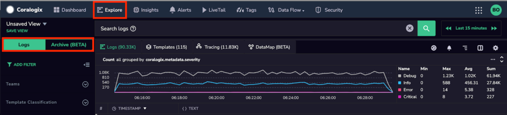

Coralogix is a powerful tool for querying your logs. By mastering how to query you will be able to find specific events out of millions of logs generated by your applications.

With this skill, you will comfortably be able to investigate issues, create alerts, and visualize your data.

In the following section you will learn about:

- Field types

- Different types of queries

Find out about our **Direct Archive Query HTTP API** [here](https://coralogixstg.wpengine.com/docs/direct-query-http-api/).

## **Concepts**

### Indexing and field mapping

In order to master how to query logs, it is important to first understand how Coralogix indexes your data after it has been analyzed. Indexing logs is important because it allows you to quickly retrieve (usually within a few seconds) matching logs using:

1. Free-text searches

3. Regular expressions

5. Field searches

**Tip:** We recommend serializing your logs as JSON to get maximum value from Coralogix analytics features. Read more about parsing unstructured logs to JSON using parsing rules [here](https://coralogixstg.wpengine.com/docs/log-parsing-rules/#parse).

### Data types

Coralogix supports the following data types:

[_Text_](https://www.elastic.co/guide/en/elasticsearch/reference/current/text.html#text-field-type): This type represents unstructured, human-readable content that is analyzed into terms before indexing.

_[Keyword](https://www.elastic.co/guide/en/elasticsearch/reference/current/keyword.html#keyword)_: This type represents text that does not pass through the analyzer before indexing. This makes it suitable for regular expressions, aggregation, and sorting.  
The syntax to use the keyword data type in your query is: <fieldName>**.keyword**

**_Note:_** Coralogix does not create the keyword type when a field is longer than **256** characters.

_[Numeric](https://www.elastic.co/guide/en/elasticsearch/reference/current/number.html#number):_ This type is suitable for range queries and arithmetic aggregations (avg, max, min, sum).  
The syntax to use the numeric data type in your query is: <fieldName>**.numeric**

[_Date_](https://www.elastic.co/guide/en/elasticsearch/reference/current/date.html): This type enables you to filter by timestamp or plot time-series graphs. Values should be formatted as epoch milliseconds.

_[Geopoint](https://www.elastic.co/guide/en/elasticsearch/reference/current/geo-point.html):_ This type allows you to plot longitude and latitude pairs on a Grafana map.

[_Object_](https://www.elastic.co/guide/en/elasticsearch/reference/current/object.html#object): This type represents a hierarchy. This means that it may contain fields of any other type (including objects).

### Notes

1. Coralogix has a default limit of 1000 mapped fields. You can view your teams mapped field statistics under _Account settings_ → _Mapping stats_

3. Explicit mapping is supported for timestamps and geopoints. Appending **\_timestamp** or **\_geopoint** to your field name will map it as a date or geopoint respectively. For example, a field named _duration\_timestamp_ is mapped as a date.

5. Dynamic mapping is used for all other fields. This means that at the time of indexing, a new field’s value determines the mapped data type.

7. Arrays are valid JSON, however, there is no dedicated array data type in Coralogix. This means that:
    1. A field may contain multiple values, and they should all be of the same data type, otherwise a [Mapping Exception](https://coralogixstg.wpengine.com/blog/elasticsearch-mapping-exceptions-the-complete-guide/) will occur.
    
    3. The first value in an array determines the field mapping.
    
    5. For an array of objects, it is not possible to query each object independently.

9. Each field in the log is mapped as 3 data types:
    1. Text or Object or Date or Geopoint
    
    3. Keyword
    
    5. Numeric

## **Querying your logs**

To get started, navigate to the Explore screen. This screen allows you to query logs from the **index** or from your **[Amazon S3 archive](https://coralogixstg.wpengine.com/docs/archive-query-from-logs-screen/)**.

The supported query languages are Lucene or [DataPrime](https://coralogixstg.wpengine.com/docs/dataprime-query-language/) (for archive queries). This tutorial will cover how to use Lucene queries on Coralogix.

### Lucene query syntax reference

A Lucene query is composed of **Terms** and **Operators**. Terms are extracted from your log by the analyzer. There are 2 types of terms:

1. **Single term**: This is a word in your Text field.

3. **Phrase**: This is a group of words surrounded by double quotation marks (“)

[This tool](https://regex101.com/r/gKuxYH/1) helps you better understand how the Coralogix analyzer extracts terms from your Text fields.

### Free text search

Use this type of search to match terms in ANY field of your log.

| Query | Results |
| --- | --- |
| a very interesting log message | Matches logs containing these terms. They may appear in any field and in any order |
| "a very interesting log message" | Matches this exact phrase in any field |

**_Note:_** [Text fields](https://www.elastic.co/guide/en/elasticsearch/reference/current/text.html#text-field-type) will pass through an analyzer before indexing. The analyzed text is separated into the “**terms**” used to index your logs.

### Field search

Use this type of search to restrict which field MUST match your search term.

Examples:

| Query | Results |
| --- | --- |
| msg:interesting | Matches logs containing this term in the msg field |
| msg:“a very interesting log message!” | Matches this exact phrase in the msg field. |
| msg.keyword:”a very interesting message!” | Matches logs that contain the phrase (including the !) |

### Range search

Use this to query a range of matching numeric values

Examples:

| Query | Results |
| --- | --- |
| status\_code.numeric:\[200 TO 299\] | Matches status codes between 200 and 299 (including 200 and 299) |
| status\_code.numeric:{199 TO 300} | Matches status codes between 200 and 299 (excluding 199 and 300) |
| status\_code.numeric:\[200 TO 300} | Matches status codes between 200 and 299 (including 200 but excluding 300) |
| status\_code.numeric:{199 TO 299\] | Matches status codes between 200 and 299 (excluding 199 but including 299) |

### Regex search

Regular expressions are available to match patterns in your log. Coralogix supports Lucene regex engine [standard operators](https://www.elastic.co/guide/en/elasticsearch/reference/8.4/regexp-syntax.html#regexp-standard-operators)

The regex pattern to be matched should be enclosed in forward slashes “/”.

**Note:** Whenever possible, we recommend using regex searches against **keywords**, because this data type is not passed through the analyzer.

Examples:

| Query | Results |
| --- | --- |
| msg.keyword:/.\*what an interesting message!_._\*/ | Matches logs that contain the pattern “what an interesting message!” (including the !) |
| version.keyword:/.\*v.\[1-5\].\[0-9\]{2}_._\*/ | Matches logs that contain the patterns like “v.1.24” or “v.5.69” in the version field |

### Boolean Operators and Grouping

The operators **AND**, **OR**, and **NOT** can be used to combine multiple filters and create more precise queries.

Parentheses “()” should be used to determine operator precedence whenever you have multiple operators in a query.

Examples:

| Query | Results |
| --- | --- |
| msg:”failed transaction” AND level: “ERROR” NOT env:”staging” | Matches ERROR level logs that contain the phrase "failed transaction" |
| (msg:"failed transaction" AND (cluster:"eu" OR cluster:"us")) NOT env:"staging" | Matches logs from the "eu" or "us" clusters that contain the phrase "failed transaction" but not from the "staging environment" |

## Additional Resources

<table><tbody><tr><td>API</td><td><strong><a href="https://coralogixstg.wpengine.com/docs/direct-query-http-api/">Direct Archive Query HTTP API</a></strong></td></tr></tbody></table>

## Support

**Need help?**

Our world-class customer success team is available 24/7 to walk you through your setup and answer any questions that may come up.

Feel free to reach out to us **via our in-app chat** or by sending us an email at [support@coralogixstg.wpengine.com](mailto:support@coralogixstg.wpengine.com).
