This tutorial will help you navigate through the main capabilities in the Coralogix **logs screen**.

The tutorial is organized by functionality:

- Queries and filters

- Rapid visualizations

- Custom views

## Queries and Filters

Queries are a combination of time selection, search query, and filter selections.

### Time selection

To make a time selection click on the time selection box on the upper right corner of the browser window

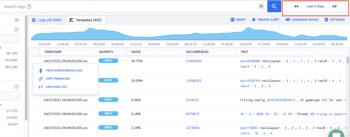

This will open few options for time selections:

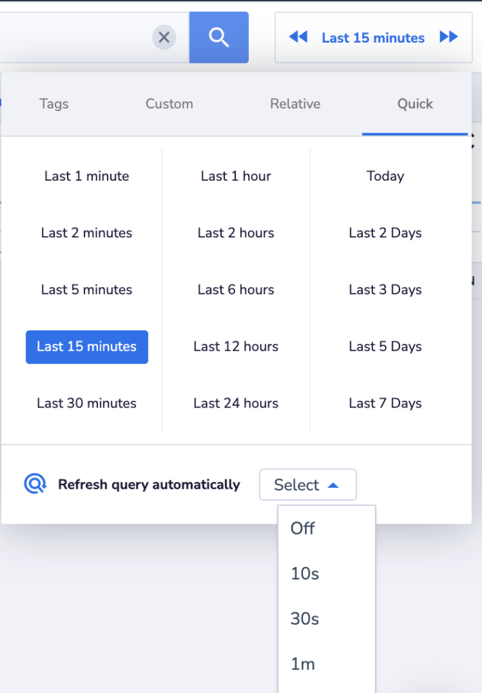

- Quick - Select a predefined query interval with one click

- Relative - Choose a time window between (current time - t1) and (current time - t2)

- Custom - Choose between two absolute dates and times

- Tags - Choose an [application tag](https://coralogixstg.wpengine.com/tutorials/software-builds-display/).

Dragging the mouse across a section of the logs flow graph will zoom into the previous query time range and set a new time interval.

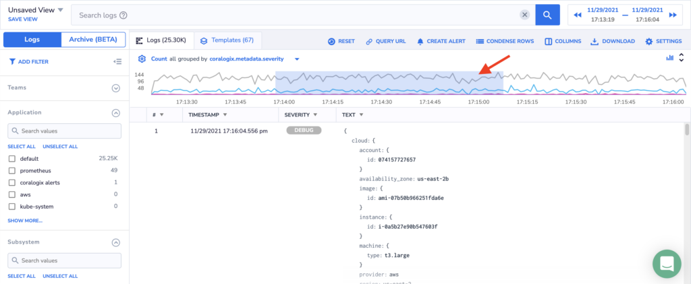

During root cause and impact analysis, it is often the case that users would like to define a query window around a specific event represented by a log. In order to do so, move the mouse to the left of the log's timestamp. Click the 3 dots that appear on the screen and choose the time window you want the query to run, around this specific log.

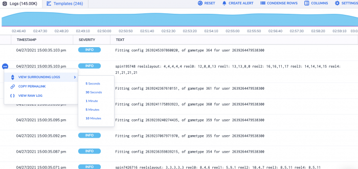

### Search queries

Search queries are still conducted mainly from the "Search logs" entry field. You can read about queries [here](https://coralogixstg.wpengine.com/tutorials/log-query-simply-retrieve-data/). The new logs screen includes facilities that help you build queries based on the log fields. When clicking on a json field value a drop-down menu opens.

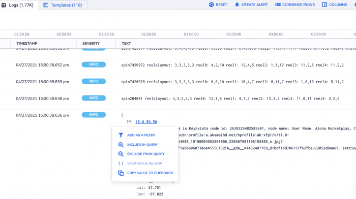

Clicking on the option "INCLUDE IN QUERY" will add the expression '\_exists\_: "IP\_geoip.ip"' to the query. Choosing the exclude option will add the expression 'NOT \_exists\_: "IP\_geoip"' to the query. You can also copy the complete JSON path to the clipboard, which can help in building query expressions.

### Filters

The filters section occupies the left side of the Logs tab. It enables the selection of specific values to be queries per filter. By default, the screen opens with application, subsystem, and severity filters, but the filters are completely customizable and metadata or log field are available.

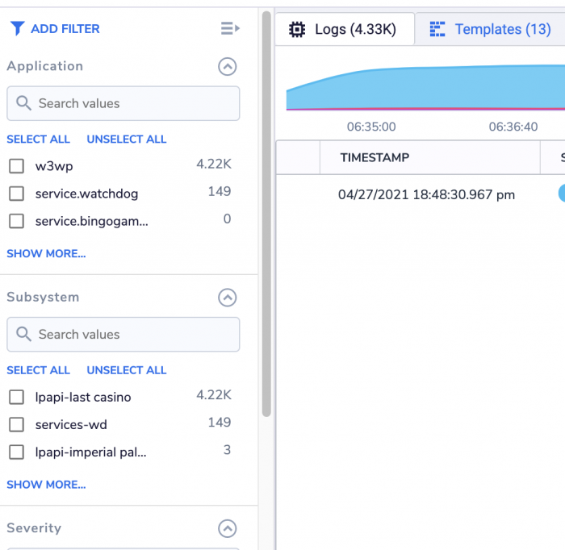

Filters can be minimized and deleted using the ^ and x icons to the right of the filter name. The graph icon allows for rapid visualization of the filter values (see next section).

Filters can be added by clicking the "ADD FILTER" button at the top of the filter section. They can also be added by choosing the "ADD TO FILTER LIST" option in the dropdown menu that opens when clicking on a JSON field.

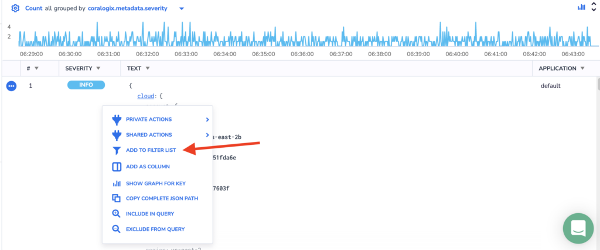

  
  

### Choose the row format

We know that during the analysis you can find that each log takes too much space on the screen. This is why you can use the Row Format button to change the way how very long logs are displayed. There are following options:

- 1-Line - logs are condensed into one line

- 2-Line - logs are condensed into two lines

- Condensed - the whole log is visible but without breaking into lines

- JSON - the default view where JSON objects are parsed

<figure>

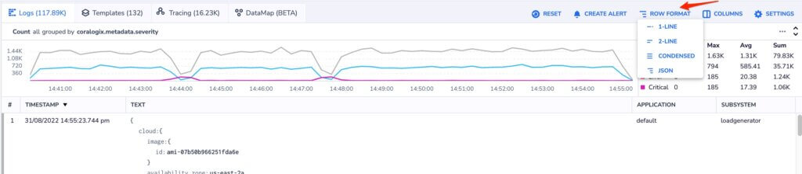

<figcaption>

_Row Format - JSON_

</figcaption>

</figure>

If you would like to see the whole log you can click on the + sign:

<figure>

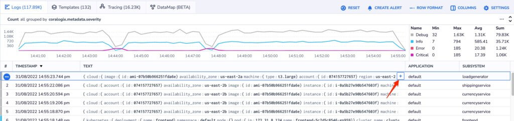

<figcaption>

_Row Format - 1-Line_

</figcaption>

</figure>

## Clearing a query

Clicking on the x to the right of the query string will delete the query string but will not affect the rest of the query parameters (filters and time window).

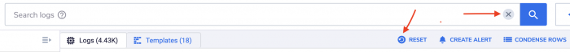

Clicking on the "RESET" button will clear all query parameters (including filters).

## Rapid visualizations

When performing root cause and impact analysis it is very common to look at values distribution, the distribution of IP addresses, user names, subsystems, etc. Within a set of logs, this can give us clues about offending components, where is the problem is, and what is its impact. Coralogix users can generate very sophisticated visualizations and dashboards using Grafana, OpenSearch and other tools. The logs screen provides ways to rapidly generate count-based visualizations as part of the analyst log flow. These visualizations can be pinned to your main dashboard and to the tags tab.

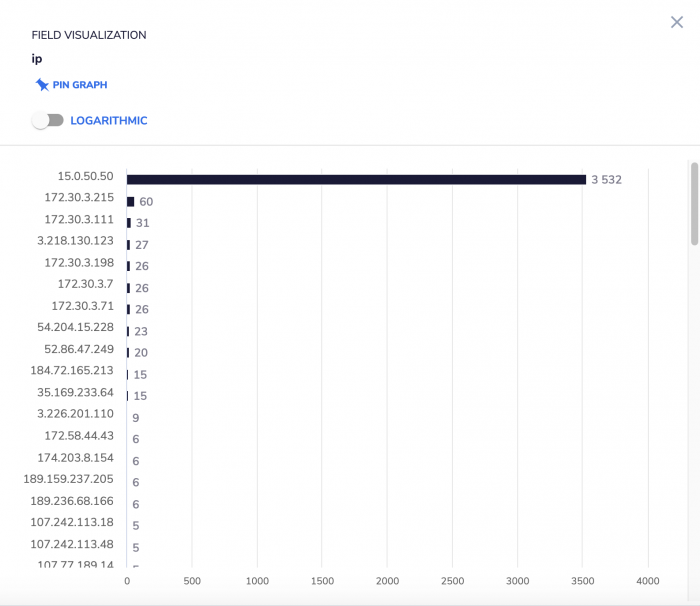

Choose the logarithmic option if there is an order of magnitude variation in the distribution.

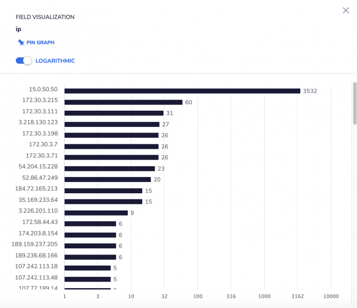

The filters section on the left shows the count-per-filter value. It will also provide a way to generate a count distribution graph for the filtered key. Hover with the mouse above the specific filter area. Click on the graph icon to the right of the filter name, and a graph similar to the above will be generated.

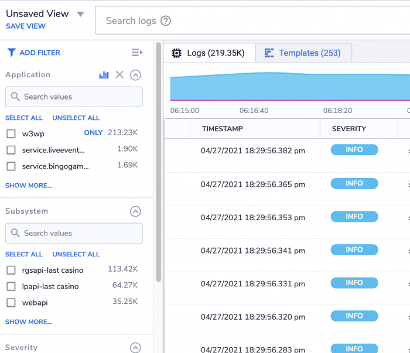

A third option of creating a rapid visualization can be found in the settings menu. The visualization will track the count of logs (same as the log flow graph at the top of the screen) per time window selected and the query parameters that are currently effective in the logs screen.

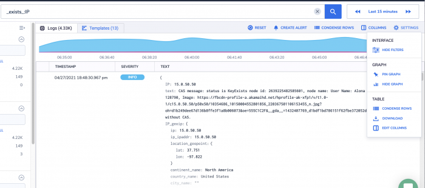

## Custom views

Custom views help users look at the specific log information that is important for them, as well as create views that will help other users be more efficient, even if they are less technical or don't know the logs as well.

A view is defined by a query (see the "Queries and filters" section) that creates the initial logs set that the view starts with, and columns (each column corresponds with a log field) that define the log data the user will see. 'Text" is a special column (or field) that holds the entire log (excluding metadata). Every field can be removed or added to a view.

Adding a column can be done by clicking on a JSON field and choosing the "ADD AS COLUMN" option from the dropdown menu.


It can also be added from the 'COLUMNS" button.

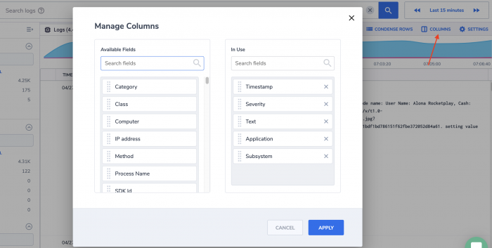

Clicking on the "COLUMNS" button will open the "Manage Columns" window. You can move fields between the two lists by dragging them. Press the "APPLY" button to make sure the action takes effect. The "Manage Columns" window can also be accessed from the  "SETTINGS" menu.

A view can be saved by using the "SAVE VIEW" option.

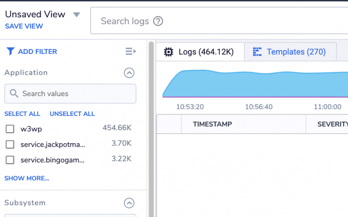

Clinking on it will open a window where you enter the name for the custom view, and indicate if it includes the query selection, if it is the new default view, and if it is private or available to all the account users.

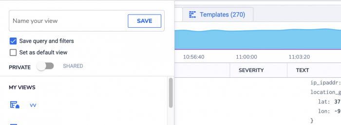

To open a saved view, click on save view or the arrow near the view name and scroll down to the list of saved views ("MY VIEWS" and "SHARED VIEWS").

## **Static query link**s

You can retrieve your data by performing queries and opening public saved views within the URL address.

**Examples:**

```
https://YOUR_TEAM_NAME.coralogixstg.wpengine.com/#/query-new/logs?query=YOUR_QUERY
```

```
https://YOUR_TEAM_NAME.coralogixstg.wpengine.com/#/query-new/logs?query=Field_Name_1:Value_1%20AND%20Field_Name_2:Value_2&startTime=1591740610000&endTime=1591741210000
```

```
https://YOUR_TEAM_NAME.coralogixstg.wpengine.com/#/query-new/logs?viewName=YOUR_VIEW
```

**Notes:**

- The time parameter should be in epoch 13 format.

- We support static query links only to public views.

- When a view is saved with query parameters the time frame will be the time range of the saved query.

**Our customers are one of our main sources of innovation, we'd love to hear from you! Please send us your feedback to [support@coralogixstg.wpengine.com](mailto:support@coralogixstg.wpengine.com) or via the chat box in the lower right corner of the screen.**
