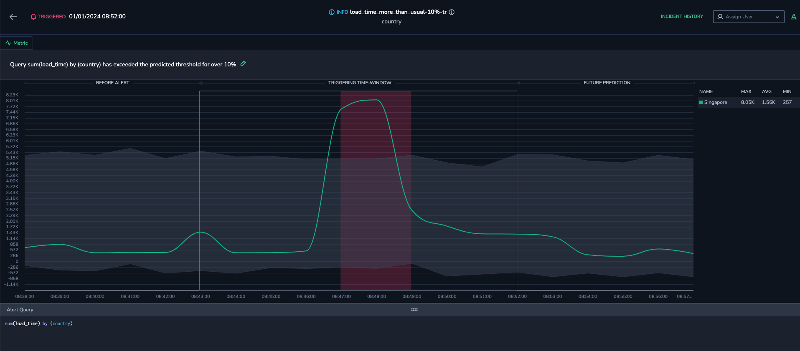
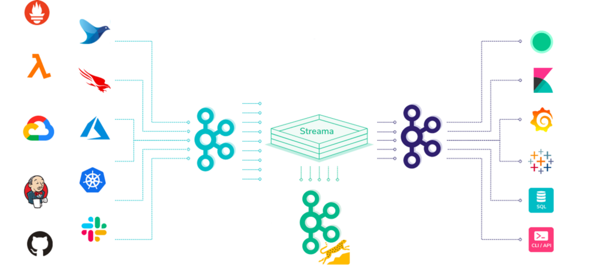
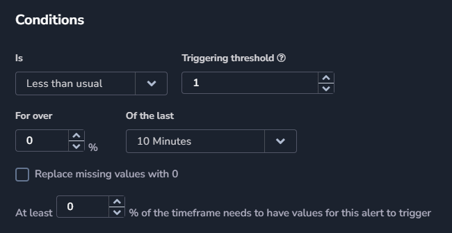
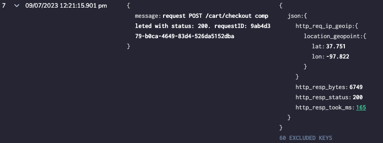

Static alerts often result in alert fatigue, causing important notifications to be lost in a flood of irrelevant ones. Misconfigurations can cause missed events or frequent false alarms, requiring constant manual adjustments. What’s more, static alerts fail to adapt to system changes.

The Coralogix **Machine-Learning Metric Alert** solves these issues by automatically learning your system and adapting to your evolving infrastructure. This allows you to quickly set up alerts that track thousands of components and proactively alert on deviations from the norm. These alerts are powered by our [Streama© technology](https://coralogixstg.wpengine.com/how-it-works/), which allows them to run on the Coralogix monitoring pipeline at a third of the cost, without prior indexing.

## Overview

The **Machine-Learning Metric Alert** utilizes advanced artificial intelligence algorithms to analyze incoming metric time series and predict their expected behavior for the next 24 hours. This powerful capability enables businesses to proactively identify anomalies in real-time, providing valuable insights and timely alerts. By establishing a baseline for normal behavior, teams can quickly respond to issues, minimizing downtime, enhancing operational efficiency, and ensuring a seamless user experience. With customizable thresholds and notification settings, the **More Than Usual** and **Less Than Usual** conditions adapt to diverse software environments, making them an indispensable tool for maintaining optimal performance.

## How Streama Enables In-Stream Machine Learning Alerting

The **Machine-Learning Metric Alert** is powered by our [Streama© technology](https://coralogixstg.wpengine.com/how-it-works/), which enables automatic triggering of your alerts as part of the streaming process, **without prior indexing**. In other words, we process your data first and delay storage and indexing until all important decisions have been made. Using this technology, our alerts automatically learn your system and adapt to your evolving infrastructure, allowing for rapid setup that can track thousands of components and proactively alert on deviations from the norm.

## User Manual

Create metric alerts with the More Than Usual or Less Than Usual conditions using our advanced machine learning model. When the value of your metric exceeds or falls short of a predefined baseline that is considered normal, an alert is triggered to notify you of the deviation.

Our machine learning model establishes the baseline standard for your metric. It is applied daily for the next 24 hours, using data from the past 7 days, and is based on a maximum of 500 permutations per metric.

When a metric surpasses or remains under this predefined threshold, it suggests that something out of the ordinary has occurred, potentially indicating a problem or an opportunity for corrective action. An alert is triggered to notify you of a deviation matching your **More Than Usual** or **Less Than Usual** conditions.

### Create a Metric Alert With the More Than Usual Condition

**STEP 1.** Follow the instructions for creating a [metric alert](https://coralogixstg.wpengine.com/docs/metric-alerts-promql/) and select **More Than Usual** in the Conditions section.

**STEP 2.** Enter a **minimum threshold** below which the alert will not be triggered.

**STEP 3.** Enter a percentage (**for over x %**) and timeframe (o**f the last x minutes**) to determine the length of time for which the metric must be more than usual within the time window.

**STEP 4.** Select the percentage (**at least x %**) of the timeframe which needs to have values for the alert to trigger.

**STEP 5.** Finish setting up the alert as specified in the instructions for creating a [metric alert](https://coralogixstg.wpengine.com/docs/metric-alerts-promql/).

### Create a Metric Alert With the Less Than Usual Condition

**STEP 1.** Follow the instructions for creating a [metric alert](https://coralogixstg.wpengine.com/docs/metric-alerts-promql/) and select **Less Than Usual** in the Conditions section.

**STEP 2.** Enter a **triggering threshold** above which the alert will not be triggered.

**STEP 3.** Enter a percentage (**for over x %**) and timeframe (**of the last x minutes**) to determine the length of time for which the metric must be less than usual within the time window.

**STEP 4.** Select the percentage (**at least x %**) of the timeframe which needs to have values for the alert to trigger.

**STEP 5.** Finish setting up the alert as specified in the instructions for creating a [metric alert](https://coralogixstg.wpengine.com/docs/metric-alerts-promql/).

## How Can I Use the Machine Learning Metric Alert?

Take a look at these use-cases to get a feel for the many ways that the **Machine Learning Metric Alert** can serve you.

### Use Case 1: Metrics

A developer needs to closely monitor the average latency of route responses within her organization's services. The services are situated in a complex cloud environment, and consist of numerous routes, each with a wide range of response times.

To accomplish this, she defines a specialized **Machine Learning Metric Alert** using the **More Than Usual** conditions. This alert is designed to detect instances when response times deviate from the norm, intelligently grouping routes by their respective labels.

The alert system incorporates prediction modeling techniques to account for the variability in response times across different routes. It considers that certain routes may have response times an order of magnitude higher than others, ensuring accurate and reliable insights into the system's performance.

By monitoring the services in this way, the developer can gain a holistic understanding of their behavior and proactively identify and address potential performance bottlenecks.

### Use Case 2: Events2Metrics

A DevOps engineer takes advantage of the **Machine-Learning Metric Alert** solution to monitor and receive notifications when a response time exceeds its usual duration.

Leveraging the power of our innovative [Events2Metrics](https://coralogixstg.wpengine.com/docs/event2metrics/) functionality, he effortlessly converts transaction logs into meaningful metrics that precisely track response times. By extracting the relevant data from the transaction logs, this Coralogix tool creates a dedicated metric specifically designed to monitor a response time. This numeric key becomes the foundation for establishing alerts that keep you informed whenever the response time deviates from its expected range.

The DevOps engineer receives instant notifications when a transaction's response time surpasses its usual duration, allowing him to quickly identify and address any performance bottlenecks or potential issues within his system.

### Use Case 3: Security

As a security analyst responsible for monitoring the outgoing traffic of hosts within your organization's cloud environment, your primary objective is to ensure the security and integrity of sensitive data, detecting any potential breaches or leaks that may occur.

One of the challenges you face is the significant variation in the amount of traffic generated by different hosts within the same platform. To address this, you utilize the **More Than Usual** condition for the **Machine-Learning Metric Alert**. By tracking the outgoing traffic and grouping it using the `host_name` label, you can effectively identify any anomalies that may indicate a data breach.

Coralogix goes a step further by learning the unique traffic-out patterns of each individual host in the environment. It creates a dedicated model for every host name, enabling you to gain a comprehensive understanding of their typical traffic-out behaviors. This personalized approach ensures that your monitoring efforts are tailored to the specific characteristics of each host, minimizing false alarms and maximizing the detection of genuine threats.

When the outgoing traffic of a host exceeds its usual levels, the metric alert triggers an immediate response from your security analyst team. This timely notification allows you to swiftly investigate and take appropriate action to mitigate any potential risks to your organization's data assets.

### Use Case 4: Resource Utilization Metrics (CPU, Memory, Disk I/O)

In a cloud or data center environment, monitoring the utilization of resources like CPU, memory, and disk I/O is essential for ensuring smooth operations.

An alert for lower-than-usual resource utilization can indicate underutilization or idleness of critical systems, which might mean that an application is down, or there's a misconfiguration causing underperformance. This type of alert helps in optimizing resource allocation and can also serve as an early warning for system failures.

## Additional Resources

<table><tbody><tr><td>Documentation</td><td><strong><a href="https://coralogixstg.wpengine.com/docs/metric-alerts-promql/">Metric Alerts</a> <a href="https://coralogixstg.wpengine.com/docs/flow-alert/">Flow Alerts</a></strong></td></tr></tbody></table>

## Support

**Need help?**

Our world-class customer success team is available 24/7 to walk you through your setup and answer any questions that may come up.

Feel free to reach out to us **via our in-app chat** or by sending us an email at [support@coralogixstg.wpengine.com](mailto:support@coralogixstg.wpengine.com).
