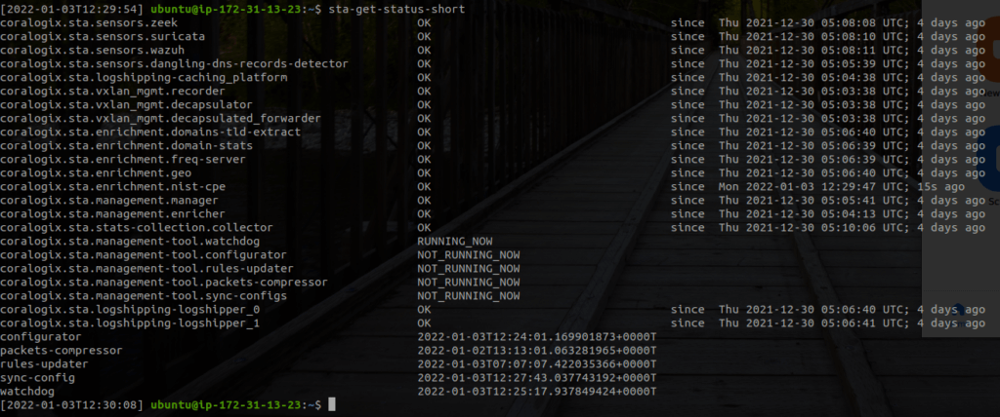

The Snowbit STA comes, prebuilt with tools and services that automatically handle the majority of the management issues of the STA so you won't have to do anything.

Just in case you'll need it, the STA comes with a collection of commands that will help you control it. In this article, we'll explain each command and when to use it.

## STA Commands

### **`sta-acknowledge-installation-id`**

When you have finished installing the STA, it is recommended that you will run the command `sta-get-installation-id` and store its output in some secure place and then run this command. The installation ID is required to get privileged access to the STA, thing which might be required by our support team. Once you run the acknowledgement command, it will erase the installation ID from the instance.

### **`sta-get-status-short`**

This command will print something similar to the following output which will indicate the current status of every service in the STA. If the STA was just installed it is normal that it takes for some services some time (up to 10 minutes) to fully stabilize:



### **`sta-test-coralogix-connection`**

This command will test the connection to Coralogix by sending a dummy event to your Coralogix account. If you see it in Coralogix within a second or two it means that the connection to Coralogix is working properly.

### `sta-get-version`

Provides the current version of the STA.

### **`sta-update-version`**

By default the STA is updating itself seamlessly. This command requires 1 additional argument which can be set to a `<specific_version>/latest` update. in case you provided a specific version for the STA using this command, please note that the STA won’t update itself until this command will be executed again with `"latest"` as an argument.

### `sta-get-defacto-config`

This command returns the STA’s current full configuration as JSON output.

### `sta-edit-config`

Editing STA’s configuration can be performed only when not using a remote storage such as S3 (highly recommended).

this holds the full configuration for the STA and all its relevant components and services.

### `sta-select-config-editor`

By using this command you can select your preferred editor for example `VI` or `nano`. please see command above for the editing constraints.

### `sta-diag-validate-config`

In case you are using a remote storage, you can validate the current `sta.conf` file’s schema. Note that when editing the configuration the STA is validating the schema on the fly - so this command is not mandatory when configuration changes are executed.

### `sta-encrypt-config-value`

As the STA’s configuration can hold delicate information that you might want to prevent from other users to read it, you can encrypt desired values by following the steps after running the command.

### `sta-get-service-logs`

Using this command, you can investigate different services that are running within the STA. additional argument is required which is representing the desired service. The service name can be found when running the command `sta-get-status-short` that presented above.

### **`sta-lookup-rule`**

This command allows you to find a Suricata rule used by the STA by using its SID as mentioned here: [How to Modify an STA Suricata Rule](https://coralogixstg.wpengine.com/tutorials/how-to-modify-an-sta-suricata-rule/)

### **`sta-wazuh-list-agents`**

If you have installed Wazuh agents and have connected them to the STA, this command will display a list of all the connected agents like this:

```
Available agents: 
   ID: 001, Name: ip-172-31-29-200, IP: any
   ID: 002, Name: ip-172-31-29-10, IP: any
   ID: 003, Name: ip-172-31-30-89, IP: any
   ID: 004, Name: ip-172-31-27-174, IP: any
   ID: 005, Name: ip-172-31-31-73, IP: any
   ID: 006, Name: ip-172-31-30-60, IP: any
   ID: 007, Name: ip-172-31-21-241, IP: any
   ID: 008, Name: ip-172-31-17-78, IP: any
   ID: 009, Name: ip-172-31-29-40, IP: any
   ID: 010, Name: ip-172-31-23-114, IP: any
```

**`sta-wazuh-add-agent`**

You can add Wazuh agents from different machines manually using this command. This command requires 2 additional arguments: `agent name` and `agent ip`. To see the constraints for those arguments please run this command without no arguments. Please note that if you are installing Wazuh agents using our Documentation, those agents are added automatically and no actions are required.

**`sta-wazuh-remove-agent`**

You can remove Wazuh agents from different machines manually using this command. This command requires 1 additional argument: `agent id`. To get all agents IDs use `sta-wazuh-list-agents` command. Please note that the STA is monitoring each agent, and in case no communication is received from the agent for some time, the STA removes it automatically.

**`sta-wazuh-restart-agents`**

By using this command, the STA restarting all Wazuh agents that are currently connected.

**`sta-wazuh-get-key`**

Use this command to get Wazuh agent’s key. requires 1 additional argument: `agent id`. To get all agents IDs use `sta-wazuh-list-agents` command.

### **`sta-force-rules-updater`**

Normally, the STA will update its set of rules for Suricata, Zeek and Wazuh every day at 07:07AM at the STA's local time. If you want it to update these rules now run this command.

### **`sta-force-sync-configs`**

Normally, the STA will attempt to synchronize its config files from the S3 bucket that has been configured during the installation phase every three minutes. If you have made a change to your configuration and would like to apply these changes now you can run this command.

### **`sta-diag-general`**

Provides a general overview of the STA's performance including both network, processor, disk and memory metrics.

### **`sta-diag-network`**

Provides detailed real-time information about the network usage in the STA.

### **`sta-diag-top`**

Launches a "top" like tool that provides information about processes, threads, memory and tasks metrics.

### **`sta-diag-delete-traffic-mirror-sessions`**

Currently supported for STA deployed on AWS. This command will delete a Traffic Mirror Session depended on a required argument representing available `<traffic_mirror_target_id> (tmt-*)` or `<traffic_mirror_filter_id> (tmf-*)`

### **`sta-diag-disk-usage`**

This command will provide current disk usage separated per root level folders. To see the disk usage iterated recursively over whole paths use the following command: `**sta-diag-disk-usage-detailed**`.

### **`sta-diag-dump-cache`**

using this command, you can dump all into console all available cache enrichment files. the output is separated per enrichment represented as files. this is the representation per line:

- Enrichment file’s full path

- File’s name written in encoded base64

- decoded content from the name written above

- relevant socket that provided that enrichment

### **`sta-test-enrich`**

Tests the enrichment of data by the various services in the STA.

### **`sta-set-mgmt-ip`**

Useful for on-prem installations where each server has a manual management IP address. In such cases use this command to specify the address you would like the STA to have.

### **`sta-set-mgmt-ip-dhcp`**

Useful for on-prem installations. In case you used the **`sta-set-mgmt-ip`** command to force the STA to use a manually set IP address for its management network interface and now interested in reverting that to the default (using an IP address from a DHCP).

### **`sta-reload-mgmt-nic`**

This command tears down current `management NIC` and bringing it up again. use this when you want to restart the management NIC that handles all STA’s traffic communication.

### **`sta-get-disk-usage`**

Run this command to see how the storage is used per root’s folders. If you wish to see every folder separately in a recursive manner use `**sta-get-disk-usage-detailed**`.

### **`sta-diag-get-debug-package`**

by using this command, the STA collects all possible logs from all services, system processes, etc. and compresses them into one archive. This command is available so you’ll be able to provide our support a full state of your STA.

Note - This command is a very heavy process. Use this command as last resort for investigating issues in your STAs as this archive hold **everything** and it similar to look for a needle in a haystack.

### **`sta-get-metric-value`**

by using this command, you are able to inspect specific metric files and perform aggregation functions in specific timeframe. the initial path for all metric files is: `/coralogix/sta/metrics/` - from there, locate the desired `Whisper` file which representing your metric. The supported aggregation functions are: `max|min|last|avg|len`.

## Notes

- Other commands that exist on the STA are meant to be used by Coralogix customer success team in very special cases.

- If you think that you need root access to the STA, there is a way to get that. Please contact us via the chat in Coralogix for additional details.
