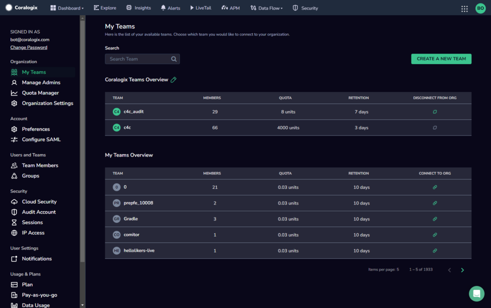
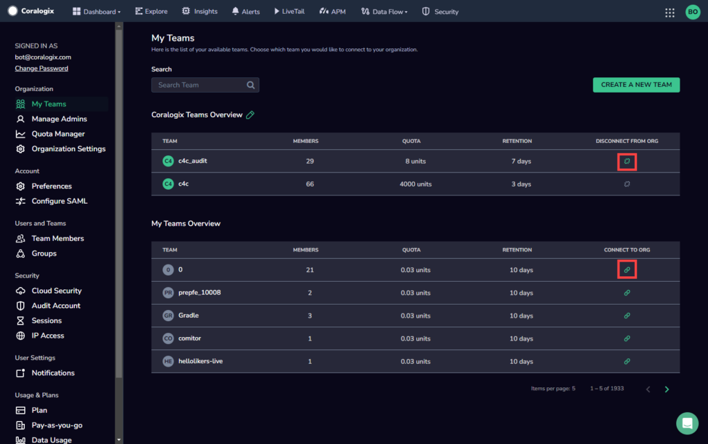
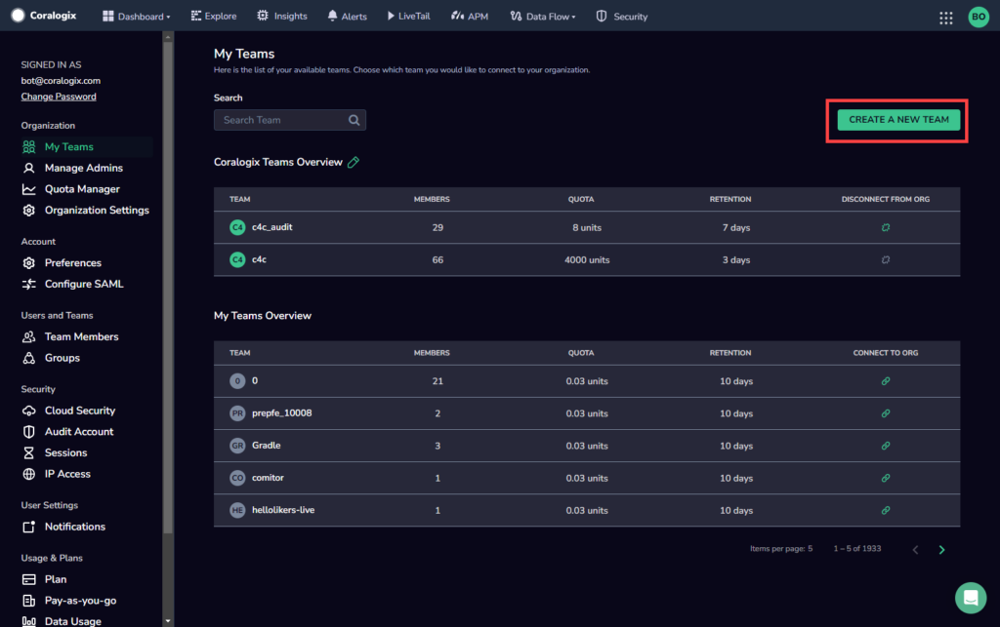
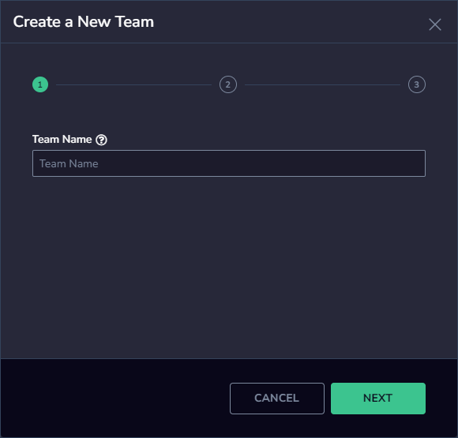
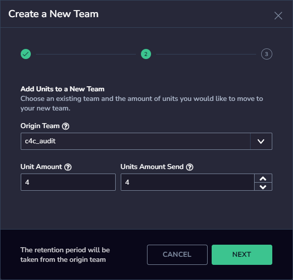
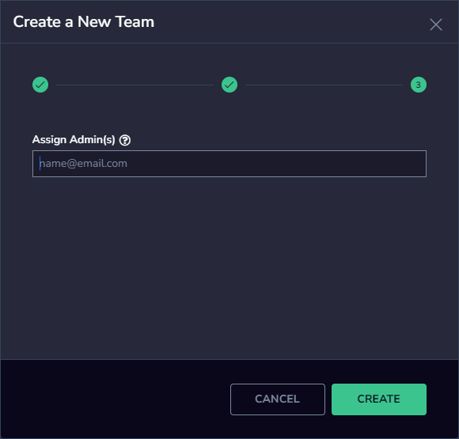

As [Organization Administrator](http://www.coralogixstg.wpengine.com/docs/managing-your-organization), you can manage the teams in your organization on your **My Teams** page.

## Overview

The **My Teams** page allows Organization Administrators (Org Admins) to manage their teams from a single convenient location.

- Connect and disconnect teams from your organization.

- For each team, view the number of members it has, [data usage quota](https://coralogixstg.wpengine.com/docs/data-usage/), and [retention](https://coralogixstg.wpengine.com/docs/archive-retention-policy/).

## Connect & Disconnect Existing Teams

To connect teams that you are a member of, but that are not yet categorized as part of your organization, click on the **connect** hyperlink symbol.

To disconnect any teams that you do not want categorized as part of your organization, click on the **disconnect** hyperlink symbol.

## Create a New Team

**STEP 1.** From the My Teams page, click **CREATE NEW TEAM**.

**STEP 2.** Enter a name for your new team and click **NEXT**.

**STEP 3.** Add units to your new team. Select an origin team to take units from and the amount of units to move to the new team.

**Note:** The retention period of the new team will be identical to that of the team from which it received its units.

**STEP 4.** Click **NEXT**.

**STEP 5.** Enter the email address of the person who should be the team administrator, then click **CREATE**.

Once the new team is created, you will be routed back to the **My Teams** page.

An email invitation will be sent to the new team admin, and they will be come the first team admin of the new team, together with the org admin.

## Additional Resources

<table><tbody><tr><td>Documentation</td><td><strong><a href="http://www.coralogixstg.wpengine.com/docs/managing-your-organization">Managing Your Organization</a></strong> <strong><a href="http://www.coralogixstg.wpengine.com/docs/managing-your-organization-manage-admins">Manage Admins</a> <a href="http://www.coralogixstg.wpengine.com/docs/managing-your-organization-quota-manager">Quota Manager</a></strong> <a href="http://www.coralogixstg.wpengine.com/docs/managing-your-organization-organization-settings"><strong>Organization Settings</strong></a></td></tr></tbody></table>

## Support

**Need help?**

Our world-class customer success team is available 24/7 to walk you through your setup and answer any questions that may come up.

Feel free to reach out to us **via our in-app chat** or by sending us an email at [support@coralogixstg.wpengine.com](mailto:support@coralogixstg.wpengine.com).
