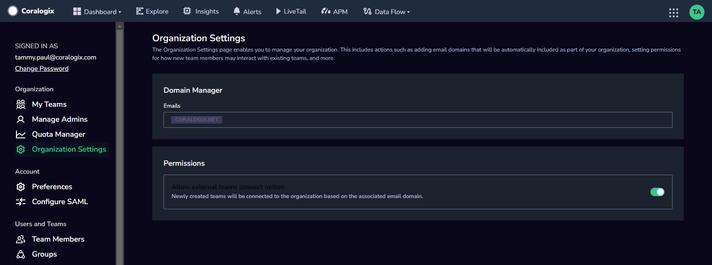

As [Organization Administrator](http://www.coralogixstg.wpengine.com/docs/managing-your-organization), you may manage your **Organization Settings.** Determine permissions for new users and which domains may connect to your organization.

## **Domain Manager**

Add your organization’s domain/s to automatically connect new users when they sign up for a Coralogix account using their work email account.

### Add a New Domain

**STEP 1.** Click **ADD NEW DOMAIN**. You will be asked to verify the new domain.

**STEP 2.** Input an email address in the new domain to which a confirmation email will be sent.

**STEP 3.** Click **SAVE**.

**STEP 4.** Check the email address which you entered for the confirmation email and click the link in the email.

**Notes:**

- The default domain is the domain of the email that the Organization Administrator used to create the organization.

- Until the email address has been confirmed, the domain will remain in a pending state and will be greyed out.

- Once the email address has been confirmed, the domain will become active.

## Additional Resources

<table><tbody><tr><td>Documentation</td><td><strong><a href="http://www.coralogixstg.wpengine.com/docs/managing-your-organization">Managing Your Organization</a></strong> <strong><strong><a href="http://www.coralogixstg.wpengine.com/docs/managing-your-organization-my-teams">My Teams</a></strong> <a href="http://www.coralogixstg.wpengine.com/docs/managing-your-organization-manage-admins">Manage Admins</a></strong> <strong><a href="http://www.coralogixstg.wpengine.com/docs/managing-your-organization-quota-manager">Quota Manager</a></strong></td></tr></tbody></table>

## Support

**Need help?**

Our world-class customer success team is available 24/7 to walk you through your setup and answer any questions that may come up.

Feel free to reach out to us **via our in-app chat** or by sending us an email at [support@coralogixstg.wpengine.com](mailto:support@coralogixstg.wpengine.com).
