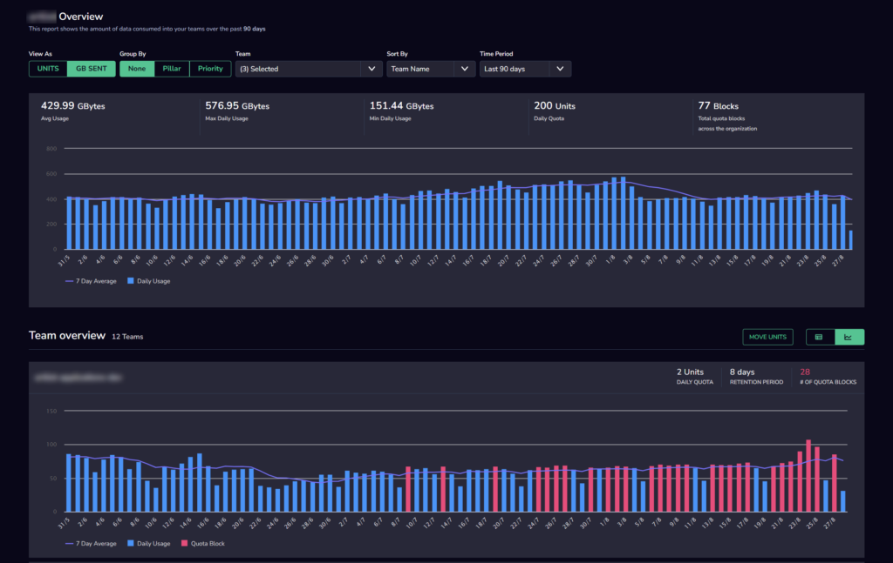
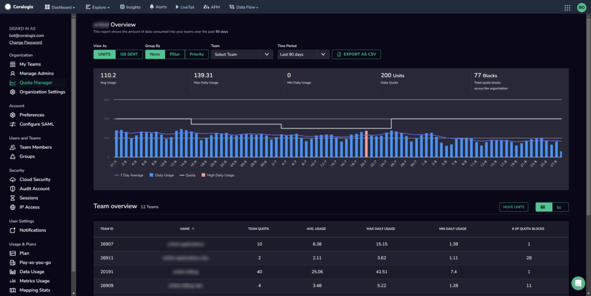
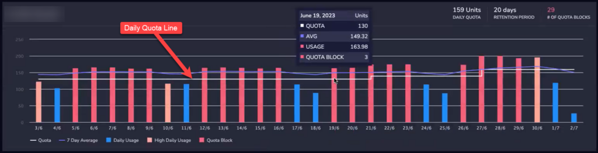
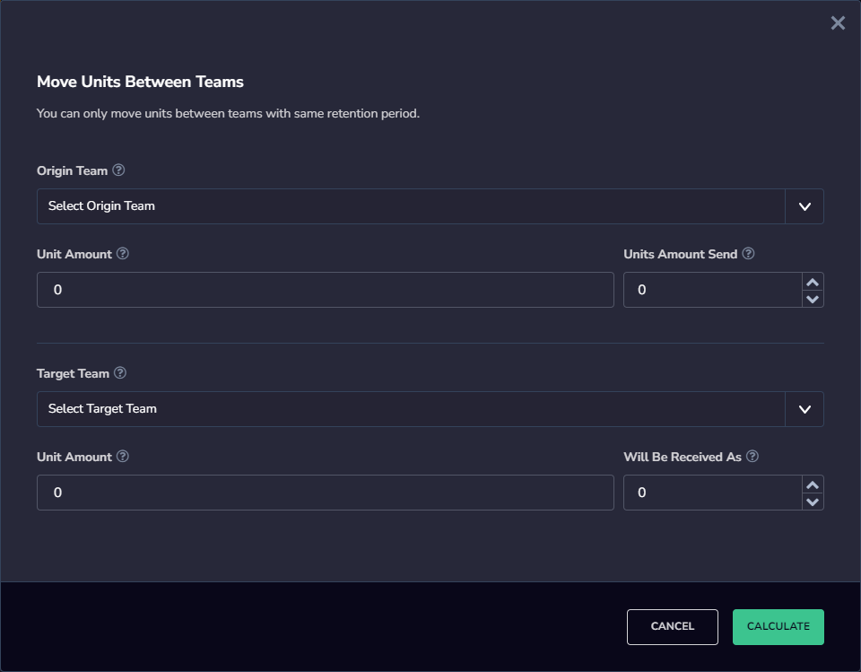
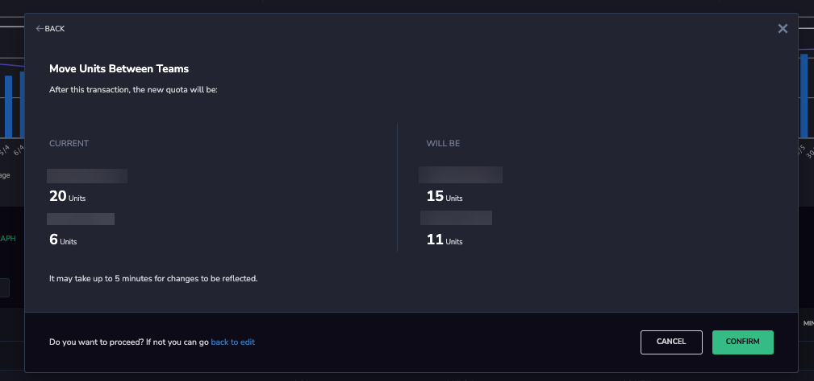

[Organization Administrators](http://www.coralogixstg.wpengine.com/docs/managing-your-organization) can use the **Quota Manager** page to view the amount of data consumed by their teams - collectively and individually - over a specific period and move units between them.

Coralogix provides the **Quota Manager** dashboard to enable Org Admins better visibility of their organization’s usage. It can help identify trends and allows the Org Admin to better utilize the organization’s quota, promoting additional savings for our customers. By identifying teams that under or over-utilize their quota, Org Admins can easily shift units and help resolve these challenges.

## Overview

### Units Usage

The Quota Manager page displays the amount of data (either in **Units** or **GB Sent**) consumed by the teams in your organization over a specific time period (either 30 days, 90 days, or in the past calendar month, depending on which setting you select).

- View **units** usage or **GB sent** by your organization collectively and by individual teams.

- View the number of units that make up your organization’s total quota, how many teams are in your organization, and how many quota blocks occurred in the specified period.

- You can select whether to group the information by pillar (logs, traces and metrics), priority (high, medium and low), or none (which shows daily usage, high daily usage, and quota blocks).

- You can select one or more teams from the Team dropdown, to view only the usage details of those specific teams.

- In the Table view, you can also export the data for the selected teams to a CSV file using the Export to CSV button.

### Team Overview

View specific team information. The Team Overview section displays information either as a set of graphs or as a table of all the teams with sortable columns. You can sort both graphs and table by team name, quota, average usage, max daily usage, min daily usage, and quota blocks.

In the graph view, the usage each day is shown based on the **Group by** setting selected at the top of the screen:

- **Group by None**: Shows normal usage, high usage (more than 80% of quota used) and quota blocked.

- **Group by Pillar**: Shows the 7-day average, as well as how many units or GB of logs, metrics and traces were sent.

- **Group by Priority:** Shows the 7-day average, as well as how many units or GB (depending on the view) were sent to high, medium and low priority.

A tooltip appears when you move the mouse over each day, showing the current quota, the average quota for the last 7 days, the quota used on that specific day, and the number of blocks that occurred that day.

**Note:** It is possible for a team to get blocked multiple times in a single day for various reasons.

Additionally in the graph view, when viewing by **Units**, there is a thick horizontal quota line which shows what the team’s quota was on any given day. This line changes when the quota is changed. This makes it easy to see when a team has exceeded their quota or if a team is always well under their daily quota. This can help when deciding to move units between teams to ensure efficient data usage.

### Unit Transfer

Move units between teams to ensure efficient data usage.

**Notes**:

- [Units](https://coralogixstg.wpengine.com/docs/data-usage/) may only be transferred between teams with the same [retention periods](https://coralogixstg.wpengine.com/docs/archive-retention-policy/).

## Move Units Between Teams

If the Org Admin decided to balance or shift units between the teams based on the dashboard insights, this can easily be done by using the **Move Units** option.

**STEP 1.** Click **MOVE UNITS** in the right-hand side of the **Team Overview** section.

**STEP 2.** Select the Origin Team (the team from which to move the units).

**STEP 3.** Enter an amount of units to send.

**STEP 4.** Select the Target Team (the team to which the units should be transferred).

**Step 5.** Click **CALCULATE**.

A simple overview is displayed, helping the user understand the previous state of both teams and the proposed new state, prior to executing the move.

**STEP 6.** Click **CONFIRM** to complete the move.

## Additional Resources

<table><tbody><tr><td>Documentation</td><td><strong><a href="http://www.coralogixstg.wpengine.com/docs/managing-your-organization">Managing Your Organization</a></strong> <strong><strong><a href="http://www.coralogixstg.wpengine.com/docs/managing-your-organization-my-teams">My Teams</a></strong> <a href="http://www.coralogixstg.wpengine.com/docs/managing-your-organization-manage-admins">Manage Admins</a></strong> <a href="http://www.coralogixstg.wpengine.com/docs/managing-your-organization-organization-settings"><strong>Organization Settings</strong></a></td></tr></tbody></table>

## Support

**Need help?**

Our world-class customer success team is available 24/7 to walk you through your setup and answer any questions that may come up.

Feel free to reach out to us **via our in-app chat** or by sending us an email at [support@coralogixstg.wpengine.com](mailto:support@coralogixstg.wpengine.com).
