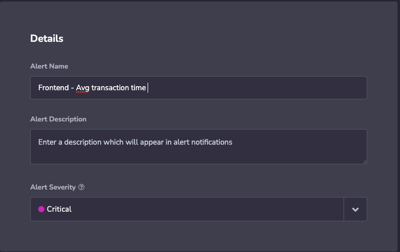
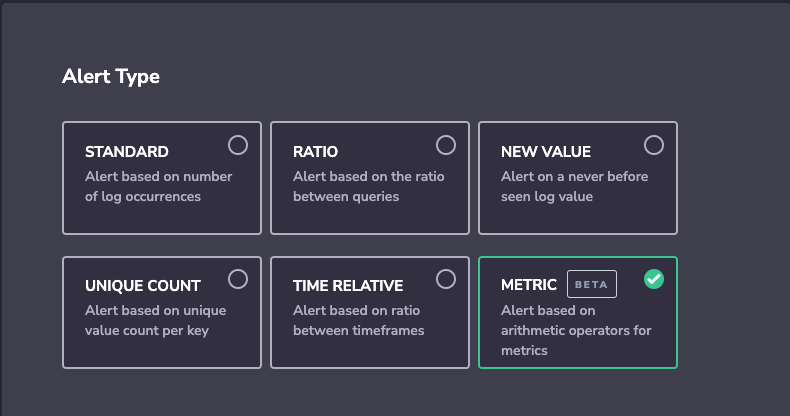
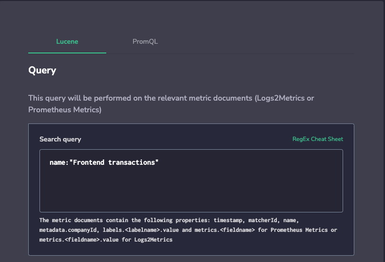
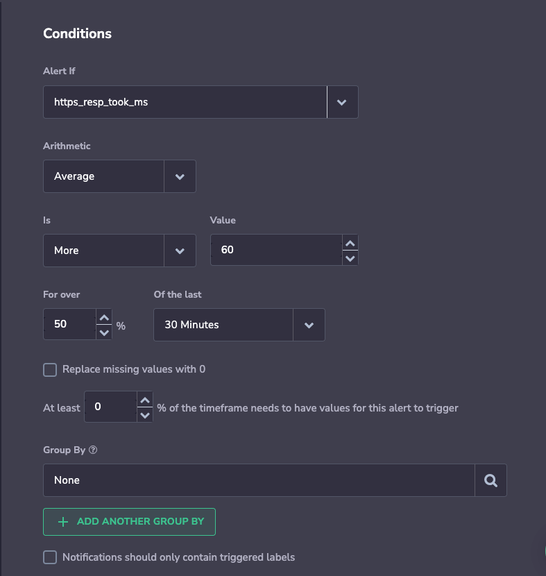

Metric alerts allow Coralogix users to be notified directly to any email/emails or custom webhook on their metric data. Metrics can be sent to Coralogix in various ways ([Prometheus](https://coralogixstg.wpengine.com/integrations/prometheus/), [MetricBeat](https://coralogixstg.wpengine.com/integrations/metric-data/), [Cloudwatch](https://coralogixstg.wpengine.com/integrations/cloudwatch-metrics/), and more) and be used for different purposes such as:

- CPU Monitoring.which process is using more cpu.

- Memory usage.Is the instance configured with the right amount of memory to handle the load, etc.

- Backend frontend response time.How much time does it take the instance to respond or process a query.

Due to its simplicity and easiness of use Lucene is one of the languages that is used for Metric alerts.

Metric Alerts can be created based on Prometheus metrics and metrics generated from log data using [Logs2Metrics](https://coralogixstg.wpengine.com/tutorials/logs2metrics/).

## Create Alert

1-To create a Metric Alert, just navigate to Alerts Tab. Click New Alert, Give your Alert a name, description, and severity.

2\. Choose **Metric Alert**.

3\. Choose the **Lucene** tab and add the query that you would like to trigger the alert on.

4. **Condition** – In this section you choose your alert condition.

You can use aggregation by anything that you like from your logs. For instance, the **app** name, **subsystem**, machine **id**, or anything of your preference.

In this Alert here we are trying to be alerted when the Avg transaction time is more than 60 ms for more than 50% of 30 minutes Interval.

After an alert is triggered, it will send a [webhook](https://coralogixstg.wpengine.com/tutorials/alert-webhooks/) or email or both to your defined destination, and appear under the **Insights** Tab – the name of the alert, the query you used, the graph to represent the alert, and the aggregation you have chosen.

If you need assistance configuring this Alert please do not hesitate to contact Corlaogix support through our in-app chat or by sending us an email to Support@coralogixstg.wpengine.com.
