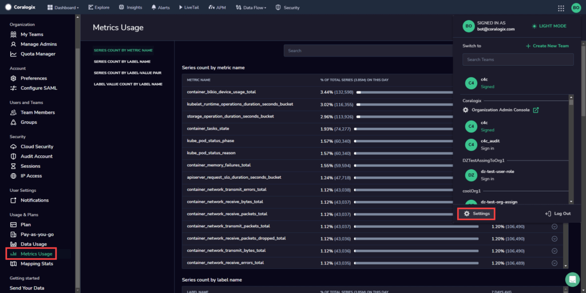
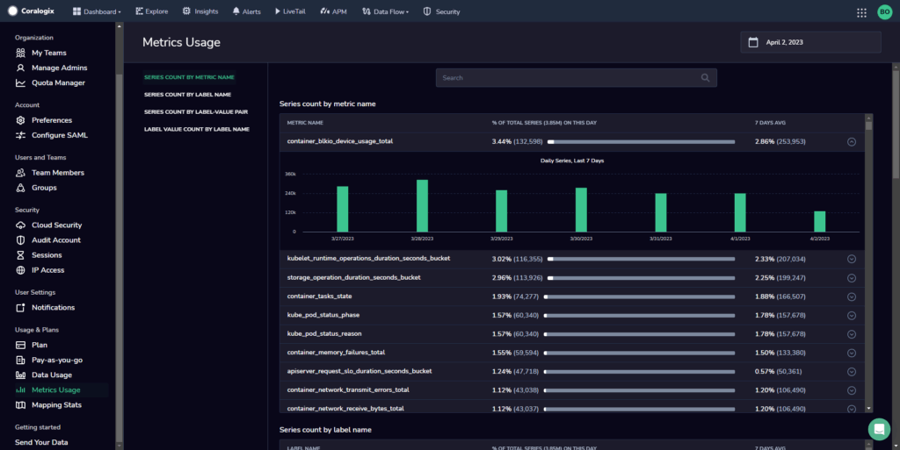
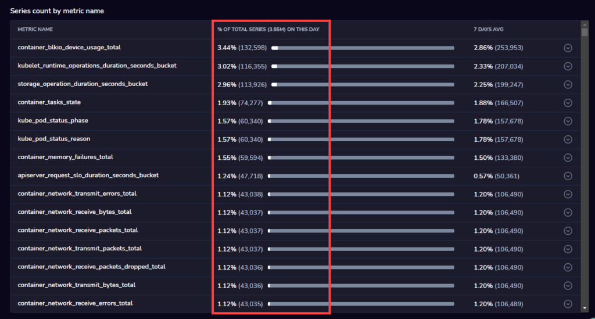
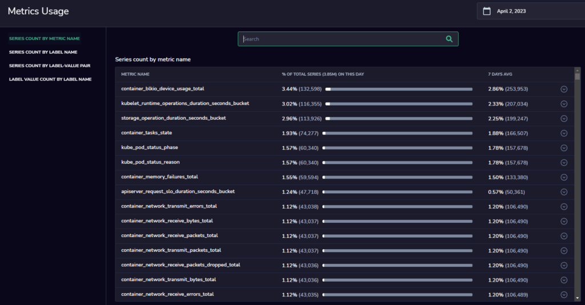

Coralogix now offers a **Metrics Usage** screen, complementing our [metrics cardinality](https://coralogixstg.wpengine.com/docs/metrics-cardinality/) feature. It provides an intuitive visual representation of the metrics-related data surrounding metric statistics, which can be [retrieved using an API](https://coralogixstg.wpengine.com/docs/metrics-cardinality/).

## Metrics Usage Screen

View this data by navigating to **Settings > Metrics Usage**.

Select the cardinality statistics of interest from the left-hand sidebar panel. The page will center on that particular section.

Each cardinality statistics section will have up to 1K entry lines.

The **% of used** column refers to the percentage of what each metric will represent against the totality of all metrics.

In the search bar, seek any particular metric or label of interest, or input just a partial value and the results will be updated throughout all sections.

In the time frame menu, select one day of interest at a time, the time frame reference being UTC.

## Support

**Need help?**

Our world-class customer success team is available 24/7 to walk you through your setup and answer any questions that may come up.

Feel free to reach out to us **via our in-app chat** or by sending us an email at [support@coralogixstg.wpengine.com](mailto:support@coralogixstg.wpengine.com).
