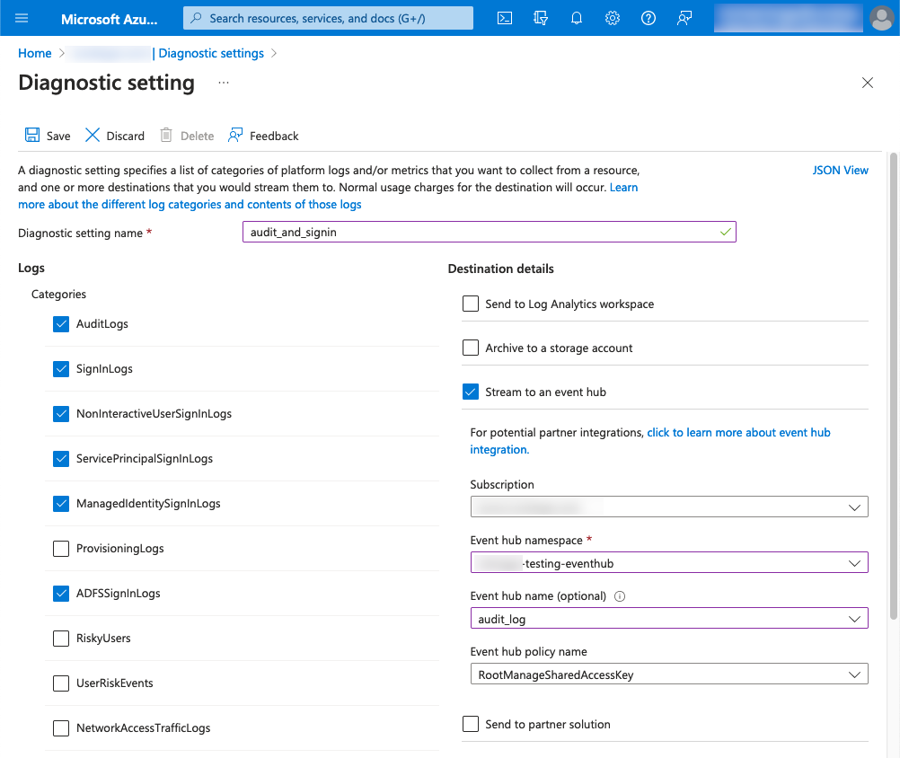

Collect Microsoft Entra ID (previously Azure Active Directory) **audit**, **sign-in**, and **provisioning** logs, and submit them to Coralogix for seamless integration.

## Overview

Sign-in and audit logs comprise the activity logs behind many Microsoft Entra ID reports, which can be used to analyze, monitor, and troubleshoot activity in your tenant. Routing your activity logs to an analysis and monitoring solution provides greater insights into your tenant's health and security.

Activity logs help you understand the behavior of users in your organization. There are three types of activity logs in Microsoft Entra ID:

- [Audit logs](https://learn.microsoft.com/en-us/azure/active-directory/reports-monitoring/concept-audit-logs) include the history of every task performed in your tenant.

- [Sign-in logs](https://learn.microsoft.com/en-us/azure/active-directory/reports-monitoring/concept-all-sign-ins) capture the sign-in attempts of your users and client applications.

- [Provisioning logs](https://learn.microsoft.com/en-us/azure/active-directory/reports-monitoring/concept-provisioning-logs) provide information about users provisioned in your tenant through a third-party service.

This tutorial demonstrates how to collect Microsoft Entra ID audit and sign-in logs and submit them to Coralogix. It requires that you configure your Microsoft Entra ID Diagnostic Settings and leverage our [Event Hub integration](https://coralogixstg.wpengine.com/docs/azure-eventhub-trigger-function/) for the collection and submission of those logs to the Coralogix platform.

## Prerequisites

- Microsoft Entra ID account with an active subscription \[**Note**: To export sign-in data, you’ll need a P1 or P2 Microsoft Entra ID license.\]

- EventHub Namespace \[**Note**: If your EventHub has restricted public access you will need to enable VNet support using these [optional configuration steps](https://coralogixstg.wpengine.com/docs/optional-configurations-microsoft-azure/).\]

## Audit and Sign-in Log Export

**STEP 1**. To configure audit and sign-in exports, navigate to your Microsoft Entra ID resource.

**STEP 2**. Under Monitoring, click **Diagnostic Settings**.

**STEP 3**. Click **\+ Add diagnostic setting**.

**STEP 4**. In the Diagnostic Setting window, select your desired **Categories** and configure the **Destination details** to submit entries to your existing Event Hub.

## Process Event Hub

Now that your audit and sign-in log entries are being exported to your Event Hub, you’ll need to deploy the Azure Event Hub integration to collect and submit the messages to the Coralogix platform.

Deploy the integration via ARM template or Terraform.

- ARM
    - [Azure Event Hub ARM](https://coralogixstg.wpengine.com/docs/azure-eventhub-trigger-function/)
    
    - [ARM Event Hub Integration Package](https://coralogixstg.wpengine.com/docs/azure-resource-manager-arm-integration-packages/)

- Terraform
    - [Azure Event Hub Terraform](https://coralogixstg.wpengine.com/docs/terraform-modules-for-azure-eventhub/)

## Additional Resources

<table><tbody><tr><td>Documentation</td><td><a href="https://www.notion.so/a4ced743a96d4b79be76e271fbf368e9?pvs=21"><strong>Introduction to Microsoft Azure</strong></a></td></tr></tbody></table>

## Support

**Need help?**

Our world-class customer success team is available 24/7 to walk you through your setup and answer any questions that may come up.

Feel free to reach out to us **via our in-app chat** or by sending us an email at [support@coralogixstg.wpengine.com](mailto:support@coralogixstg.wpengine.com).
