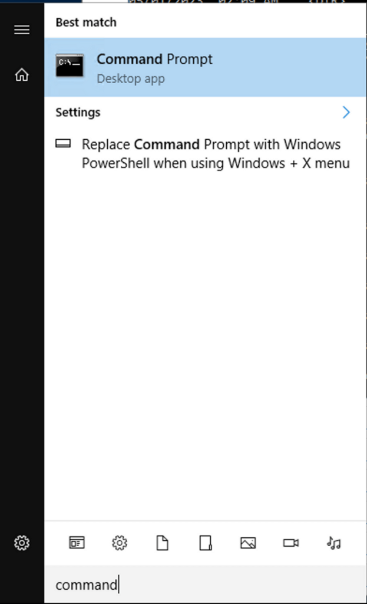

This tutorial demonstrates how to monitor Windows Server - including IIS and MSSQL - for logs, metrics, and traces using OpenTelemetry Collector and Prometheus Windows Exporter.

## Prerequisites

- [admin user](https://support.microsoft.com/en-us/windows/create-a-local-user-or-administrator-account-in-windows-20de74e0-ac7f-3502-a866-32915af2a34d) in Windows with the ability to install services

- `tar.gz` files unpacked

## Configuration

### Windows Exporter

**STEP 1**. Download the [latest MSI from GitHub](https://github.com/prometheus-community/windows_exporter/releases) ([0.22.0.msi](https://github.com/prometheus-community/windows_exporter/releases/download/v0.22.0/windows_exporter-0.22.0-amd64.msi) as of 30 April '23).

**STEP 2**. Open the command line and navigate to `C:\Users\Administrator\Downloads` or the MSI folder.

**STEP 3**. Select which exporter collectors you require - including MSSQL and IIS - from this verbose list: `cpu,cs,logical_disk,net,os,service,system,textfile,iis,mssql`.

**STEP 4**. Open Command Prompt.



**STEP 5.** Run the following command to install the MSI with the collectors chosen:

```
msiexec /i windows_exporter-0.22.0-amd64.msi ENABLED_COLLECTORS="os,iis”
```

### OpenTelemetry Collector

**STEP 1**. Download the [latest tar.gz from GitHub](https://github.com/open-telemetry/opentelemetry-collector-releases/releases) ([0.76.1.tar.gz](https://github.com/open-telemetry/opentelemetry-collector-releases/releases/download/v0.76.1/otelcol-contrib_0.76.1_windows_amd64.tar.gz) as of 30 April '23).

**STEP 2**. Unpack the content into a `C:\\cx-otel`. This may require you to install a program to unpack tar.gz files.

**STEP 3**. Create a `config.yaml` based on the following configuration.

```
receivers:
  filelog:
    include: [ C:\inetpub\logs\LogFiles\*.* ]
  prometheus:
    config:
      scrape_configs:
        - job_name: 'windows_exporter'
          scrape_interval: 15s
          static_configs:
            - targets: ['0.0.0.0:9182']
processors:
  resourcedetection:
    detectors: [system]
    system:
      hostname_sources: ["os"]
  batch:

exporters:
  coralogix:
    metrics:
      endpoint: "ingress.coralogixstg.wpengine.com:443"
    logs:
      endpoint: "ingress.coralogixstg.wpengine.com:443"
    private_key: "coralogix-api-key"
    application_name: "WinServer"
    subsystem_name: "Host"

service:
  pipelines:
    metrics:
      receivers: [prometheus]
      processors: [resourcedetection, batch]
      exporters: [coralogix]
    logs:
      receivers: [filelog]
      processors: [resourcedetection, batch]
      exporters: [coralogix]
```

**Notes**:

- The example configuration captures metrics from windows\_exporter and logs from IIS. Modify as necessary.

- You are required to input the following variables:
    - `endpoint`: Select the [**OpenTelemetry endpoint**](https://coralogixstg.wpengine.com/docs/coralogix-endpoints/) associated with your **Coralogix domain**
    
    - `private_key`: Your Coralogix [Send-Your-Data API key](https://coralogixstg.wpengine.com/docs/send-your-data-api-key/)
    
    - `application_name` & `subsystem_name`: [Application and subsystem names](https://coralogixstg.wpengine.com/docs/application-and-subsystem-names/) as they will appear in your Coralogix UI

**STEP 4**. Install the collector as a service by running the following command:

```
sc.exe create cx-otelcol displayname=cx-otelcol start=delayed-auto binPath="C:\cx-otel\otelcol-contrib.exe --config C:\cx-otel\config.yaml”
```

**STEP 5**. Run the service.

```
sc.exe start cx-otelcol 
```

### Additional Configurations

Configure [Windows exporter dashboards](https://github.com/coralogix/grafana-dashboards/tree/master/windows-prometheus) and the OpenTelemetry Kubernetes Extension to monitor the collector itself.

## Validation & Testing

**STEP 1**. Open Services and check that both `windows_exporter` and `cx-otelcol` service are running.

**STEP 2**. To validate which metrics exist in `windows_exporter`, navigate to [http://localhost:9182/metrics](http://localhost:9182/metrics).

**Notes**:

- `windows_exporter.exe` is unsafe and may require a specific “unblock” in its settings.

- Both `windows_exporter` and `otelcol` can be run without services to check for logs in the command prompt.

**STEP 3**. Navigate to [Grafana Explore](https://coralogixstg.wpengine.com/docs/grafana-plugin/) to confirm that `windows_*` metrics are arriving in your Coralogix dashboard.

## Additional Links

<table><tbody><tr><td><strong>Github</strong></td><td><a href="https://github.com/open-telemetry/opentelemetry-collector-contrib/tree/main/exporter/coralogixexporter" target="_blank" rel="noreferrer noopener">Official OpenTelemetry Collector with Coralogix Exporter</a><br><a href="https://github.com/coralogix/grafana-dashboards/tree/master/windows-prometheus">Coralogix Windows Exporter Dashboards</a></td></tr><tr><td><strong>Tutorials</strong></td><td><a href="https://coralogixstg.wpengine.com/docs/tail-sampling-with-coralogix-and-opentelemetry/">Tail Sampling with Coralogix and OpenTelemetry</a></td></tr><tr><td><strong>Blogs</strong></td><td><a href="https://coralogixstg.wpengine.com/blog/configure-otel-demo-send-telemetry-data-coralogix/">How to Configure the OTel Community Demo App to Send Telemetry Data to Coralogix</a></td></tr></tbody></table>

## Support

**Need help?**

Our world-class customer success team is available 24/7 to walk you through your setup and answer any questions that may come up.

Feel free to reach out to us **via our in-app chat** or by sending us an email at [support@coralogixstg.wpengine.com](mailto:support@coralogixstg.wpengine.com).
