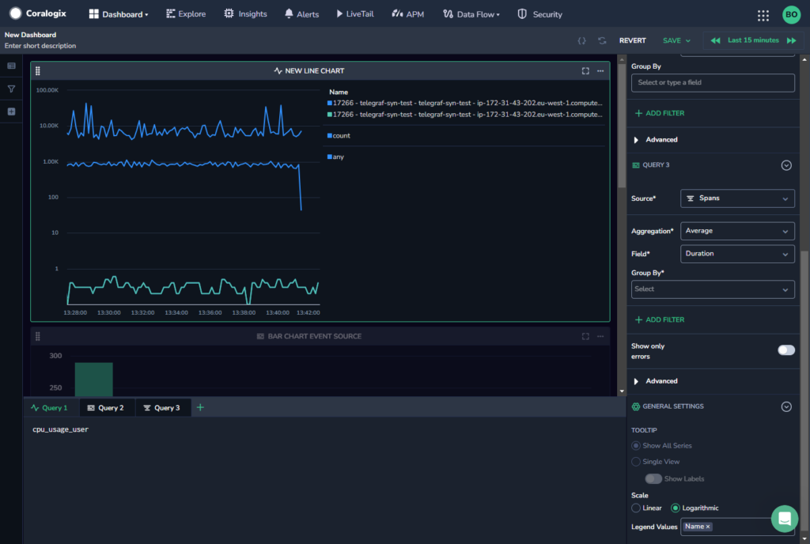

Coralogix is bringing Full Stack Observability into your Custom Dashboards! With the new multiple query feature available in custom dashboard widgets, you can view queries from multiple data types (logs, metrics, traces) in a single chart.

Each query has two sections that control its data. The query bar at the bottom of the screen lets you set the Lucene or PromQL query, and the right-hand side panel lets you select additional settings for each of your queries.

## Configuration

You can add additional queries at any time.

- To add a new query, click the **+** next to **Query 1** in the query bar or click **\+ Add Query** towards the top of the right-hand side bar. When you add a new query it appears both in the bottom query bar and the right-hand side bar.

- Edit your query as needed using the query bar and the right-hand side panel.

- Switch between queries by selecting one from either the bottom query bar or using the right-hand side bar.

- To delete a query, either click the **X** on its tab in the bottom query bar, or click the trash icon in the right-hand side bar next to the query name.

## Additional Resources

<table><tbody><tr><td>Documentation</td><td><a href="https://coralogixstg.wpengine.com/docs/custom-dashboards/"><strong>Custom Dashboards</strong></a></td></tr></tbody></table>

## Support

**Need help?**

Our world-class customer success team is available 24/7 to walk you through your setup and answer any questions that may come up.

Feel free to reach out to us **via our in-app chat** or by sending us an email at [support@coralogixstg.wpengine.com](mailto:support@coralogixstg.wpengine.com).
