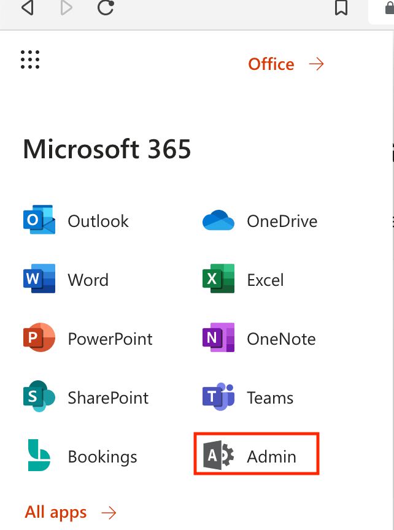
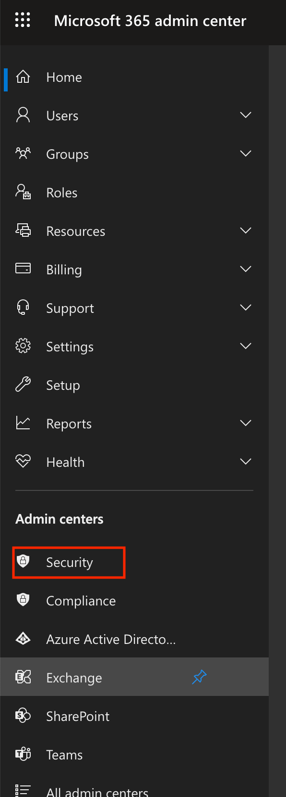
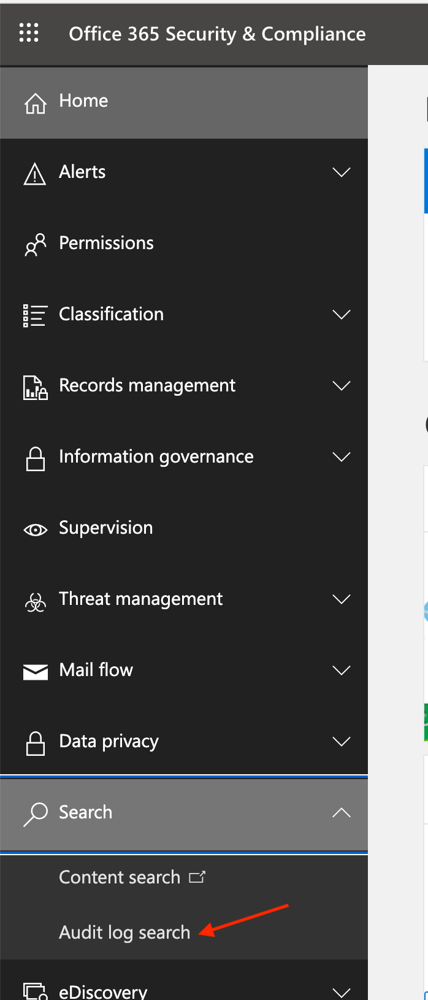
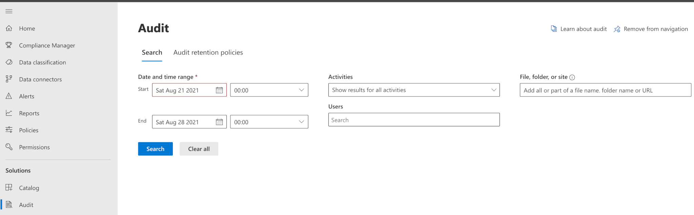
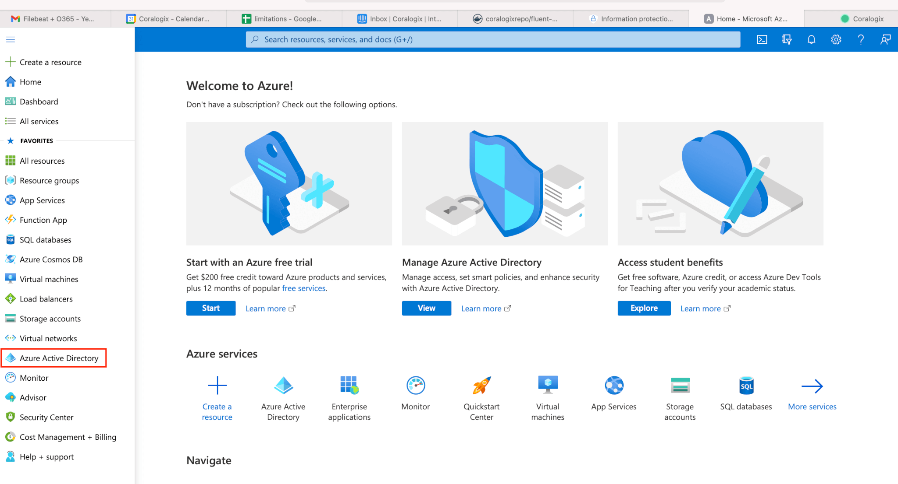
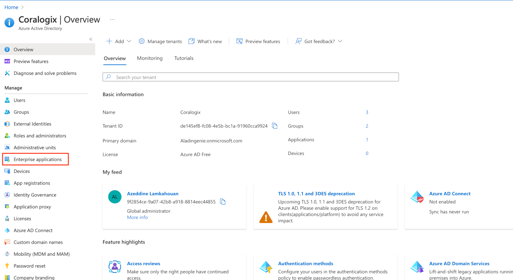
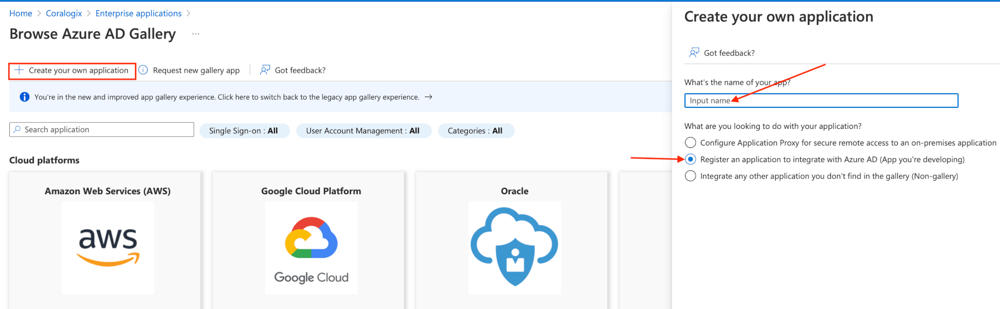
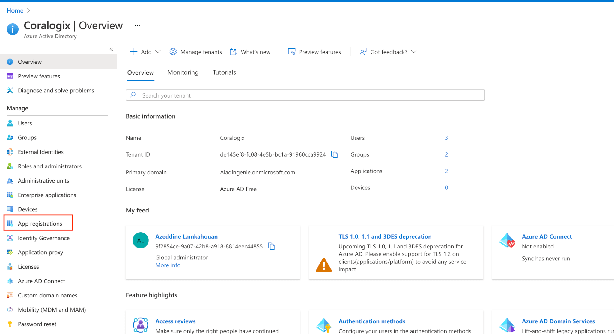
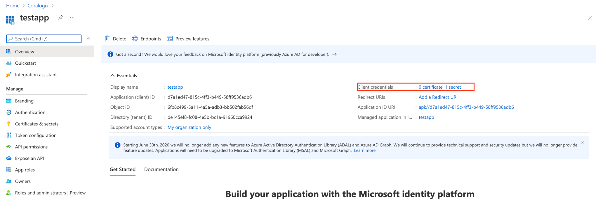
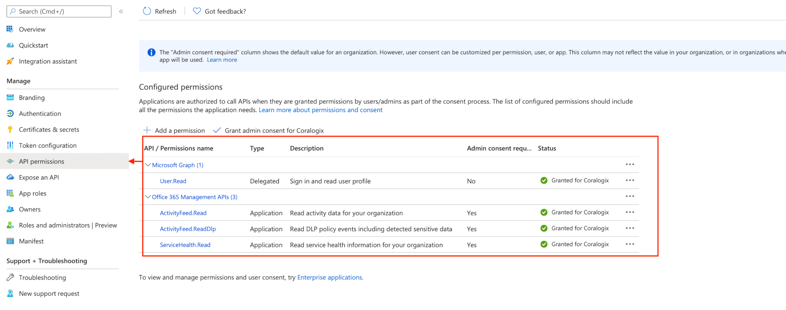

Knowing who does what and accesses which files, mailboxes,  and so on in your Office 365 is crucial to the security of your environment. With Filebeat and Coralogix you will be able to audit these actions.

The steps below will help you configure your office 365 to send audit logs to Coralogix.

## Enable Auditing in Office 365

Log in to your Office 365 and find the Admin tab:



A new window is going to open. Click Security Tab.



Look for Search in the left-hand menu, expand and click Audit Log Search.



If you have not enabled Audit logs a blue banner will be displayed on top of the page, click it to enable Audit logs.



## Create an app

Go to Azure Portal: [https://portal.azure.com/](https://portal.azure.com/)

Log in with the same credentials as your Office 365.

Look for the Azure Active Directory in the left menu and click:



A new page will open. Click on Enterprise applications.



Click on create your own application. Name your application, select register an application to integrate with Azure AD, and hit save.



In the home menu, click on App registrations.



Under owned applications tab, select the app you have created. You will see the info needed for the FileBeat Office 365 module to allow authentication to your Office 365 and grabbing the audit logs.

You also need certificates or a secret key that you should generate or upload under Client credentials on the same page.



Click on the API Permissions tab on the left, and add the permissions shown in the screenshot.



## Install Filebeat

Find our full tutorial for installing Filebeat here: [https://coralogixstg.wpengine.com/integrations/filebeat/](https://coralogixstg.wpengine.com/integrations/filebeat/)

Enable the o365 module and configure according to the following requirements.

### Using a Secret key

```
audit:

enabled: true

var.application_id: "<My Azure AD Application ID>"

var.tenants:

- id: "<My Tenant ID>"

name: "mytenant.onmicrosoft.com"

var.client_secret: "<My client secret>"
```

### Using certificates

```
audit:

enabled: true

var.application_id: "<My Azure AD Application ID>"

var.tenants: - id: "<My Tenant ID>" name: "mytenant.onmicrosoft.com"
```

```
var.certificate: "/path/to/certificate.pem"
var.key: "/path/to/private_key.pem"
var.key_passphrase: "my_passphrase" # (optional) for encrypted keys
```

Tenant name is **the primary domain that was initially created for Microsoft Office 365.**

Under Microsoft office 365 admin center.

Click setup tab.

Click Domains, on the left side you should see your Tenant name.


For more information about the o365 module in FileBeat: https://www.elastic.co/guide/en/beats/filebeat/current/filebeat-module-o365.html

Once done, restart FileBeat.

It takes the office 365 Audit logs up to 24 hours to start showing on the Office 365 admin page.

**For additional assistance with this configuration, please contact our support team via our in-app chat!**
