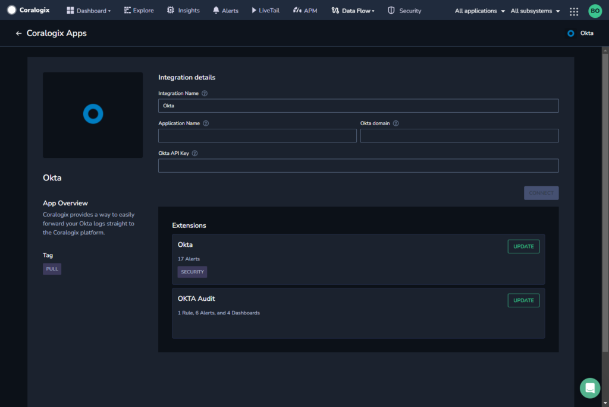
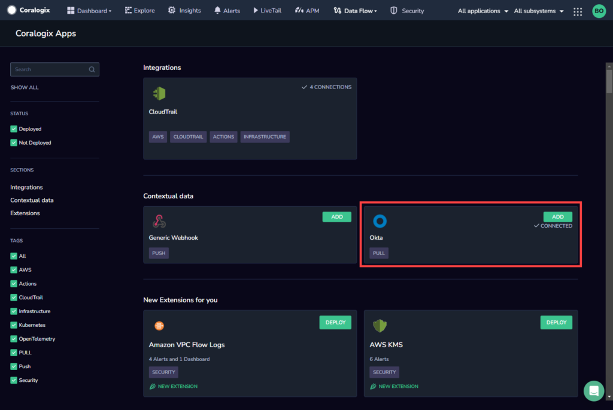

This tutorial demonstrates how to create a pulling integration with [Okta](https://www.okta.com/?_gl=1*ybrtj7*_gcl_au*NjkzNzc4MTQuMTY4NTYxMjAxMA..&_ga=2.193690475.753107304.1685612010-1255514348.1685612010) to send your contextual data logs to Coralogix.

## Overview

Okta generates various logs that capture user authentication and authorization events, such as login attempts, user provisioning, and access management. These logs contain valuable information about user activities, security events, and system behavior within your Okta environment.

Coralogix offers a pulling integration that ingests your Okta contextual data logs at specified intervals, allowing you to gain insights into system behavior within our platform and troubleshoot problems that arise.

Benefits include:

- **Security Monitoring.** Coralogix enables you to monitor user authentication and access events, detect suspicious activities, and identify potential security threats. Identify patterns, anomalies, and indicators of compromise so that you can respond swiftly to security incidents.

- **Compliance and Auditing.** By collecting and analyzing the context data logs, Coralogix helps you meet regulatory compliance requirements. It provides the ability to track and audit user activities, generate compliance reports, and ensure adherence to industry standards.

- **Operational Insights.** Our monitoring platform allows you to identify usage patterns, troubleshoot issues, track performance metrics, and optimize your Okta environment for improved efficiency.

## Prerequisites

- [Okta](https://www.okta.com/?_gl=1*ybrtj7*_gcl_au*NjkzNzc4MTQuMTY4NTYxMjAxMA..&_ga=2.193690475.753107304.1685612010-1255514348.1685612010) account

- New [API key](https://developer.okta.com/docs/guides/create-an-api-token/main/) generated in Okta

## Configuration

**STEP 1.** In your Coralogix dashboard, navigate to **Data Flow** > **Contextual Data**.

**STEP 2.** In the **Contextual Data** section, locate Okta and click on **ADD**.

**STEP 3.** Enter the integration details.

- Integration Name

- Account Name (This will appear in your Coralogix UI as your [subsystem name](https://coralogixstg.wpengine.com/docs/application-and-subsystem-names/).)

- [Okta Domain](https://developer.okta.com/docs/guides/find-your-domain/main/)

- [Okta API key](https://developer.okta.com/docs/guides/create-an-api-token/main/)

**STEP 4.** Click **CONNECT** to trigger the integration. Your pulled Okta logs should appear in your Coralogix dashboard.

**STEP 5.** \[Optional\] To enhance your monitoring capabilities, we **highly recommend** selecting the corresponding extension and deploying it.

Learn more about our **Extension Packages** [here](https://coralogixstg.wpengine.com/docs/extension-packages/).

## Additional Resources

<table><tbody><tr><td>Documentation</td><td><strong>Okta Audit Logs</strong></td></tr><tr><td>Blog</td><td><a href="https://coralogixstg.wpengine.com/blog/okta-log-insights/"><strong>Okta Log Insights with Coralogix</strong></a></td></tr></tbody></table>

## Support

**Need help?**

Our world-class customer success team is available 24/7 to walk you through your setup and answer any questions that may come up.

Feel free to reach out to us **via our in-app chat** or by sending us an email at [support@coralogixstg.wpengine.com](mailto:support@coralogixstg.wpengine.com).
