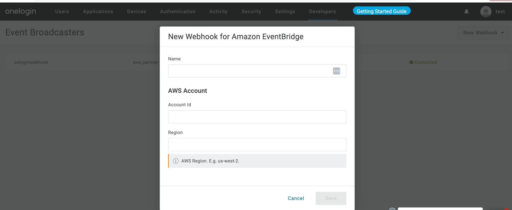
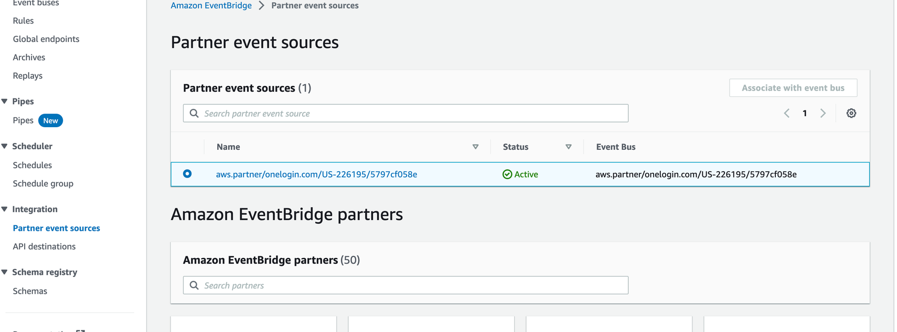

[OneLogin](https://www.onelogin.com/), a cloud-based identity and access management solution, streamlines user authentication and authorization processes for organizations. It features single sign-on (SSO) functionality, allowing users to access multiple applications using a single set of login credentials. OneLogin also offers multi-factor authentication options, such as SMS, email, and biometric verification, for enhanced security.

Administrators can efficiently manage user accounts, permissions, and access rights through a centralized dashboard. OneLogin seamlessly integrates with existing directory services like Active Directory and LDAP. Security measures like encryption and threat detection ensure data protection while complying with industry standards such as GDPR and HIPAA. Overall, OneLogin helps organizations bolster security, streamline user access management, and enhance user experience across their IT infrastructure.

Integration between OneLogin and Coralogix is facilitated via AWS EventBridge.

## Prerequisites

- Active OneLogin account with admin access

- AWS account with permission to use Amazon EventBridge

## Setup

### Creating an Event Webhook for Amazon EventBridge from OneLogin Console

1. Log in to the OneLogin Admin console.

3. Navigate to **Developers** > **Webhooks** > **New Webhook** > **Event Webhook for Amazon EventBridge**.

5. Fill in the required fields and save.

### Associating Event Webhook with AWS EventBridge

1. Go to your AWS account and navigate to **Amazon EventBridge** > **Partner Event Source**.

3. Locate the created webhook in the Partner Event Source section.

5. If the status is inactive, select the webhook and click on the **Associate with Event Bus** tab.

7. The partner event source becomes active, sending logs to the associated event bus.

### Creating a Rule for Event Destination

1. Under the associated bus, create a rule with the source as AWS events or EventBridge partner events.

3. Select the destination as API destination.

5. Choose Coralogix API destination. Find out more about creating an API destination for Coralogix with EventBridge [here](https://coralogix.com/docs/amazon-eventbridge/#instructions).

Once all steps are completed, navigate to the Event Bus and start discovery for the specific bus.

## Support

**Need help?**

Our world-class customer success team is available 24/7 to walk you through your setup and answer any questions that may come up.

Contact us **via our in-app chat** or by emailing [support@coralogix.com](mailto:support@coralogix.com).
