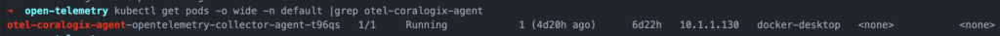
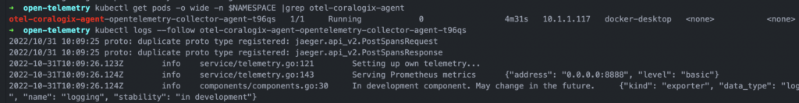
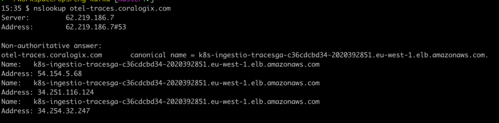

This guide shows you how to run the **v0.76.3** release of OpenTelemetry Collector in Kubernetes while deploying it in `mode: daemonset` to export your data to Coralogix. It assumes that you have already **[instrumented your application](https://opentelemetry.io/docs/concepts/instrumenting/)** with OTel SDKs and set up a **[receiver](https://github.com/open-telemetry/opentelemetry-collector/tree/main/receiver)** for your data.

Once configured, enjoy Coralogix **[APM](https://coralogixstg.wpengine.com/docs/apm/)** features when using OpenTelemetry collector with a Kubernetes processor.

## **Prerequisites**

- Coralogix [account](https://signup.coralogixstg.wpengine.com/#/)

- [Kubernetes](https://kubernetes.io/) installed, with the command-line tool [kubectl](https://kubernetes.io/docs/tasks/tools/#kubectl)

- [Helm](https://helm.sh/) installed and configured

## **Setup**

### **Installation**

Coralogix has an exporter available for the OpenTelemetry Collector which allows you to forward trace and metric data from OpenTelemetry SDKs to Coralogix. The following section shows you how to easily install the exporter by adding it to your [OpenTelemetry Collector configuration](https://opentelemetry.io/docs/collector/configuration/).

**STEP** **1: Install the Coralogix OpenTelemetry Agent Helm Chart Repository**

Open a new terminal and install the [Coralogix OpenTelemetry Agent helm chart repository](https://github.com/coralogix/telemetry-shippers/tree/master/otel-agent):

```raw
helm repo add coralogix-charts-virtual https://cgx.jfrog.io/artifactory/coralogix-charts-virtual

```

```raw
helm repo update

```

**STEP 2: Create a Secret to Protect your Private Key**

Create a `secret` with your Coralogix [Send-Your-Data API key](https://coralogixstg.wpengine.com/docs/send-your-data-api-key/) called `coralogix-keys` with the value `PRIVATE_KEY`.

Take this step in order to ensure that your private key remains protected and unexposed. While other methods exist for protecting this private information, **we recommend** [creating a secret](https://jamesdefabia.github.io/docs/user-guide/kubectl/kubectl_create_secret_generic/) in this manner while running on a Kubernetes cluster.

**Your private key, as well as the Helm chart, should be saved in the same namespace**.

```raw
export PRIVATE_KEY=<Send-Your-Data API key>

```

```raw
export NAMESPACE=<namespace>

```

```raw
kubectl create secret generic coralogix-keys -n $NAMESPACE --from-literal=PRIVATE_KEY=$PRIVATE_KEY

```

> **Hint**: If you are interested in seeing the details of your secret called `coralogix-keys`, run:

```raw
kubectl get secret coralogix-keys -o yaml -n $NAMESPACE

```

The created secret should look like this, where `PRIVATE_KEY` is the value taken from your Coralogix [Send-Your-Data API key](https://coralogixstg.wpengine.com/docs/send-your-data-api-key/). Compare the `PRIVATE_KEY` in your `secret` to the [Send-Your-Data API key](https://coralogixstg.wpengine.com/docs/send-your-data-api-key/) on your UI to ensure proper configuration.

```
apiVersion: v1
data:
  PRIVATE_KEY: <encrypted-private-key>
kind: Secret
metadata:
  name: coralogix-keys
  namespace: <namespace>
type: Opaque

```

### **Configuration**

**STEP 1: Create a YAML-Formatted Override File**

Create a new YAML-formatted override file that defines certain values for the OpenTelemetry Collector.

In order to send your data to Coralogix, you are **required** to declare the `endpoint` variable into your file. Choose the **[OpenTelemetry endpoint](https://coralogixstg.wpengine.com/docs/coralogix-endpoints/)** for the [domain](https://coralogixstg.wpengine.com/docs/coralogix-domain/) associated with your Coralogix account. You have the option of sending logs, metrics, and / or traces to Coralogix. The example override file below includes all three.

You are also **required** to specify the `mode`.

- For high data traffic clusters and/or to leverage Coralogix APM capabilities, **we recommend** `daemonset` mode acting as an agent running on each node. Be aware that it consumes resources (e.g., CPU & memory) from each node on which it runs.

- For development environments or clusters with minimal data, **we recommend** `deployment` mode.

In order to collect the cluster name(s) to appear on your Coralogix [Kubernetes Dashboard](https://coralogixstg.wpengine.com/docs/kubernetes-dashboard/), add the OTel transform processor to your configuration, as in the example below.

```
#values.yaml
---
global:
  domain: "<cx_domain>"
  clusterName: "<your_cluster_name>"
opentelemetry-collector:
  mode: "<daemonset/deployment>"
```

Save this file as values.yaml.

Here is information about other [values](https://github.com/coralogix/telemetry-shippers/blob/master/otel-agent/k8s-helm/values.yaml) for OpenTelemetry Collector. Making changes to these variables is **optional**.

- `extraEnvs`: Includes your Coralogix [Send-Your-Data API key](https://coralogixstg.wpengine.com/docs/send-your-data-api-key/) 

- `presets`: Built-in variables that automatically add processor and integration attributes

- `config`: Option of sending logs, metrics, and / or tracing to Coralogix

- `defaultApplicationName` and `defaultSubsystemName`: Logs, metrics, and traces emitted by this OpenTelemetry exporter are tagged in Coralogix with the default [application and subsystem](https://coralogixstg.wpengine.com/docs/application-and-subsystem-names/) constants “default” and “nodes”, respectively.

**STEP 2: Install the Associated OpenTelemetry Chart**

Install the associated OpenTelemetry chart with the release name of your choice.

```raw
export NAMESPACE=<namespace>

```

```raw
helm upgrade --install otel-coralogix-agent coralogix-charts-virtual/opentelemetry-coralogix \
  -f values.yaml

```

> **Hint**: Installing a new package requires two arguments: a release name that you pick and the name of the chart you want to install. You may choose any name that suits you; the example above adopts the release name `otel-coralogix-agent`.

**STEP 3: Ensure all Pods are Running**

```
kubectl get pods -o wide -n $NAMESPACE |grep otel-coralogix-agent

```

The STATUS of these pods should appear "Running". If this is not the case, see our [Troubleshooting](#troubleshooting) section below.



```raw
kubectl get pods -o wide -n $NAMESPACE |grep otel-coralogix-agent

```

## Validation

**In order to validate that you have set up your receiver correctly, set up a demo application in Node.js which generates traces.** A prerequisite for doing so is creating an account with [Docker](https://hub.docker.com/). For support in other coding languages, click [here](https://opentelemetry.io/docs/instrumentation/).

1\. Download and unzip [image.zip](https://coralogixstg.wpengine.com/wp-content/uploads/2023/01/image-2-9.zip), which contains all files needed to create the test application image.

2\. Check the IP address of my OpenTelemetry collector pod to update `tracing.js`:

```
kubectl get pods -o wide |grep otel

```

Below is an example. The string of numbers separated by periods - **172.17.0.3** - is known as the IP address.

```
otel-coralogix-agent-opentelemetry-collector-654d45fb7d-kfgj4 1/1 Running 0 42s 172.17.0.3 minikube <none> <none>

```

3\. Update and save the `tracing.js` file with the IP address in **line 18**.

```
/* tracing.js */

// Require dependencies
const opentelemetry = require("@opentelemetry/sdk-node");
const { getNodeAutoInstrumentations } = require("@opentelemetry/auto-instrumentations-node");
const { diag, DiagConsoleLogger, DiagLogLevel } = require('@opentelemetry/api');

// For troubleshooting, set the log level to DiagLogLevel.DEBUG
diag.setLogger(new DiagConsoleLogger(), DiagLogLevel.INFO);

const {
  OTLPTraceExporter,
} = require("@opentelemetry/exporter-trace-otlp-http");

const sdk = new opentelemetry.NodeSDK({
  traceExporter: new OTLPTraceExporter({
    // optional - url default value is <http://localhost:4318/v1/traces>
    url: "<http://172.17.0.3:4318/v1/traces>",
    // optional - collection of custom headers to be sent with each request, empty by default
    headers: {},
  }),
  instrumentations: [getNodeAutoInstrumentations()],
});

sdk.start()
```

4\. In order to push your docker file, log in to your Docker account:

```
docker login -u <username>

```

5\. Run the following command:

```
docker build . -t <your_docker_username>/<name_for_image>

```

6\. Push the image to your repository to make the file accessible from Kubernetes:

```
docker push <your_docker_username>/<name_for_image>

```

7\. Deploy your application by running the following command:

```
kubectl run otel-test-app-pod --image <your_docker_username>/<name_for_image> --port 8080

```

8\. Set the port forwarding:

```
kubectl port-forward otel-test-app-pod 8081:8080

```

9\. Open [](http://localhost:8081/)[http://localhost:8081/](http://localhost:8081/) on your browser. "Hello World" text should appear.

## **Demo**

In order to ensure that your data is being sent to Coralogix without being dependent on your own data, **we recommend** running a demo to validate your installation. **We suggest** doing so on non-production environments only.

**Note**: When the demo is deployed, a new OpenTelemetry pod is created which sends traces to Coralogix. Rather than testing the pod that you created, it demonstrates how your application can be integrated with OpenTelemetry.

1\. In the same namespace in which the override file is saved, install the associated demo chart with the release name of your choice:

```raw
helm install my-otel-demo open-telemetry/opentelemetry-demo

```

2\. Ensure all associated pods are running:

```raw
kubectl get pods -o wide |grep my-otel-dem

```

The STATUS of these pods should appear "Running". If this is not the case, see our [Troubleshooting](#troubleshooting) section below.

3\. Enable port forwarding so you can access the demo application from your browser:

```raw
kubectl port-forward svc/my-otel-demo-frontend 8080:8080

```

4\. Open the following address in your browser:

```raw
http://localhost:8080

```

5\. As you shop on the website, logs, metrics and/or traces will be sent to Coralogix, depending on which data you have chosen to send to us.

## **Troubleshooting**

**View data on your Coralogix dashboard**

Once the installation process is complete, you may not see your telemetry data appear in your Coralogix account. This may indicate either that the installation has failed due to some error or that your installation is successful, but your application has not been configured to send data to Coralogix via this container.

In order to find the source of the problem, we recommend you take a number of steps, including **troubleshooting your Otel logs** and **running a demo**. If the demo works successfully, the problem lies in the configuration of your application. If the demo fails to work, the problem lies in the configuration of the collector. You will find tools to solve both of these issues below.

**Troubleshoot your OTel logs**

1\. Following installation, expect Kubernetes to run a pod with your chosen installation name. Ensure this is the case by running the following command:

```raw
kubectl get pods -o wide -n $NAMESPACE |grep otel-coralogix-agent

```

2\. Locate and copy the full name of the OpenTelemetry collector agent in your list of pods. The pod should appear exactly once with the STATUS "Running." If the STATUS is "Pending", rerun the command. The AGE appearing should be the time that has elapsed since your last helm upgrade.

3\. Once you have located this specific pod, use the default logging tool command `kubectl logs` for retrieving its logs. Running this command with the `-follow` flag streams logs from the specified resource, allowing you to live tail its logs from your terminal.

```raw
kubectl logs --follow <paste full name of opentelemtry collector agent pod here> -n <namespace>

```

Here is an example of the expected output of Steps 1-3:



Rerun this set of commands at any later stage as necessary.

**Validate your endpoints**

Validating your endpoints will allow you to test the connectivity in your domain structure.

Ensure that your endpoint is correct:

```raw
nslookup <endpoint name>

```

Here is an example of the expected results for an account in the EU1 region:



If you receive an error, this may mean that you lack connectivity to your domain server.

## Limits & Quotas

Coralogix places a **hard limit of 10MB** of data to our [Otel endpoints](https://coralogixstg.wpengine.com/docs/coralogix-endpoints/), with a **recommendation of 2MB**.

Limits apply to single requests, regardless of timespan.

## **Additional Resources**

<table><tbody><tr><td><strong>Github</strong></td><td><a href="https://github.com/open-telemetry/opentelemetry-collector-contrib/tree/main/exporter/coralogixexporter" target="_blank" rel="noreferrer noopener">Official OpenTelemetry Collector with Coralogix Exporter</a></td></tr><tr><td><strong>Instructional Videos</strong></td><td><a href="https://www.youtube.com/watch?v=_YK-9z8cMgI&amp;ab_channel=Coralogix">Integrate metrics into Coralogix using OpenTelemetry, Kubernetes &amp; Helm</a><br><a href="https://www.youtube.com/watch?v=nJcYQQF4qH0&amp;ab_channel=Coralogix">Integrate traces into Coralogix using OpenTelemetry, Kubernetes &amp; Helm</a><br><a href="https://www.youtube.com/watch?v=8w1KCiOGKWY&amp;ab_channel=Coralogix">Integrate logs into Coralogix using OpenTelemetry, Kubernetes &amp; Helm</a><br><a href="https://www.youtube.com/watch?v=GWggKh4ny30&amp;ab_channel=Coralogix">Capture Kubernetes logs, transform with Logs2Metrics and render with DataMap</a></td></tr><tr><td><strong>Features</strong></td><td><a href="https://coralogixstg.wpengine.com/docs/apm/" target="_blank" rel="noreferrer noopener">Coralogix APM features</a><br><a href="https://coralogixstg.wpengine.com/docs/apm-kubernetes/">APM using OpenTelemetry Collector with Kubernetes</a></td></tr><tr><td><strong>Tutorials</strong></td><td><a href="https://coralogixstg.wpengine.com/docs/tail-sampling-with-coralogix-and-opentelemetry/">Tail Sampling with Coralogix and OpenTelemetry</a></td></tr><tr><td><strong>Blogs</strong></td><td><a href="https://coralogixstg.wpengine.com/blog/configure-otel-demo-send-telemetry-data-coralogix/">How to Configure the OTel Community Demo App to Send Telemetry Data to Coralogix</a></td></tr></tbody></table>

## **Support**

**Need help?**

Our world-class customer success team is available 24/7 to walk you through your setup and answer any questions that may come up.

Feel free to reach out to us **via our in-app chat** or by sending us an email at [support@coralogixstg.wpengine.com](mailto:support@coralogixstg.wpengine.com).
