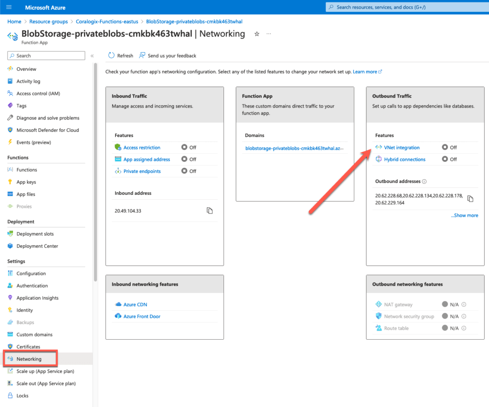
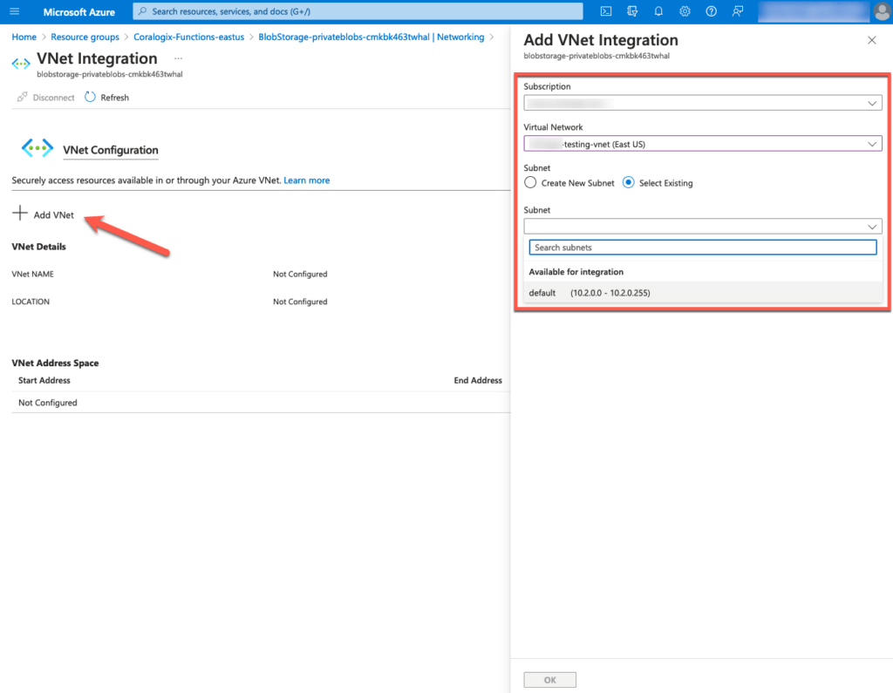
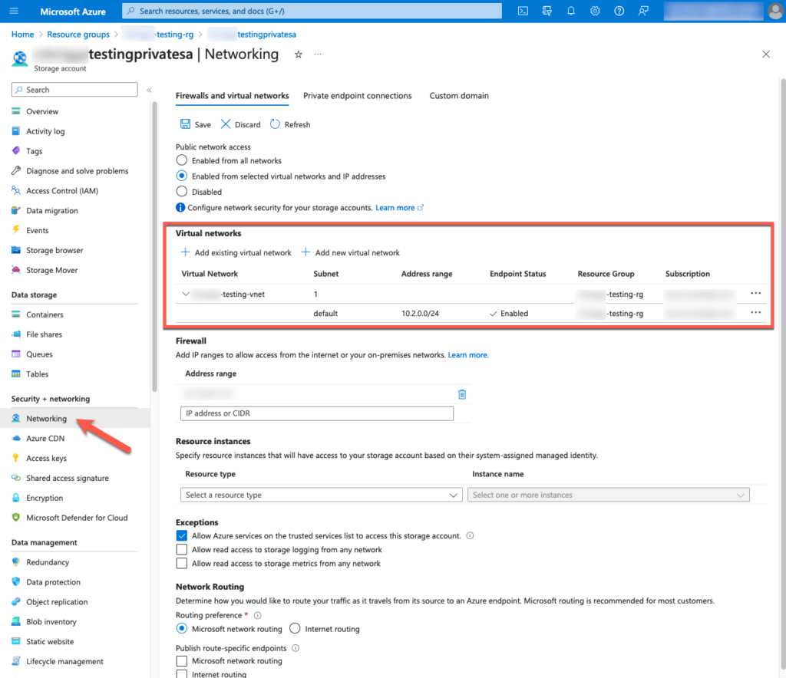

Coralogix offers optional configurations for particular use-cases utilizing our Azure deployments.

## Storage Accounts & Event Hubs With Restricted Public Access

If you require resource monitoring in Azure storage accounts or Event Hubs that cannot be made public, deploy our function apps with virtual network (VNet) support.

### Prerequisites

To enable the VNet feature, set the **Function App Service Plan Type** to 'Premium' during deployment. This will then enable the 'Networking' feature of your function app.

### Configuration

**STEP 1**. Open the **VNet integration** configuration of the function app in the left-hand **Networking** panel.

**STEP 2**. Select **Add VNet** and configure it to a VNet with access to the Storage Account or Event Hub.

**STEP 3**. Determine which virtual networks are permitted in the **Networking** section of the Blog storage account or Event Hub, as seen in the example below.

**Notes**:

- If no virtual networks are aligned with the storage account or Event Hub, select **Add new virtual network**.

- If selecting an existing virtual network, be aware that it could be internet-restricted and prevent outbound messages to reach our API. When in doubt, create a new VNet for use by Coralogix integrations and the private storage account.

### Cost Considerations

- VNet configuration is **not** available for consumption (serverless) applications, which generally incur significantly less costs.

- Selecting the 'Premium' app service plan may incur significant costs, as it requires 24/7 resource payments (as opposed to a usage-based consumption plan).

## Support

**Need help?**

Our world-class customer success team is available 24/7 to walk you through your setup and answer any questions that may come up.

Feel free to reach out to us **via our in-app chat** or by sending us an email at [support@coralogixstg.wpengine.com](mailto:support@coralogixstg.wpengine.com).
