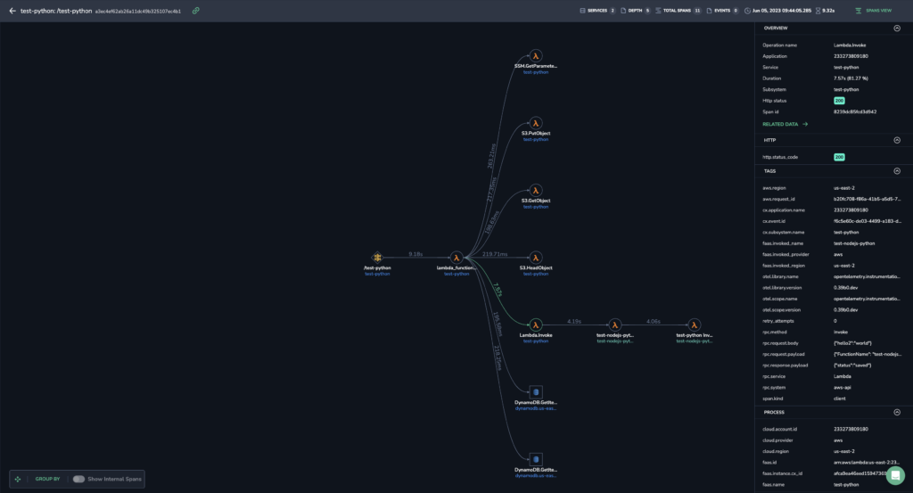
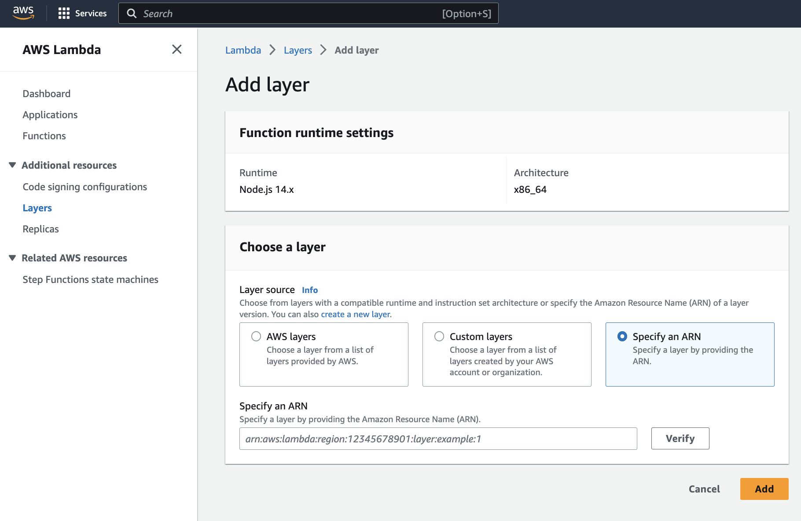
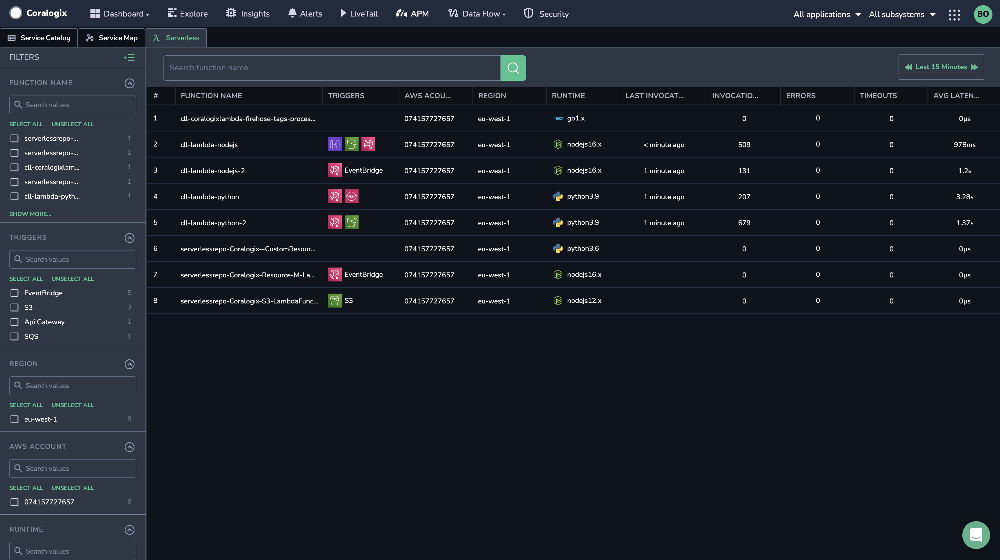
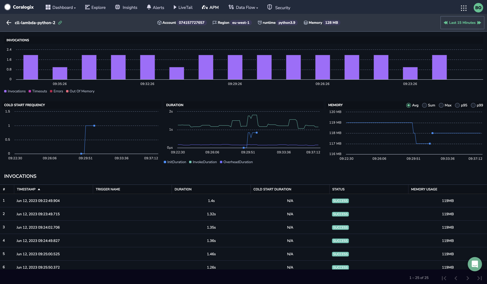

Coralogix offers `coralogix-*-wrapper-and-exporter-*` Lambda layers enable you to generate logs, metrics, and traces, providing insights into triggers, invocation times, and interconnections. These features work out-of-the-box, without requiring any modification of the monitored Lambda functions' code. Once the configuration is complete, view your data using our cutting-edge [Serverless Monitoring](https://coralogixstg.wpengine.com/docs/serverless-monitoring/) feature.

**Notes**:

This integration is one of two options - **complete** and **basic** - for monitoring Lambda, a requirement for enjoying [Serverless Monitoring](https://coralogixstg.wpengine.com/docs/serverless-monitoring/). This tutorial demonstrates how to set up Lambda monitoring to get **complete telemetry**, including traces.

To set up Lambda monitoring to get only **basic telemetry**, including logs, you are only required to set up the Coralogix AWS Lambda Telemetry Exporter. View the relevant documentation [here](https://coralogixstg.wpengine.com/docs/coralogix-aws-lambda-telemetry-exporter/).

## Overview

The Lambda instrumentation layers (`coralogix-*-wrapper-and-exporter-*`) contain modified versions of OpenTelemetry Lambda auto instrumentation wrappers, bundled together with the Coralogix AWS Lambda Telemetry Exporter.

OpenTelemetry Lambda auto instrumentation wrappers instrument the handler function, AWS SDK, and other client libraries to produce traces out-of-the-box. They also provide a configured [Otel SDK](https://opentelemetry.io/docs/concepts/sdk-configuration/) through which the function code can produce custom spans and metrics.

The telemetry produced by the auto instrumentation wrapper is forwarded to the Coralogix AWS Lambda Telemetry Exporter, which supplements it with information obtained from the Lambda Telemetry API and sends it all to Coralogix. Once fully set up, the auto instrumentation will produce traces, as shown below. The traces will help you discover:

- What invoked/triggered the lambda function

- What Lambda functions and other AWS services were called by the function

- How long did different parts of the invocation take



## Set Up Lambda Monitoring

Follow these steps in order to monitor AWS Lambda functions with Coralogix.

**STEP 1**. Set up the [Coralogix AWS resource metadata collection](https://coralogixstg.wpengine.com/docs/aws-resource-metadata-collection/).

**STEP 2**. Set up the OpenTelemetry Lambda auto instrumentation, as described in this tutorial. This is available for [Node.js](https://github.com/coralogix/opentelemetry-lambda/tree/coralogix-nodejs-autoinstrumentation) and [Python](https://github.com/coralogix/opentelemetry-lambda/tree/coralogix-python-autoinstrumentation) (v3.8 or newer). For other runtimes, opt for the Coralogix AWS Lambda Telemetry Exporter [setup](https://coralogixstg.wpengine.com/docs/coralogix-aws-lambda-telemetry-exporter/) to view basic telemetry.

## Amazon Resource Name

To deploy or update the Coralogix OpenTelemetry wrapper, select the Amazon Resource Name (ARN) corresponding to your AWS region, Lambda runtime and Architecture from the following lists.

### Python x86\_64

```
arn:aws:lambda:ap-south-1:625240141681:layer:coralogix-python-wrapper-and-exporter-x86_64:7
arn:aws:lambda:eu-north-1:625240141681:layer:coralogix-python-wrapper-and-exporter-x86_64:7
arn:aws:lambda:eu-west-3:625240141681:layer:coralogix-python-wrapper-and-exporter-x86_64:7
arn:aws:lambda:eu-west-2:625240141681:layer:coralogix-python-wrapper-and-exporter-x86_64:7
arn:aws:lambda:eu-west-1:625240141681:layer:coralogix-python-wrapper-and-exporter-x86_64:7
arn:aws:lambda:ap-northeast-3:625240141681:layer:coralogix-python-wrapper-and-exporter-x86_64:7
arn:aws:lambda:ap-northeast-2:625240141681:layer:coralogix-python-wrapper-and-exporter-x86_64:7
arn:aws:lambda:ap-northeast-1:625240141681:layer:coralogix-python-wrapper-and-exporter-x86_64:7
arn:aws:lambda:ca-central-1:625240141681:layer:coralogix-python-wrapper-and-exporter-x86_64:7
arn:aws:lambda:sa-east-1:625240141681:layer:coralogix-python-wrapper-and-exporter-x86_64:7
arn:aws:lambda:ap-southeast-1:625240141681:layer:coralogix-python-wrapper-and-exporter-x86_64:7
arn:aws:lambda:ap-southeast-2:625240141681:layer:coralogix-python-wrapper-and-exporter-x86_64:7
arn:aws:lambda:eu-central-1:625240141681:layer:coralogix-python-wrapper-and-exporter-x86_64:7
arn:aws:lambda:us-east-1:625240141681:layer:coralogix-python-wrapper-and-exporter-x86_64:7
arn:aws:lambda:us-east-2:625240141681:layer:coralogix-python-wrapper-and-exporter-x86_64:7
arn:aws:lambda:us-west-1:625240141681:layer:coralogix-python-wrapper-and-exporter-x86_64:7
arn:aws:lambda:us-west-2:625240141681:layer:coralogix-python-wrapper-and-exporter-x86_64:7
arn:aws:lambda:af-south-1:625240141681:layer:coralogix-python-wrapper-and-exporter-x86_64:7
arn:aws:lambda:ap-east-1:625240141681:layer:coralogix-python-wrapper-and-exporter-x86_64:7
arn:aws:lambda:ap-southeast-3:625240141681:layer:coralogix-python-wrapper-and-exporter-x86_64:7
arn:aws:lambda:eu-south-1:625240141681:layer:coralogix-python-wrapper-and-exporter-x86_64:7
arn:aws:lambda:me-south-1:625240141681:layer:coralogix-python-wrapper-and-exporter-x86_64:7
arn:aws:lambda:ap-south-2:625240141681:layer:coralogix-python-wrapper-and-exporter-x86_64:7
arn:aws:lambda:ap-southeast-4:625240141681:layer:coralogix-python-wrapper-and-exporter-x86_64:7
arn:aws:lambda:eu-central-2:625240141681:layer:coralogix-python-wrapper-and-exporter-x86_64:7
arn:aws:lambda:eu-south-2:625240141681:layer:coralogix-python-wrapper-and-exporter-x86_64:7
arn:aws:lambda:me-central-1:625240141681:layer:coralogix-python-wrapper-and-exporter-x86_64:7
arn:aws:lambda:il-central-1:625240141681:layer:coralogix-python-wrapper-and-exporter-x86_64:7
arn:aws:lambda:ca-west-1:625240141681:layer:coralogix-python-wrapper-and-exporter-x86_64:7
```

**Notes**:

- Python v3.8 and higher is supported. We recommend migrating away from Python 3.7 as it is scheduled for deprecation by AWS in November 2023.

### Python arm64

```
arn:aws:lambda:ap-south-1:625240141681:layer:coralogix-python-wrapper-and-exporter-arm64:7
arn:aws:lambda:eu-north-1:625240141681:layer:coralogix-python-wrapper-and-exporter-arm64:7
arn:aws:lambda:eu-west-3:625240141681:layer:coralogix-python-wrapper-and-exporter-arm64:7
arn:aws:lambda:eu-west-2:625240141681:layer:coralogix-python-wrapper-and-exporter-arm64:7
arn:aws:lambda:eu-west-1:625240141681:layer:coralogix-python-wrapper-and-exporter-arm64:7
arn:aws:lambda:ap-northeast-3:625240141681:layer:coralogix-python-wrapper-and-exporter-arm64:7
arn:aws:lambda:ap-northeast-2:625240141681:layer:coralogix-python-wrapper-and-exporter-arm64:7
arn:aws:lambda:ap-northeast-1:625240141681:layer:coralogix-python-wrapper-and-exporter-arm64:7
arn:aws:lambda:ca-central-1:625240141681:layer:coralogix-python-wrapper-and-exporter-arm64:7
arn:aws:lambda:sa-east-1:625240141681:layer:coralogix-python-wrapper-and-exporter-arm64:7
arn:aws:lambda:ap-southeast-1:625240141681:layer:coralogix-python-wrapper-and-exporter-arm64:7
arn:aws:lambda:ap-southeast-2:625240141681:layer:coralogix-python-wrapper-and-exporter-arm64:7
arn:aws:lambda:eu-central-1:625240141681:layer:coralogix-python-wrapper-and-exporter-arm64:7
arn:aws:lambda:us-east-1:625240141681:layer:coralogix-python-wrapper-and-exporter-arm64:7
arn:aws:lambda:us-east-2:625240141681:layer:coralogix-python-wrapper-and-exporter-arm64:7
arn:aws:lambda:us-west-1:625240141681:layer:coralogix-python-wrapper-and-exporter-arm64:7
arn:aws:lambda:us-west-2:625240141681:layer:coralogix-python-wrapper-and-exporter-arm64:7
arn:aws:lambda:af-south-1:625240141681:layer:coralogix-python-wrapper-and-exporter-arm64:7
arn:aws:lambda:ap-east-1:625240141681:layer:coralogix-python-wrapper-and-exporter-arm64:7
arn:aws:lambda:ap-southeast-3:625240141681:layer:coralogix-python-wrapper-and-exporter-arm64:7
arn:aws:lambda:eu-south-1:625240141681:layer:coralogix-python-wrapper-and-exporter-arm64:7
arn:aws:lambda:me-south-1:625240141681:layer:coralogix-python-wrapper-and-exporter-arm64:7
arn:aws:lambda:ap-south-2:625240141681:layer:coralogix-python-wrapper-and-exporter-arm64:7
arn:aws:lambda:ap-southeast-4:625240141681:layer:coralogix-python-wrapper-and-exporter-arm64:7
arn:aws:lambda:eu-central-2:625240141681:layer:coralogix-python-wrapper-and-exporter-arm64:7
arn:aws:lambda:eu-south-2:625240141681:layer:coralogix-python-wrapper-and-exporter-arm64:7
arn:aws:lambda:me-central-1:625240141681:layer:coralogix-python-wrapper-and-exporter-arm64:7
arn:aws:lambda:il-central-1:625240141681:layer:coralogix-python-wrapper-and-exporter-arm64:7
```

**Notes**:

- Python v3.8 and higher is supported. We recommend migrating away from Python 3.7 as it is scheduled for deprecation by AWS in November 2023.

### Node.js x86\_64

```
arn:aws:lambda:ap-south-1:625240141681:layer:coralogix-nodejs-wrapper-and-exporter-x86_64:7
arn:aws:lambda:eu-north-1:625240141681:layer:coralogix-nodejs-wrapper-and-exporter-x86_64:7
arn:aws:lambda:eu-west-3:625240141681:layer:coralogix-nodejs-wrapper-and-exporter-x86_64:7
arn:aws:lambda:eu-west-2:625240141681:layer:coralogix-nodejs-wrapper-and-exporter-x86_64:7
arn:aws:lambda:eu-west-1:625240141681:layer:coralogix-nodejs-wrapper-and-exporter-x86_64:7
arn:aws:lambda:ap-northeast-3:625240141681:layer:coralogix-nodejs-wrapper-and-exporter-x86_64:7
arn:aws:lambda:ap-northeast-2:625240141681:layer:coralogix-nodejs-wrapper-and-exporter-x86_64:7
arn:aws:lambda:ap-northeast-1:625240141681:layer:coralogix-nodejs-wrapper-and-exporter-x86_64:7
arn:aws:lambda:ca-central-1:625240141681:layer:coralogix-nodejs-wrapper-and-exporter-x86_64:7
arn:aws:lambda:sa-east-1:625240141681:layer:coralogix-nodejs-wrapper-and-exporter-x86_64:7
arn:aws:lambda:ap-southeast-1:625240141681:layer:coralogix-nodejs-wrapper-and-exporter-x86_64:7
arn:aws:lambda:ap-southeast-2:625240141681:layer:coralogix-nodejs-wrapper-and-exporter-x86_64:7
arn:aws:lambda:eu-central-1:625240141681:layer:coralogix-nodejs-wrapper-and-exporter-x86_64:7
arn:aws:lambda:us-east-1:625240141681:layer:coralogix-nodejs-wrapper-and-exporter-x86_64:7
arn:aws:lambda:us-east-2:625240141681:layer:coralogix-nodejs-wrapper-and-exporter-x86_64:7
arn:aws:lambda:us-west-1:625240141681:layer:coralogix-nodejs-wrapper-and-exporter-x86_64:7
arn:aws:lambda:us-west-2:625240141681:layer:coralogix-nodejs-wrapper-and-exporter-x86_64:7
arn:aws:lambda:af-south-1:625240141681:layer:coralogix-nodejs-wrapper-and-exporter-x86_64:7
arn:aws:lambda:ap-east-1:625240141681:layer:coralogix-nodejs-wrapper-and-exporter-x86_64:7
arn:aws:lambda:ap-southeast-3:625240141681:layer:coralogix-nodejs-wrapper-and-exporter-x86_64:7
arn:aws:lambda:eu-south-1:625240141681:layer:coralogix-nodejs-wrapper-and-exporter-x86_64:7
arn:aws:lambda:me-south-1:625240141681:layer:coralogix-nodejs-wrapper-and-exporter-x86_64:7
arn:aws:lambda:ap-south-2:625240141681:layer:coralogix-nodejs-wrapper-and-exporter-x86_64:7
arn:aws:lambda:ap-southeast-4:625240141681:layer:coralogix-nodejs-wrapper-and-exporter-x86_64:7
arn:aws:lambda:eu-central-2:625240141681:layer:coralogix-nodejs-wrapper-and-exporter-x86_64:7
arn:aws:lambda:eu-south-2:625240141681:layer:coralogix-nodejs-wrapper-and-exporter-x86_64:7
arn:aws:lambda:me-central-1:625240141681:layer:coralogix-nodejs-wrapper-and-exporter-x86_64:7
arn:aws:lambda:il-central-1:625240141681:layer:coralogix-nodejs-wrapper-and-exporter-x86_64:7
arn:aws:lambda:ca-west-1:625240141681:layer:coralogix-nodejs-wrapper-and-exporter-x86_64:7
```

### Node.js arm64

```
arn:aws:lambda:ap-south-1:625240141681:layer:coralogix-nodejs-wrapper-and-exporter-arm64:7
arn:aws:lambda:eu-north-1:625240141681:layer:coralogix-nodejs-wrapper-and-exporter-arm64:7
arn:aws:lambda:eu-west-3:625240141681:layer:coralogix-nodejs-wrapper-and-exporter-arm64:7
arn:aws:lambda:eu-west-2:625240141681:layer:coralogix-nodejs-wrapper-and-exporter-arm64:7
arn:aws:lambda:eu-west-1:625240141681:layer:coralogix-nodejs-wrapper-and-exporter-arm64:7
arn:aws:lambda:ap-northeast-3:625240141681:layer:coralogix-nodejs-wrapper-and-exporter-arm64:7
arn:aws:lambda:ap-northeast-2:625240141681:layer:coralogix-nodejs-wrapper-and-exporter-arm64:7
arn:aws:lambda:ap-northeast-1:625240141681:layer:coralogix-nodejs-wrapper-and-exporter-arm64:7
arn:aws:lambda:ca-central-1:625240141681:layer:coralogix-nodejs-wrapper-and-exporter-arm64:7
arn:aws:lambda:sa-east-1:625240141681:layer:coralogix-nodejs-wrapper-and-exporter-arm64:7
arn:aws:lambda:ap-southeast-1:625240141681:layer:coralogix-nodejs-wrapper-and-exporter-arm64:7
arn:aws:lambda:ap-southeast-2:625240141681:layer:coralogix-nodejs-wrapper-and-exporter-arm64:7
arn:aws:lambda:eu-central-1:625240141681:layer:coralogix-nodejs-wrapper-and-exporter-arm64:7
arn:aws:lambda:us-east-1:625240141681:layer:coralogix-nodejs-wrapper-and-exporter-arm64:7
arn:aws:lambda:us-east-2:625240141681:layer:coralogix-nodejs-wrapper-and-exporter-arm64:7
arn:aws:lambda:us-west-1:625240141681:layer:coralogix-nodejs-wrapper-and-exporter-arm64:7
arn:aws:lambda:us-west-2:625240141681:layer:coralogix-nodejs-wrapper-and-exporter-arm64:7
arn:aws:lambda:af-south-1:625240141681:layer:coralogix-nodejs-wrapper-and-exporter-arm64:7
arn:aws:lambda:ap-east-1:625240141681:layer:coralogix-nodejs-wrapper-and-exporter-arm64:7
arn:aws:lambda:ap-southeast-3:625240141681:layer:coralogix-nodejs-wrapper-and-exporter-arm64:7
arn:aws:lambda:eu-south-1:625240141681:layer:coralogix-nodejs-wrapper-and-exporter-arm64:7
arn:aws:lambda:me-south-1:625240141681:layer:coralogix-nodejs-wrapper-and-exporter-arm64:7
arn:aws:lambda:ap-south-2:625240141681:layer:coralogix-nodejs-wrapper-and-exporter-arm64:7
arn:aws:lambda:ap-southeast-4:625240141681:layer:coralogix-nodejs-wrapper-and-exporter-arm64:7
arn:aws:lambda:eu-central-2:625240141681:layer:coralogix-nodejs-wrapper-and-exporter-arm64:7
arn:aws:lambda:eu-south-2:625240141681:layer:coralogix-nodejs-wrapper-and-exporter-arm64:7
arn:aws:lambda:me-central-1:625240141681:layer:coralogix-nodejs-wrapper-and-exporter-arm64:7
arn:aws:lambda:il-central-1:625240141681:layer:coralogix-nodejs-wrapper-and-exporter-arm64:7
```

### Java x86\_64 (Beta)

```
arn:aws:lambda:ap-south-1:625240141681:layer:coralogix-java-wrapper-and-exporter-x86_64:2
arn:aws:lambda:eu-north-1:625240141681:layer:coralogix-java-wrapper-and-exporter-x86_64:2
arn:aws:lambda:eu-west-3:625240141681:layer:coralogix-java-wrapper-and-exporter-x86_64:2
arn:aws:lambda:eu-west-2:625240141681:layer:coralogix-java-wrapper-and-exporter-x86_64:2
arn:aws:lambda:eu-west-1:625240141681:layer:coralogix-java-wrapper-and-exporter-x86_64:2
arn:aws:lambda:ap-northeast-3:625240141681:layer:coralogix-java-wrapper-and-exporter-x86_64:2
arn:aws:lambda:ap-northeast-2:625240141681:layer:coralogix-java-wrapper-and-exporter-x86_64:2
arn:aws:lambda:ap-northeast-1:625240141681:layer:coralogix-java-wrapper-and-exporter-x86_64:2
arn:aws:lambda:ca-central-1:625240141681:layer:coralogix-java-wrapper-and-exporter-x86_64:2
arn:aws:lambda:sa-east-1:625240141681:layer:coralogix-java-wrapper-and-exporter-x86_64:2
arn:aws:lambda:ap-southeast-1:625240141681:layer:coralogix-java-wrapper-and-exporter-x86_64:2
arn:aws:lambda:ap-southeast-2:625240141681:layer:coralogix-java-wrapper-and-exporter-x86_64:2
arn:aws:lambda:eu-central-1:625240141681:layer:coralogix-java-wrapper-and-exporter-x86_64:2
arn:aws:lambda:us-east-1:625240141681:layer:coralogix-java-wrapper-and-exporter-x86_64:2
arn:aws:lambda:us-east-2:625240141681:layer:coralogix-java-wrapper-and-exporter-x86_64:2
arn:aws:lambda:us-west-1:625240141681:layer:coralogix-java-wrapper-and-exporter-x86_64:2
arn:aws:lambda:us-west-2:625240141681:layer:coralogix-java-wrapper-and-exporter-x86_64:2
arn:aws:lambda:af-south-1:625240141681:layer:coralogix-java-wrapper-and-exporter-x86_64:2
arn:aws:lambda:ap-east-1:625240141681:layer:coralogix-java-wrapper-and-exporter-x86_64:2
arn:aws:lambda:ap-southeast-3:625240141681:layer:coralogix-java-wrapper-and-exporter-x86_64:2
arn:aws:lambda:eu-south-1:625240141681:layer:coralogix-java-wrapper-and-exporter-x86_64:2
arn:aws:lambda:me-south-1:625240141681:layer:coralogix-java-wrapper-and-exporter-x86_64:2
arn:aws:lambda:ap-south-2:625240141681:layer:coralogix-java-wrapper-and-exporter-x86_64:2
arn:aws:lambda:ap-southeast-4:625240141681:layer:coralogix-java-wrapper-and-exporter-x86_64:2
arn:aws:lambda:eu-central-2:625240141681:layer:coralogix-java-wrapper-and-exporter-x86_64:2
arn:aws:lambda:eu-south-2:625240141681:layer:coralogix-java-wrapper-and-exporter-x86_64:2
arn:aws:lambda:me-central-1:625240141681:layer:coralogix-java-wrapper-and-exporter-x86_64:2
arn:aws:lambda:il-central-1:625240141681:layer:coralogix-java-wrapper-and-exporter-x86_64:2
arn:aws:lambda:ca-west-1:625240141681:layer:coralogix-java-wrapper-and-exporter-x86_64:2

```

### Java arm64 (Beta)

```
arn:aws:lambda:ap-south-1:625240141681:layer:coralogix-java-wrapper-and-exporter-arm64:2
arn:aws:lambda:eu-north-1:625240141681:layer:coralogix-java-wrapper-and-exporter-arm64:2
arn:aws:lambda:eu-west-3:625240141681:layer:coralogix-java-wrapper-and-exporter-arm64:2
arn:aws:lambda:eu-west-2:625240141681:layer:coralogix-java-wrapper-and-exporter-arm64:2
arn:aws:lambda:eu-west-1:625240141681:layer:coralogix-java-wrapper-and-exporter-arm64:2
arn:aws:lambda:ap-northeast-3:625240141681:layer:coralogix-java-wrapper-and-exporter-arm64:2
arn:aws:lambda:ap-northeast-2:625240141681:layer:coralogix-java-wrapper-and-exporter-arm64:2
arn:aws:lambda:ap-northeast-1:625240141681:layer:coralogix-java-wrapper-and-exporter-arm64:2
arn:aws:lambda:ca-central-1:625240141681:layer:coralogix-java-wrapper-and-exporter-arm64:2
arn:aws:lambda:sa-east-1:625240141681:layer:coralogix-java-wrapper-and-exporter-arm64:2
arn:aws:lambda:ap-southeast-1:625240141681:layer:coralogix-java-wrapper-and-exporter-arm64:2
arn:aws:lambda:ap-southeast-2:625240141681:layer:coralogix-java-wrapper-and-exporter-arm64:2
arn:aws:lambda:eu-central-1:625240141681:layer:coralogix-java-wrapper-and-exporter-arm64:2
arn:aws:lambda:us-east-1:625240141681:layer:coralogix-java-wrapper-and-exporter-arm64:2
arn:aws:lambda:us-east-2:625240141681:layer:coralogix-java-wrapper-and-exporter-arm64:2
arn:aws:lambda:us-west-1:625240141681:layer:coralogix-java-wrapper-and-exporter-arm64:2
arn:aws:lambda:us-west-2:625240141681:layer:coralogix-java-wrapper-and-exporter-arm64:2
arn:aws:lambda:af-south-1:625240141681:layer:coralogix-java-wrapper-and-exporter-arm64:2
arn:aws:lambda:ap-east-1:625240141681:layer:coralogix-java-wrapper-and-exporter-arm64:2
arn:aws:lambda:ap-southeast-3:625240141681:layer:coralogix-java-wrapper-and-exporter-arm64:2
arn:aws:lambda:eu-south-1:625240141681:layer:coralogix-java-wrapper-and-exporter-arm64:2
arn:aws:lambda:me-south-1:625240141681:layer:coralogix-java-wrapper-and-exporter-arm64:2
arn:aws:lambda:ap-south-2:625240141681:layer:coralogix-java-wrapper-and-exporter-arm64:2
arn:aws:lambda:ap-southeast-4:625240141681:layer:coralogix-java-wrapper-and-exporter-arm64:2
arn:aws:lambda:eu-central-2:625240141681:layer:coralogix-java-wrapper-and-exporter-arm64:2
arn:aws:lambda:eu-south-2:625240141681:layer:coralogix-java-wrapper-and-exporter-arm64:2
arn:aws:lambda:me-central-1:625240141681:layer:coralogix-java-wrapper-and-exporter-arm64:2
arn:aws:lambda:il-central-1:625240141681:layer:coralogix-java-wrapper-and-exporter-arm64:2
```

## Configuration

In your AWS Management console, navigate to **AWS Lambda**.

**STEP 1**. Access the Lambda function that you would like to monitor. Check the list of Layers. If you already have a `coralogix-aws-lambda-telemetry-exporter-*` layer added, remove it. In the following steps, you will install a `coralogix-*-wrapper-and-exporter-*` layer that already contains the telemetry exporter.

**STEP 2**. Access the Lambda function that you would like to monitor. Select **Layers** > **Add a layer**



**STEP 3**. **Specify an ARN** by pasting one from the list above > **Add**



**STEP 4.** Access the Lambda function that you would like to monitor and configure the environment variables: **Configuration** > **Environment variables**

- Set `AWS_LAMBDA_EXEC_WRAPPER` = `/opt/otel-handler` to enable the auto-instrumentation wrapper.

- Set `CX_DOMAIN` to the Coralogix [domain](https://coralogixstg.wpengine.com/docs/coralogix-domain/) within which you’ve set up your account. For example `coralogix.us` (do NOT add protocol, port, team name etc. to the domain).

- Set `CX_API_KEY` to the Coralogix [Send-Your-Data API key](https://coralogixstg.wpengine.com/docs/send-your-data-api-key/).

- Set `CX_REPORTING_STRATEGY = REPORT_AFTER_INVOCATION`
    - If the function is invoked frequently consider setting it to `LOW_OVERHEAD` instead.
    
    - See [AWS Lambda Telemetry Exporter](https://coralogixstg.wpengine.com/docs/coralogix-aws-lambda-telemetry-exporter/) documentation to learn more about reporting strategies.

**STEP 5. \[Optional\]** Fine-tune the telemetry-exporter to match your preferences. See all available configuration options [here](https://coralogixstg.wpengine.com/docs/coralogix-aws-lambda-telemetry-exporter/).

## Validation

Assuming you’ve already configured the [Coralogix AWS resource metadata collection](https://coralogixstg.wpengine.com/docs/aws-resource-metadata-collection/), you’re ready to take advantage of the [Serverless Monitoring](https://coralogixstg.wpengine.com/docs/serverless-monitoring/) feature. Validate that your setup works.

**STEP 1.** Invoke the function.

**STEP 2**. In your Coralogix navigation pane, click **APM**. Select the **Serverless** tab. Click on the function of interest.

**STEP 3**. View Lambda invocations in the **INVOCATIONS** table.

**Note**: It may take up to 1 minute for your telemetry to fully process.



**STEP 4**. Click on an invocation to drill down using our Spans View.


## Additional Resources

<table><tbody><tr><td>Documentation</td><td><strong><a href="https://coralogixstg.wpengine.com/docs/coralogix-aws-lambda-telemetry-exporter/">AWS Lambda Telemetry Exporter</a></strong><br><strong><a href="https://coralogixstg.wpengine.com/docs/aws-resource-metadata-collection/">AWS Resource Metadata Collection</a></strong><br><strong><a href="https://coralogixstg.wpengine.com/docs/serverless-monitoring/">Serverless Monitoring</a></strong></td></tr><tr><td>GitHub</td><td><strong><a href="https://github.com/coralogix/opentelemetry-lambda/tree/coralogix-nodejs-autoinstrumentation">Node.js wrapper</a><br><a href="https://github.com/coralogix/opentelemetry-lambda/tree/coralogix-python-autoinstrumentation">Python wrapper</a></strong></td></tr></tbody></table>

## Support

**Need help?**

Our world-class customer success team is available 24/7 to walk you through your setup and answer any questions that may come up.

Feel free to reach out to us **via our in-app chat** or by sending us an email at [support@coralogixstg.wpengine.com](mailto:support@coralogixstg.wpengine.com).
