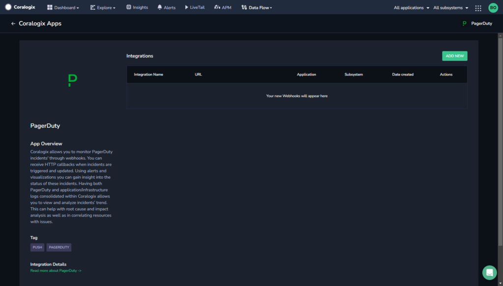
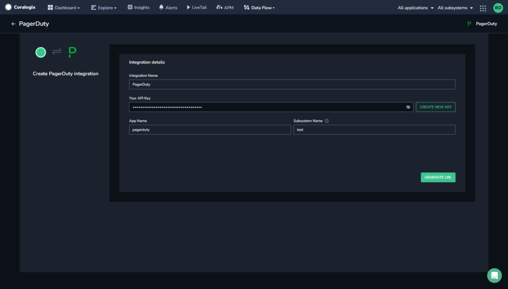
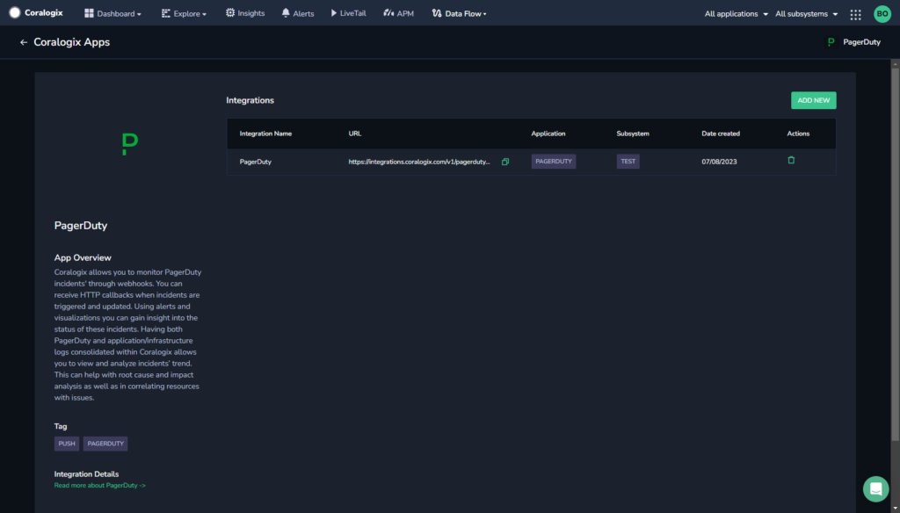
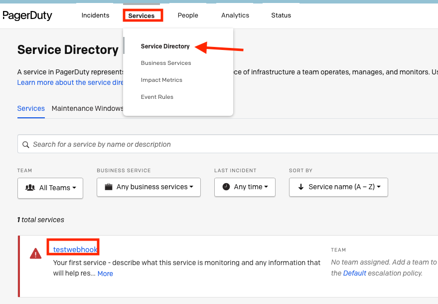
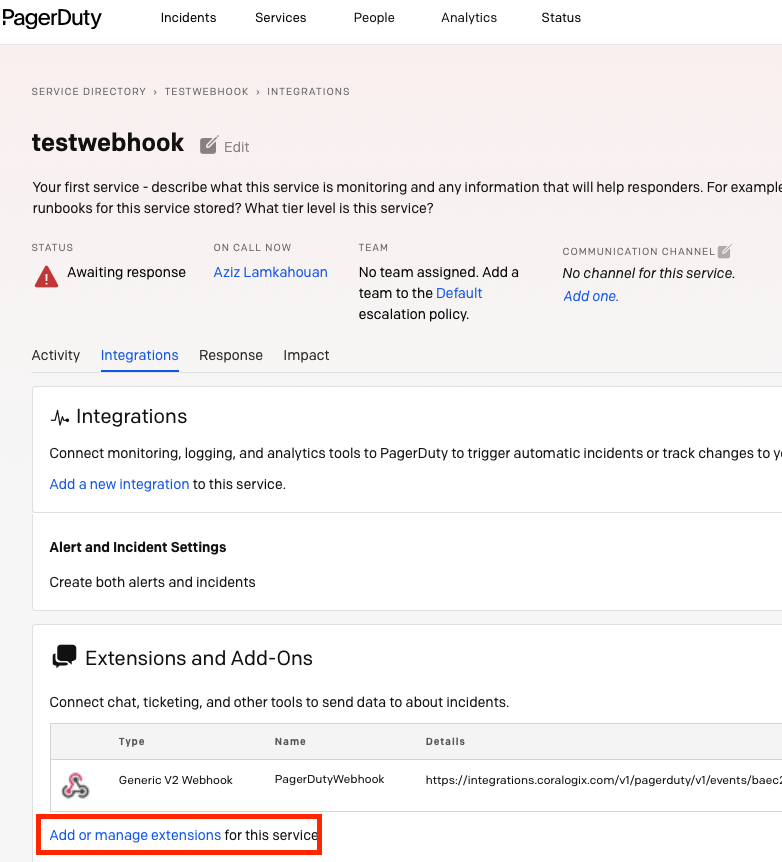
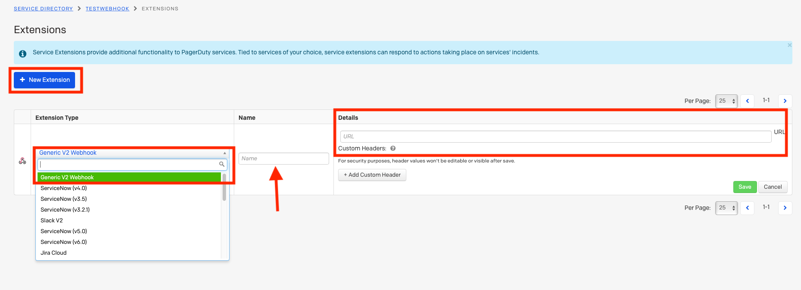

Collect your PagerDuty alerts in the Coralogix platform using our automatic **Contextual Data Integration Package**. The package automatically generates a URL to be used when creating a PagerDuty webhook.

## Overview

PagerDuty is a leading digital operations management platform designed to help businesses proactively manage and respond to critical incidents in real-time. By aggregating alerts from monitoring, cloud, and security tools, PagerDuty centralizes incident notifications and rapidly notifies the right individuals or teams, ensuring swift resolution. Its robust capabilities include automated alerting, on-call scheduling, customizable escalation policies, and rich analytics, enabling organizations to improve their incident response processes, reduce downtime, and enhance overall operational efficiency. PagerDuty's user-friendly interface and integrations with various third-party services make it a vital tool for modern IT, DevOps, and support teams seeking to maintain high system reliability and availability.

Forwarding your PagerDuty alerts to Coralogix streamlines alert consolidation, augments monitoring capabilities, and expedites incident resolution. By routing your PagerDuty alerts into Coralogix, you achieve a unified view of your alerting and incident management activities, enabling swift anomaly detection, proactive troubleshooting, and informed decision-making. This integration empowers teams to optimize incident response workflows, enhance system reliability, and sustain operational effectiveness, utilizing Coralogix's analytics, alerts, and visualization tools to extract valuable insights from PagerDuty alerts and ensure an efficient and resilient incident management process.

## Get Started

**STEP 1.** In your navigation pane, click **Data Flow** > **Contextual Data**.

**STEP 2.** In the **Contextual Data** section, select **PagerDuty** and click **+** **ADD**.



**STEP 3.** Click **ADD NEW**.

**STEP 4.** Fill in the **Integration Details**:

- **Name.** Name your integration.

- **Your API Key**. Click **CREATE NEW KEY** to generate an API key and name it.

- **Application Name and Subsystem Name**. Enter an [application and subsystem name](https://coralogixstg.wpengine.com/docs/application-and-subsystem-names/).



**STEP 5.** Click **GENERATE URL**. The URL for the integration will be automatically created. Use this when creating a Opsgenie webhook.



## **Create a PagerDuty Webhook**

Create a PagerDuty webhook using your URL.

**STEP 1**. Log in to your PagerDuty  account.

**STEP 2.** Select **Services** and select **Service directory** to see your configured services.



**STEP 3.** Click the service you want to configure the webhook for and click **Integrations**.

**STEP 4.** Click **Add or manage extensions**.



**STEP 5.** A new page will open. Click **New extension**.



**STEP 6.** Complete the form, entering the Coralogix generated URL in the **URL** field, and click **Save**.

## Example Log

```json
{
   "source_system"  :  "pagerduty" ,
   "pagerduty"  : {
     "event"  :  "incident.trigger" ,
     "log_entries"  : [
      {
         "id"  :  "R0EYM81WSBZ27ACLRWOMSVVO77" ,
         "type"  :  "trigger_log_entry" ,
         "summary"  :  "Triggered through the website" ,
         "self"  :  "https://api.pagerduty.com/log_entries/R0EYM81WSBZ27ACLRWOMSVVO77" ,
         "html_url"  :  "https://coralogixtest.pagerduty.com/incidents/PRUIXXX/log_entries/R0EYM81WSBZ27ACLRWOMSVVO77" ,
         "created_at"  :  "2021-02-22T08:44:45Z" ,
         "agent"  : {
           "id"  :  "P0G8XXX" ,
           "type"  :  "user_reference" ,
           "summary"  :  "John Doe" ,
           "self"  :  "https://api.pagerduty.com/users/P0G8XXX" ,
           "html_url"  :  "https://coralogixtest.pagerduty.com/users/P0G8XXX" 
        },
         "channel"  : {
           "type"  :  "web_trigger" ,
           "summary"  :  "Outage" ,
           "subject"  :  "Outage" ,
           "details"  :  "Hey there, this is serious outage!" ,
           "details_omitted"  :  false ,
           "body_omitted"  :  false 
        },
         "service"  : {
           "id"  :  "PTIHXXX" ,
           "type"  :  "service_reference" ,
           "summary"  :  "web-server" ,
           "self"  :  "https://api.pagerduty.com/services/PTIHXXX" ,
           "html_url"  :  "https://coralogixtest.pagerduty.com/service-directory/PTIHXXX" 
        },
         "incident"  : {
           "id"  :  "PRUIXXX" ,
           "type"  :  "incident_reference" ,
           "summary"  :  "[#7] Outage" ,
           "self"  :  "https://api.pagerduty.com/incidents/PRUIXXX" ,
           "html_url"  :  "https://coralogixtest.pagerduty.com/incidents/PRUIXXX" 
        },
         "teams"  : [],
         "contexts"  : [],
         "event_details"  : {
           "description"  :  "Outage" 
        }
      }
    ],
     "webhook"  : {
       "endpoint_url"  :  "https://integrations.dev-shared.coralogix.net/v1/pagerduty/v1/events/98663b44-74e5-11eb-a35c-0a1196871111?appName=pagerfero&amp;subSystem=stagging-incidents" ,
       "name"  :  "Cora" ,
       "description"  :  null ,
       "webhook_object"  : {
         "id"  :  "PTIHXXX" ,
         "type"  :  "service_reference" ,
         "summary"  :  "web-server" ,
         "self"  :  "https://api.pagerduty.com/services/PTIHXXX" ,
         "html_url"  :  "https://coralogixtest.pagerduty.com/service-directory/PTIHXXX" 
      },
       "config"  : {
         "referer"  :  "https://coralogixtest.pagerduty.com/services/PTIHXXX/integrations?service_profile=1" 
      },
       "outbound_integration"  : {
         "id"  :  "PJFWXXX" ,
         "type"  :  "outbound_integration_reference" ,
         "summary"  :  "Generic V2 Webhook" ,
         "self"  :  "https://api.pagerduty.com/outbound_integrations/PJFWXXX" ,
         "html_url"  :  null 
      },
       "accounts_addon"  :  null ,
       "id"  :  "PZNHXXX" ,
       "type"  :  "webhook" ,
       "summary"  :  "Cora" ,
       "self"  :  "https://api.pagerduty.com/webhooks/PZNHXXX" ,
       "html_url"  :  null 
    },
     "incident"  : {
       "incident_number"  :  7 ,
       "title"  :  "Outage" ,
       "description"  :  "Outage" ,
       "created_at"  :  "2021-02-22T08:44:45Z" ,
       "status"  :  "triggered" ,
       "incident_key"  :  "a466d2a1d4a74932a3b980cb599e47ec" ,
       "service"  : {
         "id"  :  "PTIHXXX" ,
         "name"  :  "web-server" ,
         "description"  :  "Your first service - describe what this service is monitoring and any information that will help responders.
For example: What is the SLA of this service? Where are the runbooks for this service stored? What tier level is this service?" ,
         "created_at"  :  "2021-02-09T16:00:23Z" ,
         "updated_at"  :  "2021-02-09T16:00:23Z" ,
         "status"  :  "critical" ,
         "teams"  : [],
         "alert_creation"  :  "create_alerts_and_incidents" ,
         "addons"  : [],
         "scheduled_actions"  : [],
         "support_hours"  :  null ,
         "last_incident_timestamp"  :  "2021-02-22T08:44:45Z" ,
         "escalation_policy"  : {
           "id"  :  "PLGAXXX" ,
           "type"  :  "escalation_policy_reference" ,
           "summary"  :  "Default" ,
           "self"  :  "https://api.pagerduty.com/escalation_policies/PLGAXXX" ,
           "html_url"  :  "https://coralogixtest.pagerduty.com/escalation_policies/PLGAXXX" 
        },
         "incident_urgency_rule"  : {
           "type"  :  "constant" ,
           "urgency"  :  "high" 
        },
         "acknowledgement_timeout"  :  null ,
         "auto_resolve_timeout"  :  null ,
         "alert_grouping"  :  null ,
         "alert_grouping_timeout"  :  null ,
         "alert_grouping_parameters"  : {
           "type"  :  null ,
           "config"  :  null 
        },
         "integrations"  : [
          {
             "id"  :  "PXKGXXX" ,
             "type"  :  "app_event_transform_inbound_integration_reference" ,
             "summary"  :  "Coralogix" ,
             "self"  :  "https://api.pagerduty.com/services/PTIHXXX/integrations/PXKGXXX" ,
             "html_url"  :  "https://coralogixtest.pagerduty.com/services/PTIHXXX/integrations/PXKGXXX" 
          }
        ],
         "metadata"  : {},
         "response_play"  :  null ,
         "type"  :  "service" ,
         "summary"  :  "web-server" ,
         "self"  :  "https://api.pagerduty.com/services/PTIHXXX" ,
         "html_url"  :  "https://coralogixtest.pagerduty.com/service-directory/PTIHXXX" 
      },
       "assignments"  : [
        {
           "at"  :  "2021-02-22T08:44:45Z" ,
           "assignee"  : {
             "id"  :  "P0G8XXX" ,
             "type"  :  "user_reference" ,
             "summary"  :  "John Doe" ,
             "self"  :  "https://api.pagerduty.com/users/P0G8XXX" ,
             "html_url"  :  "https://coralogixtest.pagerduty.com/users/P0G8XXX" 
          }
        }
      ],
       "assigned_via"  :  "escalation_policy" ,
       "last_status_change_at"  :  "2021-02-22T08:44:45Z" ,
       "first_trigger_log_entry"  : {
         "id"  :  "R0EYM81WSBZ27ACLRWOMSVV111" ,
         "type"  :  "trigger_log_entry_reference" ,
         "summary"  :  "Triggered through the website" ,
         "self"  :  "https://api.pagerduty.com/log_entries/R0EYM81WSBZ27ACLRWOMSVV111" ,
         "html_url"  :  "https://coralogixtest.pagerduty.com/incidents/PRUIXXX/log_entries/R0EYM81WSBZ27ACLRWOMSVV111" 
      },
       "alert_counts"  : {
         "all"  :  0 ,
         "triggered"  :  0 ,
         "resolved"  :  0 
      },
       "is_mergeable"  :  true ,
       "escalation_policy"  : {
         "id"  :  "PLGAXXX" ,
         "type"  :  "escalation_policy_reference" ,
         "summary"  :  "Default" ,
         "self"  :  "https://api.pagerduty.com/escalation_policies/PLGAXXX" ,
         "html_url"  :  "https://coralogixtest.pagerduty.com/escalation_policies/PLGAXXX" 
      },
       "teams"  : [],
       "impacted_services"  : [
        {
           "id"  :  "PTIHXXX" ,
           "type"  :  "service_reference" ,
           "summary"  :  "web-server" ,
           "self"  :  "https://api.pagerduty.com/services/PTIHXXX" ,
           "html_url"  :  "https://coralogixtest.pagerduty.com/service-directory/PTIHXXX" 
        }
      ],
       "pending_actions"  : [],
       "acknowledgements"  : [],
       "basic_alert_grouping"  :  null ,
       "alert_grouping"  :  null ,
       "last_status_change_by"  : {
         "id"  :  "PTIHUXXX" ,
         "type"  :  "service_reference" ,
         "summary"  :  "web-server" ,
         "self"  :  "https://api.pagerduty.com/services/PTIHXXX" ,
         "html_url"  :  "https://coralogixtest.pagerduty.com/service-directory/PTIHXXX" 
      },
       "metadata"  : {},
       "external_references"  : [],
       "incidents_responders"  : [],
       "responder_requests"  : [],
       "subscriber_requests"  : [],
       "urgency"  :  "high" ,
       "id"  :  "PRUI111" ,
       "type"  :  "incident" ,
       "summary"  :  "[#7] Outage" ,
       "self"  :  "https://api.pagerduty.com/incidents/PRUI111" ,
       "html_url"  :  "https://coralogixtest.pagerduty.com/incidents/PRUI111" ,
       "alerts"  : []
    },
     "id"  :  "36f99188-74ea-11eb-87ca-0242c0a81111" ,
     "created_on"  :  "2021-02-22T08:44:45Z" ,
     "account_features"  : {
       "response_automation"  :  true 
    },
     "account_id"  :  "PWLHXXX" 
  }
}

```

## Support

**Need help?**

Our world-class customer success team is available 24/7 to walk you through your setup and answer any questions that may come up.

Feel free to reach out to us **via our in-app chat** or by sending us an email at [support@coralogixstg.wpengine.com](mailto:support@coralogixstg.wpengine.com).
