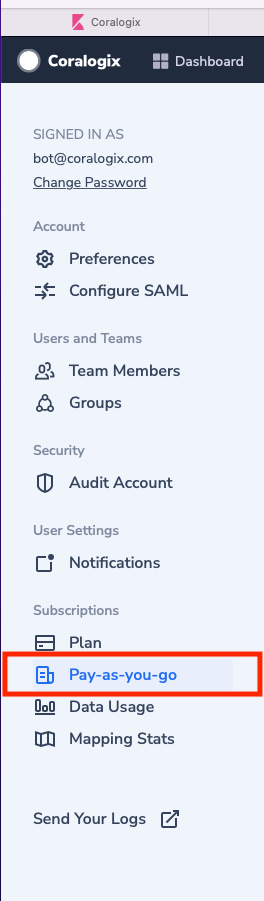
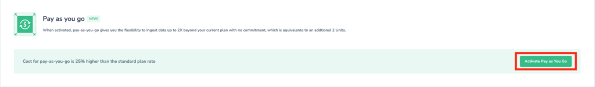
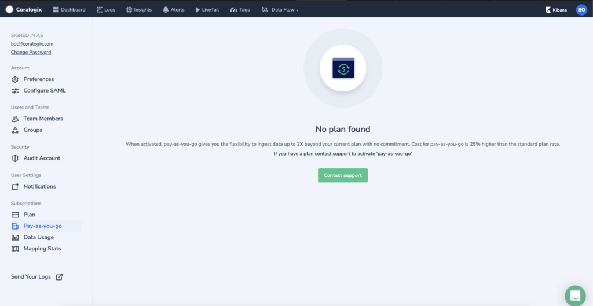

'Pay as you go' is an option that offers flexibility to ingest up to one time your contractual quota without commitment**.**

_Note: Keep in mind that data ingested as part of the 'Pay as you go' plan will be charged at a rate 25% higher than the standard plan._

## Activation

To activate pay-as-you-go:

1-On the right top corner, click your name.

2-Click settings.

3- On the left pan select 'Pay as you go'.

Click activate Pay as you go and you are all set.

If you have a custom plan, you will see the screen below, and you will need to contact Coralogix support to help you activate pay-as-you-go.

_Note: It can take up to 5-min to deactivate your 'Pay as you go' plan._
